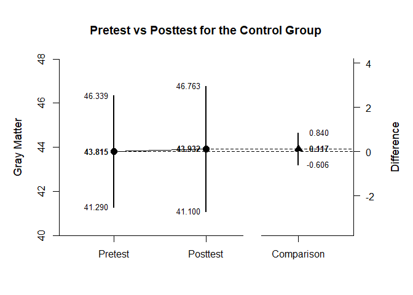
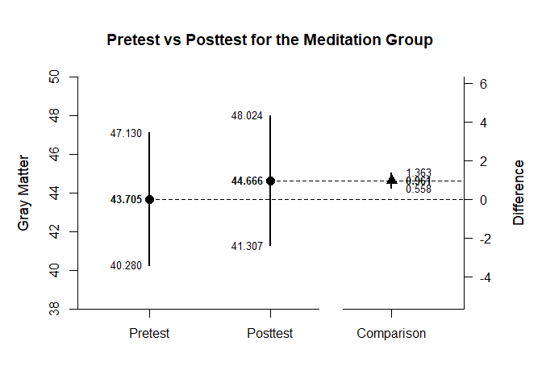

## Holzel Data Example

This page analyzes a two-factor mixed design (one between-subjects and
one within-subjects factor) using raw data input.

- [Data Management](#data-management)
- [Analyses of the Differences within
  Conditions](#analyses-of-the-differences-within-conditions)

------------------------------------------------------------------------

### Data Management

First, enter the data.

``` r
Group <- c("Control","Control","Control","Control","Control","Control","Control","Control","Control","Control","Control","Control","Control","Control","Control","Control","Control","Meditation","Meditation","Meditation","Meditation","Meditation","Meditation","Meditation","Meditation","Meditation","Meditation","Meditation","Meditation","Meditation","Meditation","Meditation","Meditation")
Pretest <- c(48.261,42.745,46.222,46.889,43.752,36.928,52.026,39.739,45.503,45.386,44.745,31.725,40.562,39.216,46.771,48.314,46.065,43.072,41.922,48.366,49.725,40.013,39.673,38.405,52.51,41.281,42.157,41.281,57.843,41.935,45.281,29.673,46.144)
Posttest <- c(50.026,41.137,45.542,48.261,45.242,33.621,53.634,40.275,43.595,46.235,45.621,32.092,40.588,39.987,47.19,47.137,46.654,42.549,41.974,49.882,50.967,41.059,41.569,40.418,54.078,43.046,43.333,41.333,58,42.471,45.83,31.137,47.007)
HolzelData <- data.frame(Group,Pretest,Posttest)
```

Then subdivide the data into subsets (one for each simple effect of
interest).

``` r
HolzelSubsetControl <- subset(HolzelData,Group=="Control")
HolzelSubsetMeditation <- subset(HolzelData,Group=="Meditation")
```

### Analyses of the Differences within Conditions

For each subset, obtain a difference plot comparing pretest and
posttest.

``` r
with(HolzelSubsetControl,estimateMeanComparison(cbind(Pretest,Posttest)))
```

    ## $`Confidence Intervals for the Means`
    ##                M      SE      df      LL      UL
    ## Pretest   43.815   1.191  16.000  41.290  46.339
    ## Posttest  43.932   1.336  16.000  41.100  46.763
    ## 
    ## $`Confidence Interval for the Mean Difference`
    ##               Diff      SE      df      LL      UL
    ## Comparison   0.117   0.341  16.000  -0.606   0.840

``` r
with(HolzelSubsetControl,plotMeanComparison(cbind(Pretest,Posttest),main="Pretest vs Posttest for the Control Group",ylab="Gray Matter"))
```

<!-- -->

``` r
with(HolzelSubsetMeditation,estimateMeanComparison(cbind(Pretest,Posttest)))
```

    ## $`Confidence Intervals for the Means`
    ##                M      SE      df      LL      UL
    ## Pretest   43.705   1.607  15.000  40.280  47.130
    ## Posttest  44.666   1.576  15.000  41.307  48.024
    ## 
    ## $`Confidence Interval for the Mean Difference`
    ##               Diff      SE      df      LL      UL
    ## Comparison   0.961   0.189  15.000   0.558   1.363

``` r
with(HolzelSubsetMeditation,plotMeanComparison(cbind(Pretest,Posttest),main="Pretest vs Posttest for the Meditation Group",ylab="Gray Matter"))
```

<!-- -->

Then for each subset, obtain the standardized effect size comparing
pretest to posttest.

``` r
with(HolzelSubsetControl,estimateStandardizedMeanDifference(cbind(Pretest,Posttest)))
```

    ## $`Confidence Interval for the Standardized Mean Difference`
    ##                  d      SE      LL      UL
    ## Comparison   0.022   0.067  -0.110   0.155

``` r
with(HolzelSubsetMeditation,estimateStandardizedMeanDifference(cbind(Pretest,Posttest)))
```

    ## $`Confidence Interval for the Standardized Mean Difference`
    ##                  d      SE      LL      UL
    ## Comparison   0.151   0.041   0.070   0.232
