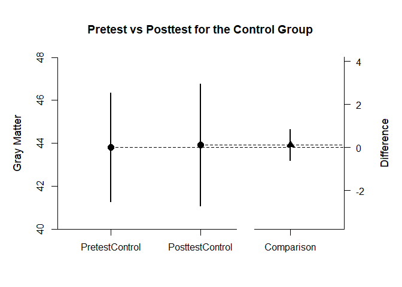
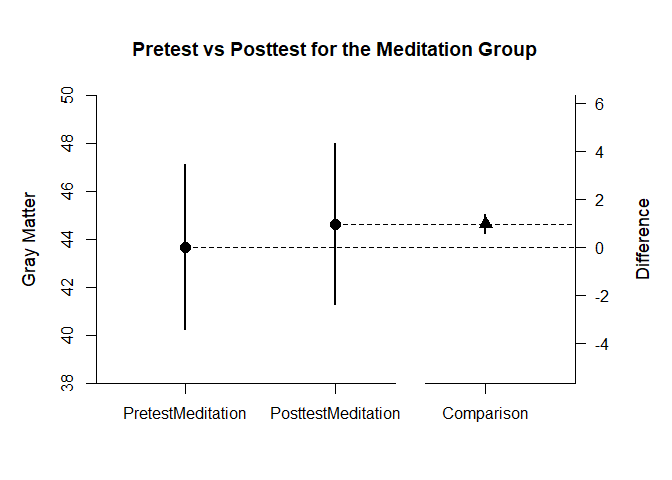

## Holzel Summary Statistics Example

### Data Management

Create two tables of summary statistics for the first simple effect of interest.


```r
PretestControl <- c(N=17,M=43.815,SD=4.910)
PosttestControl <- c(N=17,M=43.932,SD=5.507)
HolzelSummaryControl <- rbind(PretestControl,PosttestControl)
class(HolzelSummaryControl) <- "wss"

HolzelCorrControl <- declareCorrelations("PretestControl","PosttestControl")
HolzelCorrControl["PretestControl","PosttestControl"] <- .970
HolzelCorrControl <- fillCorrelations(HolzelCorrControl)
```

Create two tables of summary statistics for the second simple effect of interest.


```r
PretestMeditation <- c(N=16,M=43.705,SD=6.427)
PosttestMeditation <- c(N=16,M=44.666,SD=6.303)
HolzelSummaryMeditation <- rbind(PretestMeditation,PosttestMeditation)
class(HolzelSummaryMeditation) <- "wss"

HolzelCorrMeditation <- declareCorrelations("PretestMeditation","PosttestMeditation")
HolzelCorrMeditation["PretestMeditation","PosttestMeditation"] <- .993
HolzelCorrMeditation <- fillCorrelations(HolzelCorrMeditation)
```

### Analyses of the Differences within Conditions

For each subset, obtain a difference plot comparing pretest and posttest.


```r
estimateMeanComparison(HolzelSummaryControl,HolzelCorrControl)
```

```
## $`Confidence Intervals for the Means`
##                       M      SE      df      LL      UL
## PretestControl   43.815   1.191  16.000  41.291  46.339
## PosttestControl  43.932   1.336  16.000  41.101  46.763
## 
## $`Confidence Interval for the Mean Difference`
##               Diff      SE      df      LL      UL
## Comparison   0.117   0.341  16.000  -0.606   0.840
```

```r
plotMeanComparison(HolzelSummaryControl,HolzelCorrControl,main="Pretest vs Posttest for the Control Group",ylab="Gray Matter",values=FALSE)
```

<!-- -->

```r
estimateMeanComparison(HolzelSummaryMeditation,HolzelCorrMeditation)
```

```
## $`Confidence Intervals for the Means`
##                          M      SE      df      LL      UL
## PretestMeditation   43.705   1.607  15.000  40.280  47.130
## PosttestMeditation  44.666   1.576  15.000  41.307  48.025
## 
## $`Confidence Interval for the Mean Difference`
##               Diff      SE      df      LL      UL
## Comparison   0.961   0.191  15.000   0.554   1.368
```

```r
plotMeanComparison(HolzelSummaryMeditation,HolzelCorrMeditation,main="Pretest vs Posttest for the Meditation Group",ylab="Gray Matter",values=FALSE)
```

<!-- -->

Then for each subset, obtain the standardized effect size comparing pretest to posttest.


```r
estimateStandardizedMeanDifference(HolzelSummaryControl,HolzelCorrControl)
```

```
## $`Confidence Interval for the Standardized Mean Difference`
##                  d      SE      LL      UL
## Comparison   0.022   0.068  -0.110   0.155
```

```r
estimateStandardizedMeanDifference(HolzelSummaryMeditation,HolzelCorrMeditation)
```

```
## $`Confidence Interval for the Standardized Mean Difference`
##                  d      SE      LL      UL
## Comparison   0.151   0.041   0.070   0.232
```
