## Mixed Design Summary Statistics Example

This page analyzes a two-factor mixed design (one between-subjects and
one within-subjects factor) using summary statistics input.

- [Data Management](#data-management)
  - [Data Entry](#data-entry)
  - [Descriptive Statistics](#descriptive-statistics)
- [Analyses of the Means](#analyses-of-the-means)
  - [Confidence Intervals](#confidence-intervals)
  - [Significance Tests](#significance-tests)
  - [Standardized Effect Sizes](#standardized-effect-sizes)
- [Analyses of a Comparison](#analyses-of-a-comparison)
  - [Confidence Intervals](#confidence-intervals)
  - [Significance Tests](#significance-tests)
  - [Standardized Effect Sizes](#standardized-effect-sizes)
- [Analyses of a Contrast](#analyses-of-a-contrast)
  - [Confidence Intervals](#confidence-intervals)
  - [Significance Tests](#significance-tests)
  - [Standardized Effect Sizes](#standardized-effect-sizes)

------------------------------------------------------------------------

### Data Management

#### Data Entry

This code inputs the variable summaries and creates a summary table.

``` r
Outcome1 <- c(N = 10, M = 8.000, SD = 1.414)
Outcome2 <- c(N = 10, M = 11.000, SD = 2.211)
Outcome3 <- c(N = 10, M = 12.000, SD = 2.449)
MixedSummaryL1 <- construct(Outcome1, Outcome2, Outcome3, type = "wss")
```

This code creates a correlation matrix.

``` r
Outcome1 <- c(1.000, .533, .385)
Outcome2 <- c(.533, 1.000, .574)
Outcome3 <- c(.385, .574, 1.000)
MixedCorrL1 <- construct(Outcome1, Outcome2, Outcome3, type = "corr")
```

And repeat the process to create the second subset.

``` r
Outcome1 <- c(N = 10, M = 8.000, SD = 2.449)
Outcome2 <- c(N = 10, M = 8.000, SD = 2.000)
Outcome3 <- c(N = 10, M = 7.000, SD = 2.211)
MixedSummaryL2 <- construct(Outcome1, Outcome2, Outcome3, type = "wss")
```

And for the correlation matrix of the second subset.

``` r
Outcome1 <- c(1.000, .408, .164)
Outcome2 <- c(.408, 1.000, .553)
Outcome3 <- c(.164, .553, 1.000)
MixedCorrL2 <- construct(Outcome1, Outcome2, Outcome3, type = "corr")
```

#### Descriptive Statistics

This code confirms the descriptive statistics from the summary tables.

``` r
(MixedSummaryL1) |> describeMeans()
```

    ## $`Descriptive Statistics for the Data`
    ##                N       M      SD
    ## Outcome1  10.000   8.000   1.414
    ## Outcome2  10.000  11.000   2.211
    ## Outcome3  10.000  12.000   2.449

``` r
(MixedCorrL1) |> describeCorrelations()
```

    ## $`Correlation Matrix for the Variables`
    ##          Outcome1 Outcome2 Outcome3
    ## Outcome1    1.000    0.533    0.385
    ## Outcome2    0.533    1.000    0.574
    ## Outcome3    0.385    0.574    1.000

``` r
(MixedSummaryL2) |> describeMeans()
```

    ## $`Descriptive Statistics for the Data`
    ##                N       M      SD
    ## Outcome1  10.000   8.000   2.449
    ## Outcome2  10.000   8.000   2.000
    ## Outcome3  10.000   7.000   2.211

``` r
(MixedCorrL2) |> describeCorrelations()
```

    ## $`Correlation Matrix for the Variables`
    ##          Outcome1 Outcome2 Outcome3
    ## Outcome1    1.000    0.408    0.164
    ## Outcome2    0.408    1.000    0.553
    ## Outcome3    0.164    0.553    1.000

### Analyses of the Means

This section produces analyses that are equivalent to one-sample
analyses separately for each level of a factor.

#### Confidence Intervals

This code will provide tables of confidence intervals for each level of
the factor.

``` r
(MixedSummaryL1) |> estimateMeans()
```

    ## $`Confidence Intervals for the Means`
    ##                M      SE      df      LL      UL
    ## Outcome1   8.000   0.447   9.000   6.988   9.012
    ## Outcome2  11.000   0.699   9.000   9.418  12.582
    ## Outcome3  12.000   0.774   9.000  10.248  13.752

``` r
(MixedSummaryL2) |> estimateMeans()
```

    ## $`Confidence Intervals for the Means`
    ##                M      SE      df      LL      UL
    ## Outcome1   8.000   0.774   9.000   6.248   9.752
    ## Outcome2   8.000   0.632   9.000   6.569   9.431
    ## Outcome3   7.000   0.699   9.000   5.418   8.582

This code will produce a graph of the confidence intervals for each
level of the factor.

``` r
(MixedSummaryL1) |> plotMeans()
```

<!-- -->

``` r
(MixedSummaryL2) |> plotMeans()
```

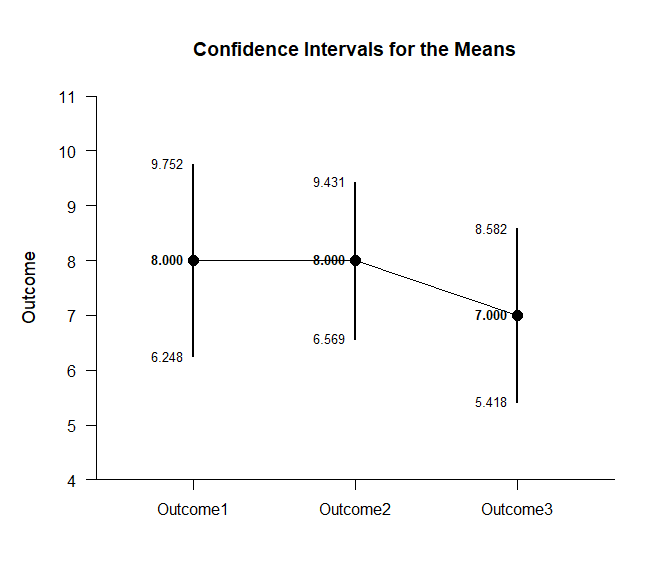<!-- -->

The code defaults to 95% confidence intervals. This can be changed if
desired.

``` r
(MixedSummaryL1) |> estimateMeans(conf.level = .99)
```

    ## $`Confidence Intervals for the Means`
    ##                M      SE      df      LL      UL
    ## Outcome1   8.000   0.447   9.000   6.547   9.453
    ## Outcome2  11.000   0.699   9.000   8.728  13.272
    ## Outcome3  12.000   0.774   9.000   9.483  14.517

``` r
(MixedSummaryL2) |> estimateMeans(conf.level = .99)
```

    ## $`Confidence Intervals for the Means`
    ##                M      SE      df      LL      UL
    ## Outcome1   8.000   0.774   9.000   5.483  10.517
    ## Outcome2   8.000   0.632   9.000   5.945  10.055
    ## Outcome3   7.000   0.699   9.000   4.728   9.272

For the graph, it is possible to add a comparison line to represent a
population (or test) value and a region of practical equivalence in
addition to changing the confidence level.

``` r
(MixedSummaryL1) |> plotMeans(conf.level = .99, line = 9, rope = c(8, 10))
```

<!-- -->

``` r
(MixedSummaryL2) |> plotMeans(conf.level = .99, line = 9, rope = c(8, 10))
```

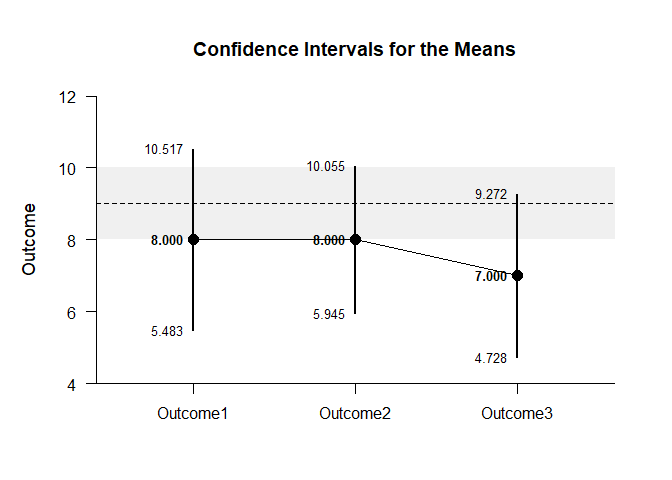<!-- -->

#### Significance Tests

This code will produce a table of NHST separately for each level of the
factor. In this case, all the means are tested against a value of zero.

``` r
(MixedSummaryL1) |> testMeans()
```

    ## $`Hypothesis Tests for the Means`
    ##             Diff      SE      df       t       p
    ## Outcome1   8.000   0.447   9.000  17.891   0.000
    ## Outcome2  11.000   0.699   9.000  15.733   0.000
    ## Outcome3  12.000   0.774   9.000  15.495   0.000

``` r
(MixedSummaryL2) |> testMeans()
```

    ## $`Hypothesis Tests for the Means`
    ##             Diff      SE      df       t       p
    ## Outcome1   8.000   0.774   9.000  10.330   0.000
    ## Outcome2   8.000   0.632   9.000  12.649   0.000
    ## Outcome3   7.000   0.699   9.000  10.012   0.000

Often, the default test value of zero is not meaningful or plausible.
This too can be altered (often in conjunction with what is presented in
the plot).

``` r
(MixedSummaryL1) |> testMeans(mu = 9)
```

    ## $`Hypothesis Tests for the Means`
    ##             Diff      SE      df       t       p
    ## Outcome1  -1.000   0.447   9.000  -2.236   0.052
    ## Outcome2   2.000   0.699   9.000   2.860   0.019
    ## Outcome3   3.000   0.774   9.000   3.874   0.004

``` r
(MixedSummaryL2) |> testMeans(mu = 9)
```

    ## $`Hypothesis Tests for the Means`
    ##             Diff      SE      df       t       p
    ## Outcome1  -1.000   0.774   9.000  -1.291   0.229
    ## Outcome2  -1.000   0.632   9.000  -1.581   0.148
    ## Outcome3  -2.000   0.699   9.000  -2.860   0.019

#### Standardized Effect Sizes

This code will produce a table of standardized mean differences
separately for each level of the factor. In this case, the mean is
compared to zero to form the effect size.

``` r
(MixedSummaryL1) |> estimateStandardizedMeans()
```

    ## $`Confidence Intervals for the Standardized Means`
    ##                d      SE      LL      UL
    ## Outcome1   5.658   1.251   3.005   8.297
    ## Outcome2   4.975   1.111   2.622   7.312
    ## Outcome3   4.900   1.096   2.580   7.204

``` r
(MixedSummaryL2) |> estimateStandardizedMeans()
```

    ## $`Confidence Intervals for the Standardized Means`
    ##                d      SE      LL      UL
    ## Outcome1   3.267   0.771   1.645   4.864
    ## Outcome2   4.000   0.915   2.068   5.911
    ## Outcome3   3.166   0.752   1.586   4.721

Here too it is possible to alter the width of the confidence intervals
and to establish a more plausible comparison value for the mean.

``` r
(MixedSummaryL1) |> estimateStandardizedMeans(mu = 9, conf.level = .99)
```

    ## $`Confidence Intervals for the Standardized Means`
    ##                d      SE      LL      UL
    ## Outcome1  -0.707   0.364  -1.614   0.222
    ## Outcome2   0.905   0.384  -0.083   1.873
    ## Outcome3   1.225   0.422   0.126   2.317

``` r
(MixedSummaryL2) |> estimateStandardizedMeans(mu = 9, conf.level = .99)
```

    ## $`Confidence Intervals for the Standardized Means`
    ##                d      SE      LL      UL
    ## Outcome1  -0.408   0.343  -1.249   0.451
    ## Outcome2  -0.500   0.348  -1.357   0.378
    ## Outcome3  -0.905   0.384  -1.873   0.083

### Analyses of a Comparison

This section produces analyses involving comparisons of two levels of a
factor.

#### Confidence Intervals

This code identifies the two levels for comparison and estimates the
confidence interval of the difference.

``` r
(MixedSummaryL1) |> pick(Outcome1, Outcome2) |> estimateMeanDifference(MixedCorrL1)
```

    ## $`Confidence Interval for the Mean Difference`
    ##               Diff      SE      df      LL      UL
    ## Comparison   3.000   0.596   9.000   1.651   4.349

``` r
(MixedSummaryL2) |> pick(Outcome1, Outcome2) |> estimateMeanDifference(MixedCorrL2)
```

    ## $`Confidence Interval for the Mean Difference`
    ##               Diff      SE      df      LL      UL
    ## Comparison   0.000   0.775   9.000  -1.752   1.752

This code obtains and plots the confidence intervals for the mean
difference in the identified comparison.

``` r
(MixedSummaryL1) |> pick(Outcome1, Outcome2) |> plotMeanDifference(MixedCorrL1)
```

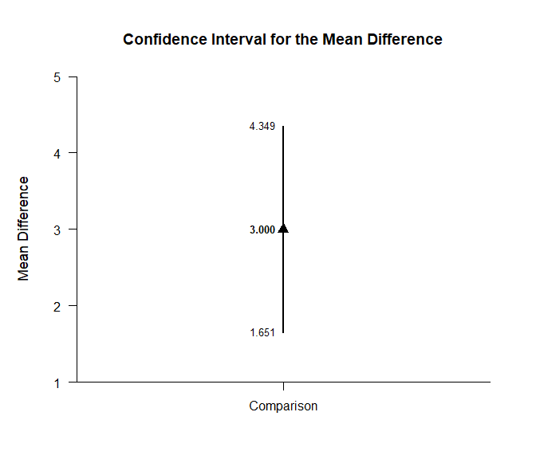<!-- -->

``` r
(MixedSummaryL2) |> pick(Outcome1, Outcome2) |> plotMeanDifference(MixedCorrL2)
```

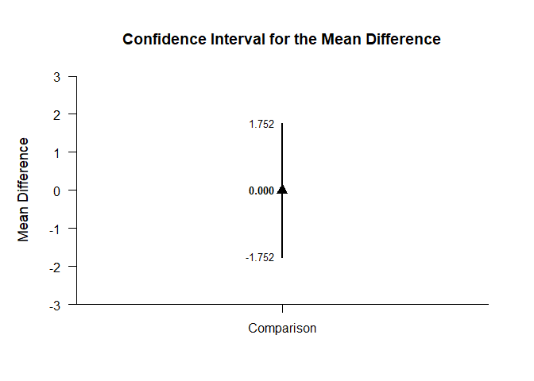<!-- -->

Of course, you can change the confidence level from the default 95% if
desired.

``` r
(MixedSummaryL1) |> pick(Outcome1, Outcome2) |> estimateMeanDifference(MixedCorrL1, conf.level = .99)
```

    ## $`Confidence Interval for the Mean Difference`
    ##               Diff      SE      df      LL      UL
    ## Comparison   3.000   0.596   9.000   1.062   4.938

``` r
(MixedSummaryL2) |> pick(Outcome1, Outcome2) |> estimateMeanDifference(MixedCorrL2, conf.level = .99)
```

    ## $`Confidence Interval for the Mean Difference`
    ##               Diff      SE      df      LL      UL
    ## Comparison   0.000   0.775   9.000  -2.517   2.517

Once again, the confidence levels can be changed away from the default
and a comparison line to represent a population (or test) value and a
region of practical equivalence can be added to the graph.

``` r
(MixedSummaryL1) |> pick(Outcome1, Outcome2) |> plotMeanDifference(MixedCorrL1, conf.level = .99, line = 0, rope = c(-2, 2))
```

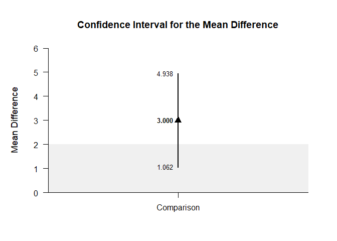<!-- -->

``` r
(MixedSummaryL2) |> pick(Outcome1, Outcome2) |> plotMeanDifference(MixedCorrL2, conf.level = .99, line = 0, rope = c(-2, 2))
```

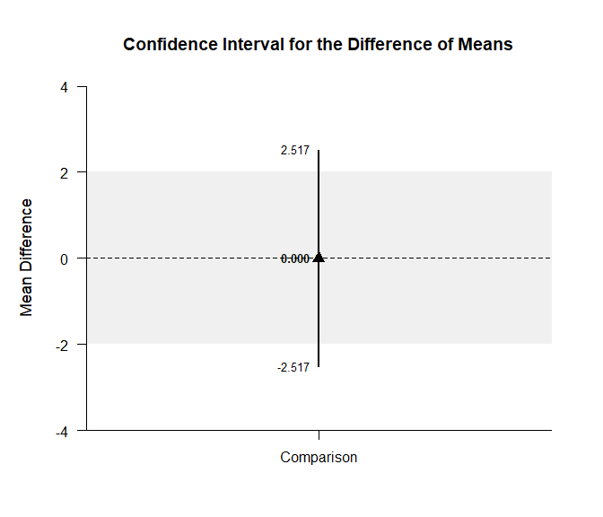<!-- -->

If you wish, you can get the confidence intervals for the means and the
mean difference in one command.

``` r
(MixedSummaryL1) |> pick(Outcome1, Outcome2) |> estimateMeanComparison(MixedCorrL1)
```

    ## $`Confidence Intervals for the Means`
    ##                M      SE      df      LL      UL
    ## Outcome1   8.000   0.447   9.000   6.988   9.012
    ## Outcome2  11.000   0.699   9.000   9.418  12.582
    ## 
    ## $`Confidence Interval for the Mean Difference`
    ##               Diff      SE      df      LL      UL
    ## Comparison   3.000   0.596   9.000   1.651   4.349

``` r
(MixedSummaryL2) |> pick(Outcome1, Outcome2) |> estimateMeanComparison(MixedCorrL2)
```

    ## $`Confidence Intervals for the Means`
    ##                M      SE      df      LL      UL
    ## Outcome1   8.000   0.774   9.000   6.248   9.752
    ## Outcome2   8.000   0.632   9.000   6.569   9.431
    ## 
    ## $`Confidence Interval for the Mean Difference`
    ##               Diff      SE      df      LL      UL
    ## Comparison   0.000   0.775   9.000  -1.752   1.752

This code produces a difference plot using the confidence intervals for
the means and the mean difference.

``` r
(MixedSummaryL1) |> pick(Outcome1, Outcome2) |> plotMeanComparison(MixedCorrL1)
```

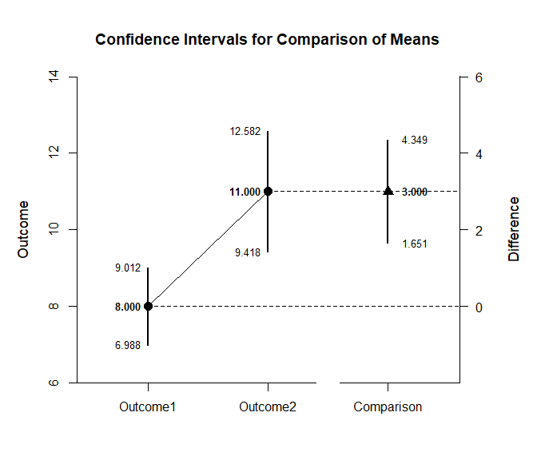<!-- -->

``` r
(MixedSummaryL2) |> pick(Outcome1, Outcome2) |> plotMeanComparison(MixedCorrL2)
```

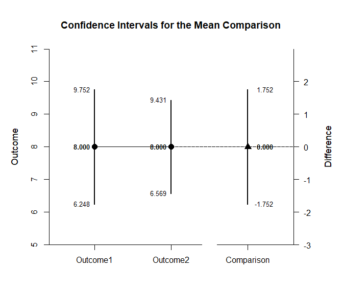<!-- -->

Of course, you can change the confidence level from the default 95% if
desired.

``` r
(MixedSummaryL1) |> pick(Outcome1, Outcome2) |> estimateMeanComparison(MixedCorrL1, conf.level = .99)
```

    ## $`Confidence Intervals for the Means`
    ##                M      SE      df      LL      UL
    ## Outcome1   8.000   0.447   9.000   6.547   9.453
    ## Outcome2  11.000   0.699   9.000   8.728  13.272
    ## 
    ## $`Confidence Interval for the Mean Difference`
    ##               Diff      SE      df      LL      UL
    ## Comparison   3.000   0.596   9.000   1.062   4.938

``` r
(MixedSummaryL2) |> pick(Outcome1, Outcome2) |> estimateMeanComparison(MixedCorrL2, conf.level = .99)
```

    ## $`Confidence Intervals for the Means`
    ##                M      SE      df      LL      UL
    ## Outcome1   8.000   0.774   9.000   5.483  10.517
    ## Outcome2   8.000   0.632   9.000   5.945  10.055
    ## 
    ## $`Confidence Interval for the Mean Difference`
    ##               Diff      SE      df      LL      UL
    ## Comparison   0.000   0.775   9.000  -2.517   2.517

Once again, the confidence levels can be changed away from the default
and a region of practical equivalence can be added to the graph.

``` r
(MixedSummaryL1) |> pick(Outcome1, Outcome2) |> plotMeanComparison(MixedCorrL1, conf.level = .99, rope = c(-2, 2))
```

<!-- -->

``` r
(MixedSummaryL2) |> pick(Outcome1, Outcome2) |> plotMeanComparison(MixedCorrL2, conf.level = .99, rope = c(-2, 2))
```

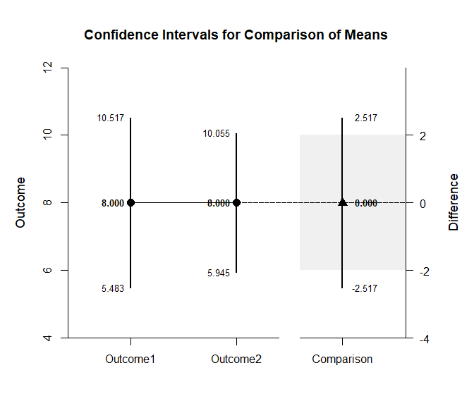<!-- -->

#### Significance Tests

This code produces NHST for the identified comparison (using a default
test value of zero).

``` r
(MixedSummaryL1) |> pick(Outcome1, Outcome2) |> testMeanDifference(MixedCorrL1)
```

    ## $`Hypothesis Test for the Mean Difference`
    ##               Diff      SE      df       t       p
    ## Comparison   3.000   0.596   9.000   5.031   0.001

``` r
(MixedSummaryL2) |> pick(Outcome1, Outcome2) |> testMeanDifference(MixedCorrL2)
```

    ## $`Hypothesis Test for the Mean Difference`
    ##               Diff      SE      df       t       p
    ## Comparison   0.000   0.775   9.000   0.000   1.000

If the default value of zero is not plausible, it too can be changed.

``` r
(MixedSummaryL1) |> pick(Outcome1, Outcome2) |> testMeanDifference(MixedCorrL1, mu = -2)
```

    ## $`Hypothesis Test for the Mean Difference`
    ##               Diff      SE      df       t       p
    ## Comparison   5.000   0.596   9.000   8.386   0.000

``` r
(MixedSummaryL2) |> pick(Outcome1, Outcome2) |> testMeanDifference(MixedCorrL2, mu = -2)
```

    ## $`Hypothesis Test for the Mean Difference`
    ##               Diff      SE      df       t       p
    ## Comparison   2.000   0.775   9.000   2.582   0.030

#### Standardized Effect Sizes

This code calculates a standardized mean difference for the comparison
and its confidence interval.

``` r
(MixedSummaryL1) |> pick(Outcome1, Outcome2) |> estimateStandardizedMeanDifference(MixedCorrL1)
```

    ## $`Confidence Interval for the Standardized Mean Difference`
    ##                  d      SE      LL      UL
    ## Comparison   1.617   0.466   0.703   2.530

``` r
(MixedSummaryL2) |> pick(Outcome1, Outcome2) |> estimateStandardizedMeanDifference(MixedCorrL2)
```

    ## $`Confidence Interval for the Standardized Mean Difference`
    ##                  d      SE      LL      UL
    ## Comparison   0.000   0.365  -0.716   0.716

The width of the confidence interval for the effect size can be altered
if desired.

``` r
(MixedSummaryL1) |> pick(Outcome1, Outcome2) |> estimateStandardizedMeanDifference(MixedCorrL1, conf.level = .99)
```

    ## $`Confidence Interval for the Standardized Mean Difference`
    ##                  d      SE      LL      UL
    ## Comparison   1.617   0.466   0.416   2.817

``` r
(MixedSummaryL2) |> pick(Outcome1, Outcome2) |> estimateStandardizedMeanDifference(MixedCorrL2, conf.level = .99)
```

    ## $`Confidence Interval for the Standardized Mean Difference`
    ##                  d      SE      LL      UL
    ## Comparison   0.000   0.365  -0.941   0.941

### Analyses of a Contrast

This section produces analyses involving multiple levels of a factor.

#### Confidence Intervals

This code produces a confidence interval for that contrast.

``` r
(MixedSummaryL1) |> estimateMeanContrast(MixedCorrL1, contrast = c(-1, .5, .5))
```

    ## $`Confidence Interval for the Mean Contrast`
    ##              Est      SE      df      LL      UL
    ## Contrast   3.500   0.572   9.000   2.205   4.795

``` r
(MixedSummaryL2) |> estimateMeanContrast(MixedCorrL2, contrast = c(-1, .5, .5))
```

    ## $`Confidence Interval for the Mean Contrast`
    ##              Est      SE      df      LL      UL
    ## Contrast  -0.500   0.810   9.000  -2.332   1.332

This code obtains and plots the confidence intervals for the mean
difference in the identified contrast.

``` r
(MixedSummaryL1) |> plotMeanContrast(MixedCorrL1, contrast = c(-1, .5, .5))
```

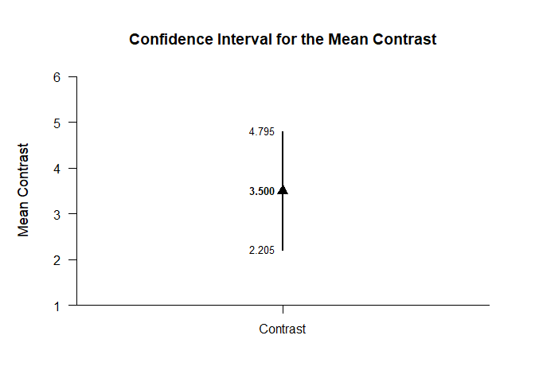<!-- -->

``` r
(MixedSummaryL2) |> plotMeanContrast(MixedCorrL2, contrast = c(-1, .5, .5))
```

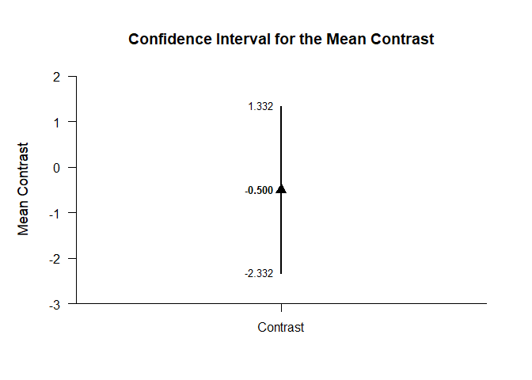<!-- -->

As in all other cases, the default value of the confidence interval can
be changed.

``` r
(MixedSummaryL1) |> estimateMeanContrast(MixedCorrL1, contrast = c(-1, .5, .5), conf.level = .99)
```

    ## $`Confidence Interval for the Mean Contrast`
    ##              Est      SE      df      LL      UL
    ## Contrast   3.500   0.572   9.000   1.640   5.360

``` r
(MixedSummaryL2) |> estimateMeanContrast(MixedCorrL2, contrast = c(-1, .5, .5), conf.level = .99)
```

    ## $`Confidence Interval for the Mean Contrast`
    ##              Est      SE      df      LL      UL
    ## Contrast  -0.500   0.810   9.000  -3.131   2.131

The width of the confidence interval for the contrast can be altered and
a comparison line to represent a population (or test) value and a region
of practical equivalence can be added to the graph.

``` r
(MixedSummaryL1) |> plotMeanContrast(MixedCorrL1, contrast = c(-1, .5, .5), conf.level = .99, line = 0, rope = c(-2, 2))
```

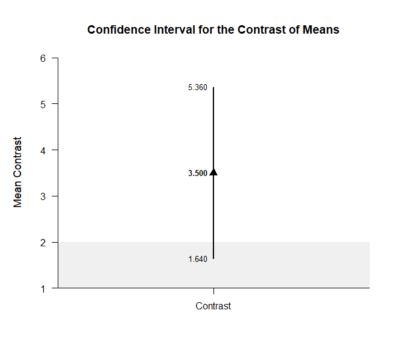<!-- -->

``` r
(MixedSummaryL2) |> plotMeanContrast(MixedCorrL2, contrast = c(-1, .5, .5), conf.level = .99, line = 0, rope = c(-2, 2))
```

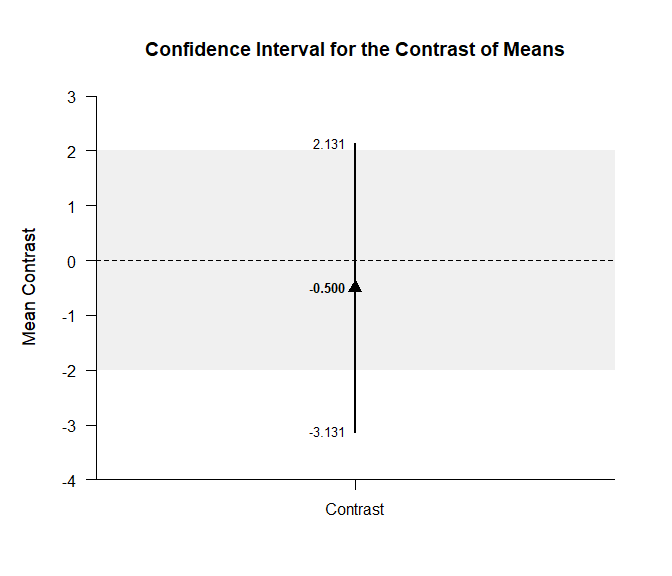<!-- -->

If you wish, you can get the confidence intervals for the mean subsets
and the mean contrast in one command.

``` r
(MixedSummaryL1) |> estimateMeanSubsets(MixedCorrL1, contrast = c(-1, .5, .5))
```

    ## $`Confidence Intervals for the Mean Subsets`
    ##                  Est      SE      df      LL      UL
    ## Neg Weighted   8.000   0.447   9.000   6.988   9.012
    ## Pos Weighted  11.500   0.654   9.000  10.021  12.979
    ## 
    ## $`Confidence Interval for the Mean Contrast`
    ##              Est      SE      df      LL      UL
    ## Contrast   3.500   0.572   9.000   2.205   4.795

``` r
(MixedSummaryL2) |> estimateMeanSubsets(MixedCorrL2, contrast = c(-1, .5, .5))
```

    ## $`Confidence Intervals for the Mean Subsets`
    ##                  Est      SE      df      LL      UL
    ## Neg Weighted   8.000   0.774   9.000   6.248   9.752
    ## Pos Weighted   7.500   0.587   9.000   6.172   8.828
    ## 
    ## $`Confidence Interval for the Mean Contrast`
    ##              Est      SE      df      LL      UL
    ## Contrast  -0.500   0.810   9.000  -2.332   1.332

This code produces a difference plot using the confidence intervals for
the mean subsets and the mean contrast.

``` r
(MixedSummaryL1) |> plotMeanSubsets(MixedCorrL1, contrast = c(-1, .5, .5))
```

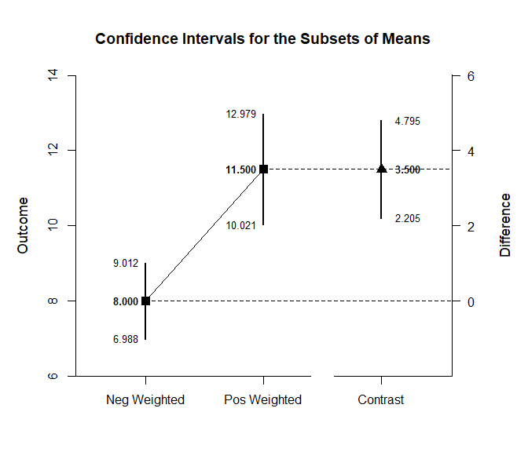<!-- -->

``` r
(MixedSummaryL2) |> plotMeanSubsets(MixedCorrL2, contrast = c(-1, .5, .5))
```

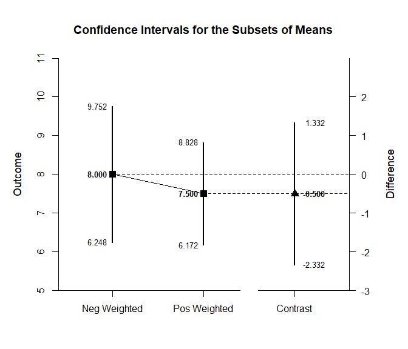<!-- -->

Of course, you can change the confidence level from the default 95% if
desired.

``` r
(MixedSummaryL1) |> estimateMeanSubsets(MixedCorrL1, contrast = c(-1, .5, .5), conf.level = .99)
```

    ## $`Confidence Intervals for the Mean Subsets`
    ##                  Est      SE      df      LL      UL
    ## Neg Weighted   8.000   0.447   9.000   6.547   9.453
    ## Pos Weighted  11.500   0.654   9.000   9.375  13.625
    ## 
    ## $`Confidence Interval for the Mean Contrast`
    ##              Est      SE      df      LL      UL
    ## Contrast   3.500   0.572   9.000   1.640   5.360

``` r
(MixedSummaryL2) |> estimateMeanSubsets(MixedCorrL2, contrast = c(-1, .5, .5), conf.level = .99)
```

    ## $`Confidence Intervals for the Mean Subsets`
    ##                  Est      SE      df      LL      UL
    ## Neg Weighted   8.000   0.774   9.000   5.483  10.517
    ## Pos Weighted   7.500   0.587   9.000   5.593   9.407
    ## 
    ## $`Confidence Interval for the Mean Contrast`
    ##              Est      SE      df      LL      UL
    ## Contrast  -0.500   0.810   9.000  -3.131   2.131

Once again, the confidence levels can be changed away from the default
and a region of practical equivalence can be added to the graph.

``` r
(MixedSummaryL1) |> plotMeanSubsets(MixedCorrL1, contrast = c(-1, .5, .5), labels = c("Outcome1", "Others"), conf.level = .99, rope = c(-2, 2))
```

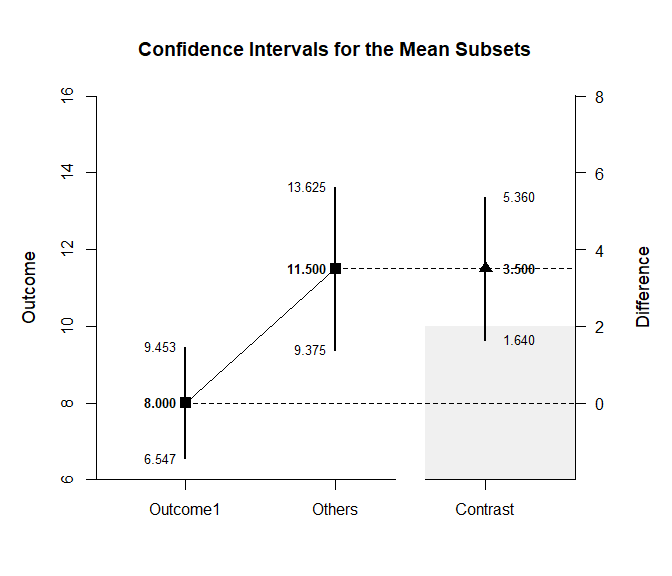<!-- -->

``` r
(MixedSummaryL2) |> plotMeanSubsets(MixedCorrL2, contrast = c(-1, .5, .5), labels = c("Outcome1", "Others"), conf.level = .99, rope = c(-2, 2))
```

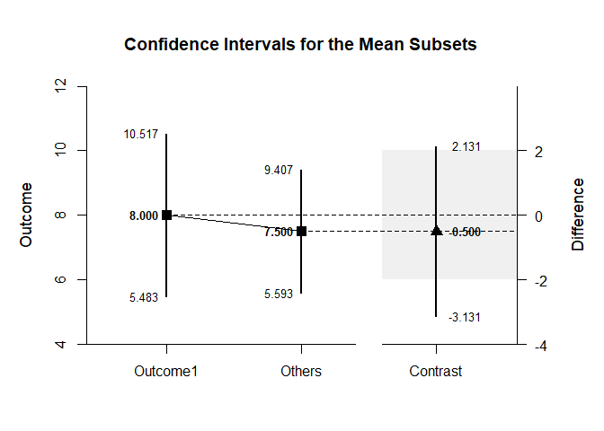<!-- -->

#### Significance Tests

This code produces a NHST for the identified contrast. It tests the
contrast against a value of zero by default.

``` r
(MixedSummaryL1) |> testMeanContrast(MixedCorrL1, contrast = c(-1, .5, .5))
```

    ## $`Hypothesis Test for the Mean Contrast`
    ##              Est      SE      df       t       p
    ## Contrast   3.500   0.572   9.000   6.116   0.000

``` r
(MixedSummaryL2) |> testMeanContrast(MixedCorrL2, contrast = c(-1, .5, .5))
```

    ## $`Hypothesis Test for the Mean Contrast`
    ##              Est      SE      df       t       p
    ## Contrast  -0.500   0.810   9.000  -0.618   0.552

If desired, the contrast can be tested against other values.

``` r
(MixedSummaryL1) |> testMeanContrast(MixedCorrL1, contrast = c(-1, .5, .5), mu = 4)
```

    ## $`Hypothesis Test for the Mean Contrast`
    ##              Est      SE      df       t       p
    ## Contrast  -0.500   0.572   9.000  -0.874   0.405

``` r
(MixedSummaryL2) |> testMeanContrast(MixedCorrL2, contrast = c(-1, .5, .5), mu = 4)
```

    ## $`Hypothesis Test for the Mean Contrast`
    ##              Est      SE      df       t       p
    ## Contrast  -4.500   0.810   9.000  -5.558   0.000

#### Standardized Effect Sizes

This code calculates a standardized contrast and its confidence
interval.

``` r
(MixedSummaryL1) |> estimateStandardizedMeanContrast(MixedCorrL1, contrast = c(-1, .5, .5))
```

    ## $`Confidence Interval for the Standardized Mean Contrast`
    ##              Est      SE      LL      UL
    ## Contrast   1.689   0.371   0.962   2.415

``` r
(MixedSummaryL2) |> estimateStandardizedMeanContrast(MixedCorrL2, contrast = c(-1, .5, .5))
```

    ## $`Confidence Interval for the Standardized Mean Contrast`
    ##              Est      SE      LL      UL
    ## Contrast  -0.224   0.341  -0.892   0.443

The width of the confidence interval for the effect size can be altered
if desired.

``` r
(MixedSummaryL1) |> estimateStandardizedMeanContrast(MixedCorrL1, contrast = c(-1, .5, .5), conf.level = .99)
```

    ## $`Confidence Interval for the Standardized Mean Contrast`
    ##              Est      SE      LL      UL
    ## Contrast   1.689   0.371   0.734   2.644

``` r
(MixedSummaryL2) |> estimateStandardizedMeanContrast(MixedCorrL2, contrast = c(-1, .5, .5), conf.level = .99)
```

    ## $`Confidence Interval for the Standardized Mean Contrast`
    ##              Est      SE      LL      UL
    ## Contrast  -0.224   0.341  -1.102   0.653
