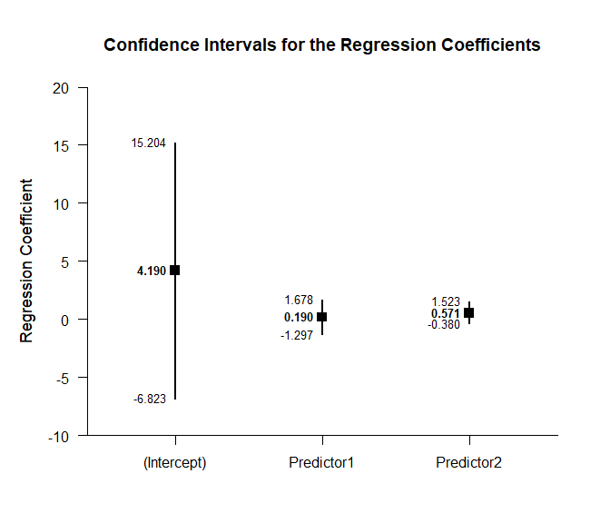
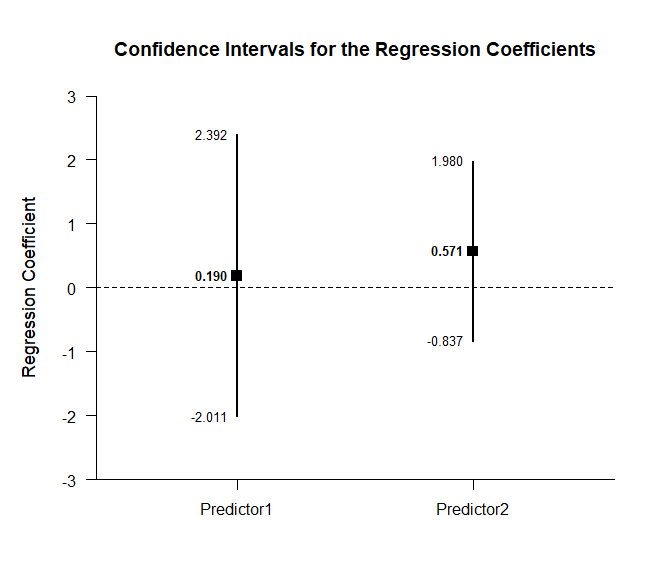
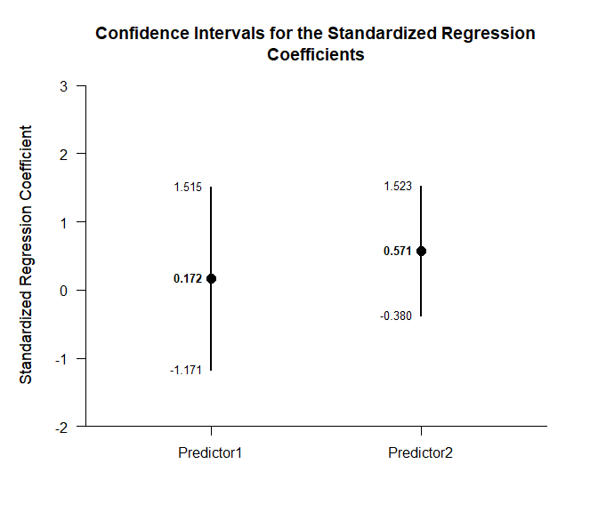
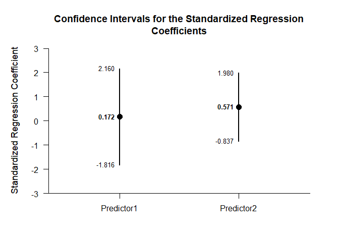

## Multiple Regression Data Example

This page analyzes multiple regression models using raw data input.

- [Data Management](#data-management)
  - [Data Entry](#data-entry)
  - [Descriptive Statistics](#descriptive-statistics)
- [Analyses of the Overall Model](#analyses-of-the-overall-model)
  - [Confidence Interval](#confidence-interval)
  - [Significance Test](#significance-test)
- [Analyses of the Regression
  Coefficients](#analyses-of-the-regression-coefficients)
  - [Confidence Intervals](#confidence-intervals)
  - [Significance Tests](#significance-tests)
  - [Standardized Coefficients](#standardized-coefficients)

------------------------------------------------------------------------

### Data Management

#### Data Entry

This code inputs the variable names and creates a viewable data frame.

``` r
Predictor1 <- c(6, 8, 6, 8, 10, 8, 10, 9, 8, 7)
Predictor2 <- c(7, 13, 11, 10, 13, 8, 11, 14, 12, 11)
Criterion <- c(9, 16, 11, 12, 15, 13, 9, 14, 11, 10)
RegressionData <- construct(Predictor1, Predictor2, Criterion)
```

#### Descriptive Statistics

This code obtains the descriptive statistics for the data frame.

``` r
(RegressionData) |> describeMeans()
```

    ## $`Descriptive Statistics for the Data`
    ##                  N       M      SD    Skew    Kurt
    ## Predictor1  10.000   8.000   1.414   0.000  -0.738
    ## Predictor2  10.000  11.000   2.211  -0.617  -0.212
    ## Criterion   10.000  12.000   2.449   0.340  -1.102

``` r
(RegressionData) |> describeCorrelations()
```

    ## $`Correlation Matrix for the Variables`
    ##            Predictor1 Predictor2 Criterion
    ## Predictor1      1.000      0.533     0.385
    ## Predictor2      0.533      1.000     0.574
    ## Criterion       0.385      0.574     1.000

### Analyses of the Overall Model

This section produces analyses of the overall regression model.

#### Confidence Interval

This code will produce the confidence interval for R Squared.

``` r
(RegressionData) |> estimateRegressionOmnibus()
```

    ## $`Proportion of Variance Accounted For by the Regression Model`
    ##           Est      LL      UL
    ## Model   0.339   0.000   0.549

The code defaults to 90% confidence intervals. This can be changed if
desired.

``` r
(RegressionData) |> estimateRegressionOmnibus(conf.level = .95)
```

    ## $`Proportion of Variance Accounted For by the Regression Model`
    ##           Est      LL      UL
    ## Model   0.339   0.000   0.598

#### Significance Test

This code will produce a source table associated with the regression
model.

``` r
(RegressionData) |> describeRegressionOmnibus()
```

    ## $`Source Table for the Regression Model`
    ##            SS      df      MS
    ## Model  18.286   2.000   9.143
    ## Error  35.714   7.000   5.102
    ## Total  54.000   9.000   6.000

This code will calculate NHST for the regression model.

``` r
(RegressionData) |> testRegressionOmnibus()
```

    ## $`Hypothesis Test for the Regression Model`
    ##             F     df1     df2       p
    ## Model   1.792   2.000   7.000   0.235

### Analyses of the Regression Coefficients

This section analyses the regression coefficients obtained from the
overall model.

#### Confidence Intervals

This code will provide a table of confidence intervals for each of the
regression coefficients.

``` r
(RegressionData) |> estimateRegressionCoefficients()
```

    ## $`Confidence Intervals for the Regression Coefficients`
    ##                 Est      SE      LL      UL
    ## (Intercept)   4.190   4.657  -6.823  15.204
    ## Predictor1    0.190   0.629  -1.297   1.678
    ## Predictor2    0.571   0.402  -0.380   1.523

This code will produce a graph of the confidence intervals for each of
the regression coefficients.

``` r
(RegressionData) |> plotRegressionCoefficients()
```

<!-- -->

The code defaults to 95% confidence intervals. This can be changed if
desired.

``` r
(RegressionData) |> estimateRegressionCoefficients(conf.level = .99)
```

    ## $`Confidence Intervals for the Regression Coefficients`
    ##                 Est      SE      LL      UL
    ## (Intercept)   4.190   4.657 -12.108  20.489
    ## Predictor1    0.190   0.629  -2.011   2.392
    ## Predictor2    0.571   0.402  -0.837   1.980

For the graph, it is possible to plot just coefficients for the
predictors (minus the intercept) in addition to changing the confidence
level.

``` r
(RegressionData) |> plotRegressionCoefficients(conf.level = .99, line = 0, intercept = FALSE)
```

<!-- -->

#### Significance Tests

This code will produce a table of NHST separately for each of the
regression coefficients. In this case, all the coefficients are tested
against a value of zero.

``` r
(RegressionData) |> testRegressionCoefficients()
```

    ## $`Hypothesis Tests for the Regression Coefficients`
    ##                 Est      SE       t       p
    ## (Intercept)   4.190   4.657   0.900   0.398
    ## Predictor1    0.190   0.629   0.303   0.771
    ## Predictor2    0.571   0.402   1.420   0.199

#### Standardized Coefficients

This code will provide a table of confidence intervals for each of the
standardized coefficients.

``` r
(RegressionData) |> estimateStandardizedRegressionCoefficients()
```

    ## $`Confidence Intervals for the Standardized Regression Coefficients`
    ##                Est      SE      LL      UL
    ## Predictor1   0.172   0.568  -1.171   1.515
    ## Predictor2   0.571   0.402  -0.380   1.523

This code will produce a graph of the confidence intervals for each of
the standardized coefficients.

``` r
(RegressionData) |> plotStandardizedRegressionCoefficients()
```

<!-- -->

As in other places, the code defaults to 95% confidence intervals. This
can be changed if desired.

``` r
(RegressionData) |> estimateStandardizedRegressionCoefficients(conf.level = .99)
```

    ## $`Confidence Intervals for the Standardized Regression Coefficients`
    ##                Est      SE      LL      UL
    ## Predictor1   0.172   0.568  -1.816   2.160
    ## Predictor2   0.571   0.402  -0.837   1.980

For the graph, it is possible to change the confidence level.

``` r
(RegressionData) |> plotStandardizedRegressionCoefficients(conf.level = .99)
```

<!-- -->
