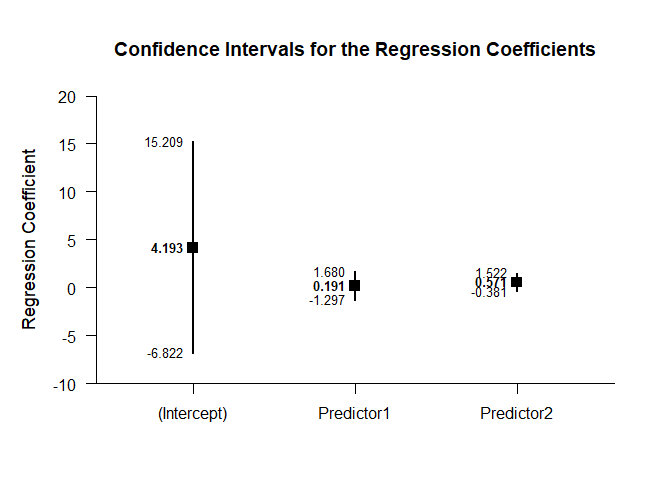
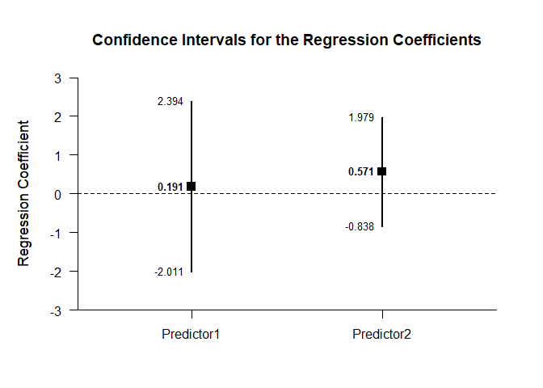
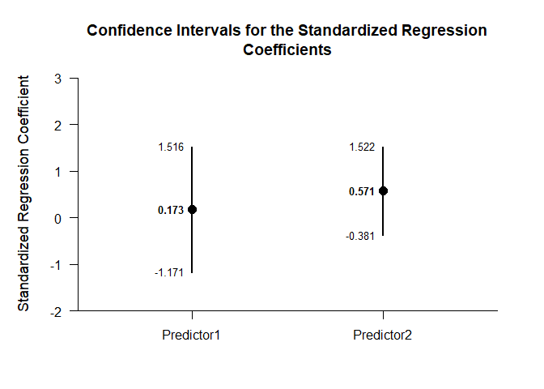
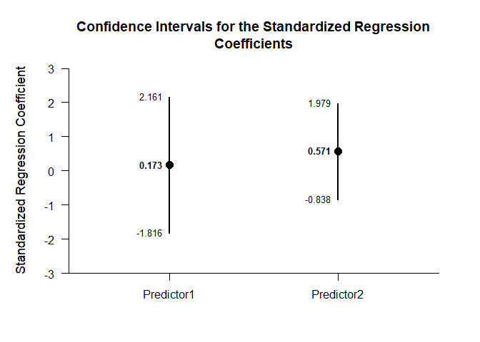

## Multiple Regression Summary Statistics Example

This page analyzes multiple regression models using summary statistics
input.

- [Data Management](#data-management)
  - [Data Entry](#data-entry)
  - [Summary Statistics](#summary-statistics)
- [Analyses of the Overall Model](#analyses-of-the-overall-model)
  - [Confidence Interval](#confidence-interval)
  - [Significance Test](#significance-test)
- [Analyses of the Regression
  Coefficients](#analyses-of-the-regression-coefficients)
  - [Confidence Intervals](#confidence-intervals)
  - [Significance Tests](#significance-tests)
  - [Standardized Coefficients](#standardized-coefficients)

------------------------------------------------------------------------

### Data Management

#### Data Entry

This code inputs the variable summaries and creates a summary table.

``` r
Predictor1 <- c(N = 10, M = 8.000, SD = 1.414)
Predictor2 <- c(N = 10, M = 11.000, SD = 2.211)
Criterion <- c(N = 10, M = 12.000, SD = 2.449)
RegressionSummary <- construct(Predictor1, Predictor2, Criterion, type = "wss")
```

This code creates a correlation matrix.

``` r
Predictor1 <- c(1.000, .533, .385)
Predictor2 <- c(.533, 1.000, .574)
Criterion <- c(.385, .574, 1.000)
RegressionCorr <- construct(Predictor1, Predictor2, Criterion, type = "corr")
```

#### Summary Statistics

This code confirms the descriptive statistics from the summary tables.

``` r
(RegressionSummary) |> describeSummary()
```

    ## $`Summary Statistics for the Data`
    ##                  N       M      SD
    ## Predictor1  10.000   8.000   1.414
    ## Predictor2  10.000  11.000   2.211
    ## Criterion   10.000  12.000   2.449

``` r
(RegressionCorr) |> describeCorrelations()
```

    ## $`Correlation Matrix for the Variables`
    ##            Predictor1 Predictor2 Criterion
    ## Predictor1      1.000      0.533     0.385
    ## Predictor2      0.533      1.000     0.574
    ## Criterion       0.385      0.574     1.000

### Analyses of the Overall Model

This section produces analyses of the overall regression model.

This code will produce a source table associated with the regression
model.

``` r
(RegressionSummary) |> describeRegressionEffect(RegressionCorr)
```

    ## $`Source Table for the Regression Model`
    ##            SS      df      MS
    ## Model  18.256   2.000   9.128
    ## Error  35.723   7.000   5.103
    ## Total  53.978   9.000   5.998

#### Confidence Interval

This code will produce the confidence interval for R Squared.

``` r
(RegressionSummary) |> estimateRegressionEffect(RegressionCorr)
```

    ## $`Proportion of Variance Accounted For by the Regression Model`
    ##           Est      LL      UL
    ## Model   0.338   0.000   0.548

The code defaults to 90% confidence intervals. This can be changed if
desired.

``` r
(RegressionSummary) |> estimateRegressionEffect(RegressionCorr, conf.level = .95)
```

    ## $`Proportion of Variance Accounted For by the Regression Model`
    ##           Est      LL      UL
    ## Model   0.338   0.000   0.598

#### Significance Test

This code will calculate NHST for the regression model.

``` r
(RegressionSummary) |> testRegressionEffect(RegressionCorr)
```

    ## $`Hypothesis Test for the Regression Model`
    ##             F     df1     df2       p
    ## Model   1.789   2.000   7.000   0.236

### Analyses of the Regression Coefficients

This section analyses the regression coefficients obtained from the
overall model.

#### Confidence Intervals

This code will provide a table of confidence intervals for each of the
regression coefficients.

``` r
(RegressionSummary) |> estimateRegressionCoefficients(RegressionCorr)
```

    ## $`Confidence Intervals for the Regression Coefficients`
    ##                 Est      SE      LL      UL
    ## (Intercept)   4.193   4.659  -6.822  15.209
    ## Predictor1    0.191   0.629  -1.297   1.680
    ## Predictor2    0.571   0.403  -0.381   1.522

This code will produce a graph of the confidence intervals for each of
the regression coefficients.

``` r
(RegressionSummary) |> plotRegressionCoefficients(RegressionCorr)
```

<!-- -->

The code defaults to 95% confidence intervals. This can be changed if
desired.

``` r
(RegressionSummary) |> estimateRegressionCoefficients(RegressionCorr, conf.level = .99)
```

    ## $`Confidence Intervals for the Regression Coefficients`
    ##                 Est      SE      LL      UL
    ## (Intercept)   4.193   4.659 -12.109  20.496
    ## Predictor1    0.191   0.629  -2.011   2.394
    ## Predictor2    0.571   0.403  -0.838   1.979

For the graph, it is possible to plot just coefficients for the
predictors (minus the intercept) in addition to changing the confidence
level.

``` r
(RegressionSummary) |> plotRegressionCoefficients(RegressionCorr, conf.level = .99, line = 0, intercept = FALSE)
```

<!-- -->

#### Significance Tests

This code will produce a table of NHST separately for each of the
regression coefficients. In this case, all the coefficients are tested
against a value of zero.

``` r
(RegressionSummary) |> testRegressionCoefficients(RegressionCorr)
```

    ## $`Hypothesis Tests for the Regression Coefficients`
    ##                 Est      SE       t       p
    ## (Intercept)   4.193   4.659   0.900   0.398
    ## Predictor1    0.191   0.629   0.304   0.770
    ## Predictor2    0.571   0.403   1.418   0.199

#### Standardized Coefficients

This code will provide a table of confidence intervals for each of the
standardized coefficients.

``` r
(RegressionSummary) |> estimateStandardizedRegressionCoefficients(RegressionCorr)
```

    ## $`Confidence Intervals for the Standardized Regression Coefficients`
    ##                Est      SE      LL      UL
    ## Predictor1   0.173   0.568  -1.171   1.516
    ## Predictor2   0.571   0.403  -0.381   1.522

This code will produce a graph of the confidence intervals for each of
the standardized coefficients.

``` r
(RegressionSummary) |> plotStandardizedRegressionCoefficients(RegressionCorr)
```

<!-- -->

As in other places, the code defaults to 95% confidence intervals. This
can be changed if desired.

``` r
(RegressionSummary) |> estimateStandardizedRegressionCoefficients(RegressionCorr, conf.level = .99)
```

    ## $`Confidence Intervals for the Standardized Regression Coefficients`
    ##                Est      SE      LL      UL
    ## Predictor1   0.173   0.568  -1.816   2.161
    ## Predictor2   0.571   0.403  -0.838   1.979

For the graph, it is possible to change the confidence level.

``` r
(RegressionSummary) |> plotStandardizedRegressionCoefficients(RegressionCorr, conf.level = .99)
```

<!-- -->
