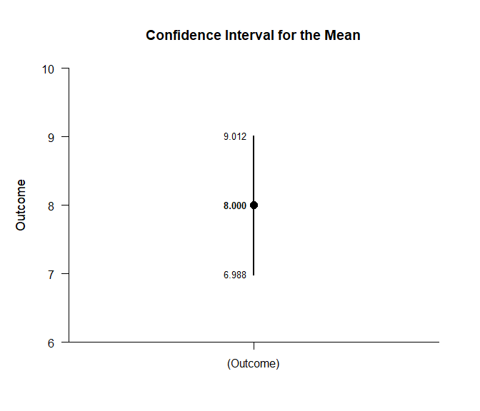
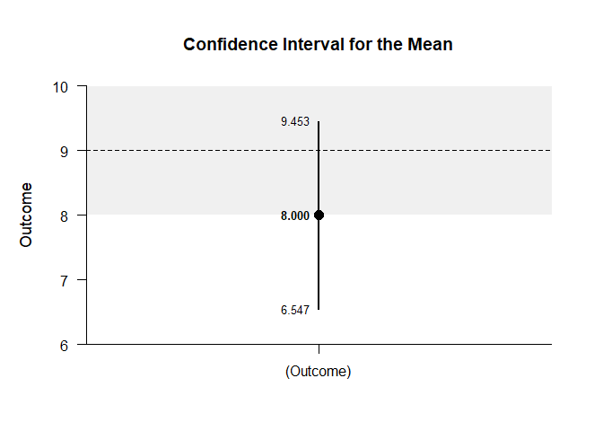

## One Sample Data Example

This page analyzes a single-group (one sample) design using raw data
input.

- [Data Management](#data-management)
  - [Data Entry](#data-entry)
  - [Summary Statistics](#summary-statistics)
- [Analyses of the Mean](#analyses-of-the-mean)
  - [Confidence Interval](#confidence-interval)
  - [Significance Test](#significance-test)
  - [Standardized Effect Size](#standardized-effect-size)

------------------------------------------------------------------------

### Data Management

#### Data Entry

This code inputs the variable name and creates a viewable data frame.

``` r
Outcome <- c(6, 8, 6, 8, 10, 8, 10, 9, 8, 7)
OneSampleData <- construct(Outcome)
```

#### Summary Statistics

This code obtains the descriptive statistics for the data frame.

``` r
(Outcome) |> describeSummary()
```

    ## $`Summary Statistics for the Data`
    ##                 N       M      SD    Skew    Kurt
    ## (Outcome)  10.000   8.000   1.414   0.000  -0.738

### Analyses of the Mean

This section produces analyses that are equivalent to one-sample
analyses for the variable.

#### Confidence Interval

This code will provide a confidence interval for the variable.

``` r
(Outcome) |> estimateMeans()
```

    ## $`Confidence Interval for the Mean`
    ##                 M      SE      df      LL      UL
    ## (Outcome)   8.000   0.447   9.000   6.988   9.012

This code will produce a graph of the confidence interval for the
variable.

``` r
(Outcome) |> plotMeans()
```

<!-- -->

The code defaults to 95% confidence intervals. This can be changed if
desired.

``` r
(Outcome) |> estimateMeans(conf.level = .99)
```

    ## $`Confidence Interval for the Mean`
    ##                 M      SE      df      LL      UL
    ## (Outcome)   8.000   0.447   9.000   6.547   9.453

For the graph, it is possible to add a comparison line to represent a
population (or test) value and a region of practical equivalence in
addition to changing the confidence level.

``` r
(Outcome) |> plotMeans(conf.level = .99, line = 9, rope = c(8, 10))
```

<!-- -->

#### Significance Test

This code will produce a table of NHST for the variable. In this case,
the mean is tested against a value of zero.

``` r
(Outcome) |> testMeans()
```

    ## $`Hypothesis Test for the Mean`
    ##              Diff      SE      df       t       p
    ## (Outcome)   8.000   0.447   9.000  17.889   0.000

Often, the default test value of zero is not meaningful or plausible.
This too can be altered (often in conjunction with what is presented in
the plot).

``` r
(Outcome) |> testMeans(mu = 9)
```

    ## $`Hypothesis Test for the Mean`
    ##              Diff      SE      df       t       p
    ## (Outcome)  -1.000   0.447   9.000  -2.236   0.052

#### Standardized Effect Size

This code will provide the standardized mean difference for the
variable. In this case, the mean is compared to zero to form the effect
size.

``` r
(Outcome) |> estimateStandardizedMeans()
```

    ## $`Confidence Interval for the Standardized Mean`
    ##                 d      SE      LL      UL
    ## (Outcome)   5.657   1.251   3.005   8.295

Here too it is possible to alter the width of the confidence interval
and to establish a more plausible comparison value for the mean.

``` r
(Outcome) |> estimateStandardizedMeans(mu = 9, conf.level = .99)
```

    ## $`Confidence Interval for the Standardized Mean`
    ##                 d      SE      LL      UL
    ## (Outcome)  -0.707   0.364  -1.614   0.222
