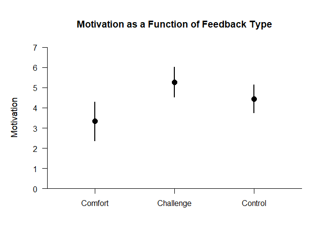
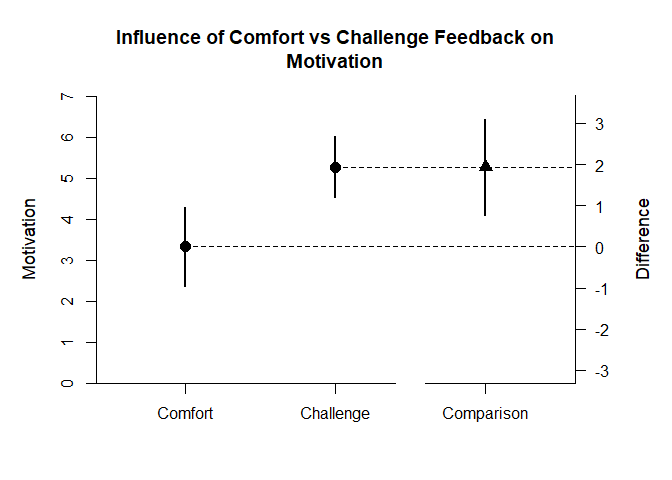
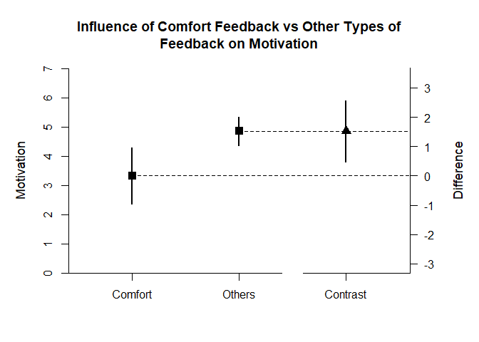

## Rattan Data Example

### Data Management

Prior to analyses, enter the data.


```r
Feedback <- c(1,1,1,1,1,1,1,1,1,1,1,1,1,1,1,1,1,1,2,2,2,2,2,2,2,2,2,2,2,2,2,2,2,2,2,3,3,3,3,3,3,3,3,3,3,3,3,3,3,3,3,3,3,3)
Motivation <- c(5.5,5,5.5,6,1,2.5,4.5,1,3.5,1.5,5.5,6,1.5,1,3.5,2.5,3,1,2,6,4.5,4.5,6,7,3,7,3.5,5,4.5,5.5,6.5,6,6,7,5.5,6,2.5,4.5,3.5,6,5,6,3.5,4,3,5.5,3,6,3,5,6,6.5,3.5,2)
Feedback <- factor(Feedback,levels=c(1,2,3),labels=c("Comfort","Challenge","Control"))
RattanData <- data.frame(Feedback,Motivation)
```

### Analyses of the Different Groups

With multiple groups, it is useful to get descriptive statistics and confidence intervals for each group.


```r
estimateMeans(Motivation~Feedback)
```

```
## $`Confidence Intervals for the Means`
##                 M      SE      df      LL      UL
## Comfort     3.333   0.452  17.000   2.380   4.287
## Challenge   5.265   0.351  16.000   4.520   6.009
## Control     4.447   0.329  18.000   3.757   5.138
```

It is also useful to view the means and confidence intervals of the groups in a plot.


```r
plotMeans(Motivation~Feedback,main="Motivation as a Function of Feedback Type",ylab="Motivation")
```

<!-- -->

### Analysis of a Group Difference

The first research question is whether there is a difference between the two non-control groups.

First, set the comparison and obtain the difference plot for that comparison.


```r
Comparison <- factor(Feedback,c("Comfort","Challenge"))
plotMeanComparison(Motivation~Comparison,main="Influence of Comfort vs Challenge Feedback on Motivation",ylab="Motivation")
```

<!-- -->

Then, obtain the standardized effect size for that comparison.


```r
estimateStandardizedMeanDifference(Motivation~Comparison)
```

```
## $`Confidence Interval for the Standardized Mean Difference`
##                  d      SE      LL      UL
## Comparison   1.137   0.376   0.401   1.873
```

### Analysis of a Group Contrast

The second research question is whether the Comfort group differs from the other two groups.

First, set the contrast and obtain a difference plot for the contrast.


```r
ComfortvsOthers <- c(-1,.5,.5)
plotMeanSubsets(Motivation~Feedback,contrast=ComfortvsOthers,labels=c("Comfort","Others"),main="Influence of Comfort Feedback vs \n Other Types of Feedback on Motivation",ylab="Motivation")
```

<!-- -->

Then, estimate the standardized contrast.


```r
estimateStandardizedMeanContrast(Motivation~Feedback,contrast=ComfortvsOthers)
```

```
## $`Confidence Interval for the Standardized Mean Contrast`
##              Est      SE      LL      UL
## Contrast   0.943   0.340   0.276   1.610
```
