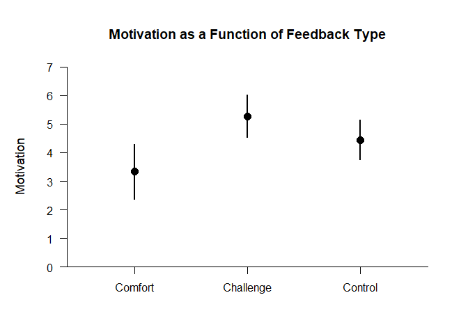
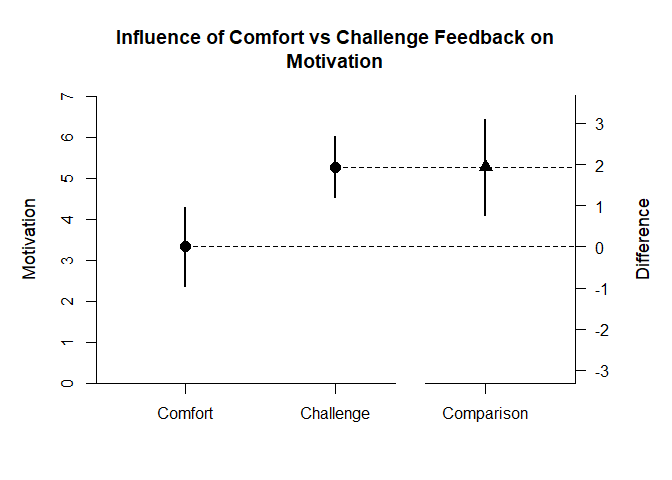
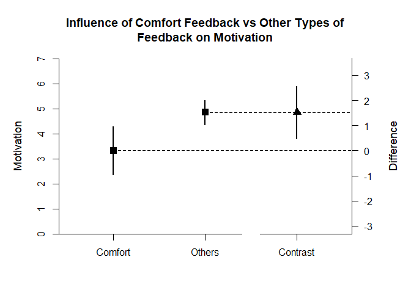

## Rattan Summary Statistics Example

This page analyzes a single-factor between-subjects (one-way) design using summary statistics input.

### Data Management

Prior to analyses, enter a table of summary statistics.


```r
Comfort <- c(N=18,M=3.333,SD=1.917)
Challenge <- c(N=17,M=5.265,SD=1.448)
Control <- c(N=19,M=4.447,SD=1.433)
RattanSummary <- rbind(Comfort,Challenge,Control)
class(RattanSummary) <- "bss"
```

### Analyses of the Different Groups

With multiple groups, it is useful to get descriptive statistics and confidence intervals for each group.


```r
estimateMeans(RattanSummary)
```

```
## $`Confidence Intervals for the Means`
##                 M      SE      df      LL      UL
## Comfort     3.333   0.452  17.000   2.380   4.286
## Challenge   5.265   0.351  16.000   4.521   6.009
## Control     4.447   0.329  18.000   3.756   5.138
```

```r
plotMeans(RattanSummary,main="Motivation as a Function of Feedback Type",ylab="Motivation",ylim=c(0,7),values=FALSE)
```

<!-- -->

### Analysis of a Group Difference

The first research question is whether there is a difference between the two non-control groups.

First, set the comparison and obtain the difference plot for that comparison.


```r
ComfortvsChallenge <- rbind(Comfort,Challenge)
class(ComfortvsChallenge) <- "bss"
estimateMeanComparison(ComfortvsChallenge)
```

```
## $`Confidence Intervals for the Means`
##                 M      SE      df      LL      UL
## Comfort     3.333   0.452  17.000   2.380   4.286
## Challenge   5.265   0.351  16.000   4.521   6.009
## 
## $`Confidence Interval for the Mean Difference`
##               Diff      SE      df      LL      UL
## Comparison   1.932   0.572  31.521   0.766   3.098
```

```r
plotMeanComparison(ComfortvsChallenge,main="Influence of Comfort vs Challenge Feedback on Motivation",ylab="Motivation",ylim=c(0,7),values=FALSE)
```

<!-- -->

Then, obtain the standardized effect size for that comparison.


```r
estimateStandardizedMeanDifference(ComfortvsChallenge)
```

```
## $`Confidence Interval for the Standardized Mean Difference`
##                  d      SE      LL      UL
## Comparison   1.137   0.376   0.401   1.873
```

### Analysis of a Group Contrast

The second research question is whether the Comfort group differs from the other two groups.

First, set the contrast and obtain a difference plot for the contrast.


```r
ComfortvsOthers <- c(-1,.5,.5)
estimateMeanSubsets(RattanSummary,contrast=ComfortvsOthers)
```

```
## $`Confidence Intervals for the Mean Subsets`
##                  Est      SE      df      LL      UL
## Neg Weighted   3.333   0.452  17.000   2.380   4.286
## Pos Weighted   4.856   0.241  33.477   4.367   5.345
## 
## $`Confidence Interval for the Mean Contrast`
##              Est      SE      df      LL      UL
## Contrast   1.523   0.512  26.903   0.473   2.573
```

```r
plotMeanSubsets(RattanSummary,contrast=ComfortvsOthers,labels=c("Comfort","Others"),main="Influence of Comfort Feedback vs \n Other Types of Feedback on Motivation",ylab="Motivation",ylim=c(0,7),values=FALSE)
```

<!-- -->

Then, estimate the standardized contrast.


```r
estimateStandardizedMeanContrast(RattanSummary,contrast=ComfortvsOthers)
```

```
## $`Confidence Interval for the Standardized Mean Contrast`
##              Est      SE      LL      UL
## Contrast   0.943   0.340   0.276   1.610
```
