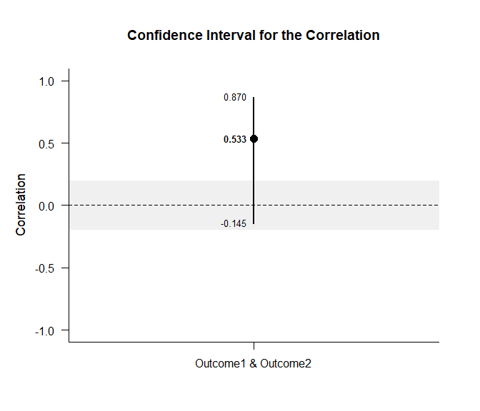
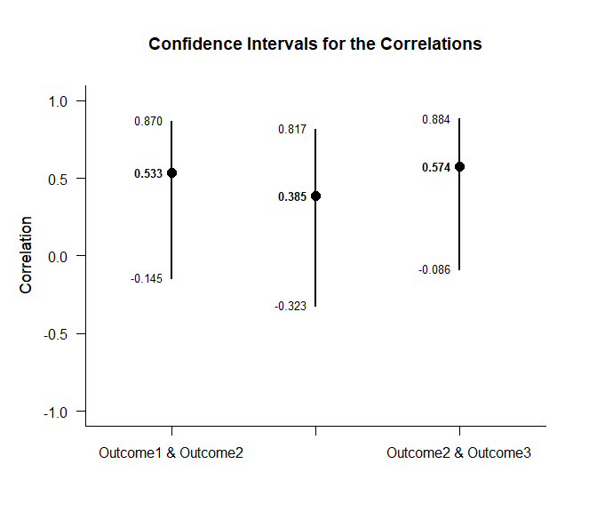

## Set of Correlations Data Example

This page analyzes ba set of correlations among variables using raw data
input.

- [Data Management](#data-management)
  - [Data Entry](#data-entry)
  - [Summary Statistics](#summary-statistics)
- [Analyses of a Correlation](#analyses-of-a-correlation)
  - [Confidence Interval](#confidence-interval)
  - [Significance Test](#significance-test)
- [Analyses of Several Correlations](#analyses-of-several-correlations)
  - [Confidence Intervals](#confidence-intervals)
  - [Significance Tests](#significance-tests)

------------------------------------------------------------------------

### Data Management

#### Data Entry

This code inputs the variable names and creates a viewable data frame.

``` r
Outcome1 <- c(6, 8, 6, 8, 10, 8, 10, 9, 8, 7)
Outcome2 <- c(7, 13, 11, 10, 13, 8, 11, 14, 12, 11)
Outcome3 <- c(9, 16, 11, 12, 15, 13, 9, 14, 11, 10)
RepeatedData <- construct(Outcome1, Outcome2, Outcome3)
```

#### Summary Statistics

This code obtains the descriptive statistics for the data frame.

``` r
(RepeatedData) |> describeSummary()
```

    ## $`Summary Statistics for the Data`
    ##                N       M      SD    Skew    Kurt
    ## Outcome1  10.000   8.000   1.414   0.000  -0.738
    ## Outcome2  10.000  11.000   2.211  -0.617  -0.212
    ## Outcome3  10.000  12.000   2.449   0.340  -1.102

``` r
(RepeatedData) |> describeCorrelations()
```

    ## $`Correlation Matrix for the Variables`
    ##          Outcome1 Outcome2 Outcome3
    ## Outcome1    1.000    0.533    0.385
    ## Outcome2    0.533    1.000    0.574
    ## Outcome3    0.385    0.574    1.000

### Analyses of a Correlation

This section produces analyses of a single correlation.

#### Confidence Interval

This code will provide the confidence interval for the correlation.

``` r
(RepeatedData) |> pick(Outcome1, Outcome2) |> estimateCorrelations()
```

    ## $`Confidence Interval for the Correlation`
    ##                           R      SE      LL      UL
    ## Outcome1 & Outcome2   0.533   0.378  -0.145   0.870

This code will produce a graph of the confidence interval for the
correlation.

``` r
(RepeatedData) |> pick(Outcome1, Outcome2) |> plotCorrelations()
```

<!-- -->

The code defaults to 95% confidence intervals. This can be changed if
desired.

``` r
(RepeatedData) |> pick(Outcome1, Outcome2) |> estimateCorrelations(conf.level = .99)
```

    ## $`Confidence Interval for the Correlation`
    ##                           R      SE      LL      UL
    ## Outcome1 & Outcome2   0.533   0.378  -0.362   0.917

Of course, it is possible to change from the default confidence level in
the graph. It is also possible to add a comparison value and a region of
practical equivalence.

``` r
(RepeatedData) |> pick(Outcome1, Outcome2) |> plotCorrelations(conf.level = .99, line = 0, rope = c(-.2, .2))
```

<!-- -->

#### Significance Test

This code will produce a table of NHST for the correlation (against a
value of zero).

``` r
(RepeatedData) |> pick(Outcome1, Outcome2) |> testCorrelations()
```

    ## $`Hypothesis Test for the Correlation`
    ##                           R      SE      df       t       p
    ## Outcome1 & Outcome2   0.533   0.299   8.000   1.782   0.113

### Analyses of Several Correlations

This section analyzes the correlations among multiple variables.

#### Confidence Intervals

This code will provide the confidence intervals for the correlations.

``` r
(RepeatedData) |> estimateCorrelations()
```

    ## $`Confidence Intervals for the Correlations`
    ##                           R      SE      LL      UL
    ## Outcome1 & Outcome2   0.533   0.378  -0.145   0.870
    ## Outcome1 & Outcome3   0.385   0.378  -0.323   0.817
    ## Outcome2 & Outcome3   0.574   0.378  -0.086   0.884

This code will produce a graph of the confidence intervals for the
correlations.

``` r
(RepeatedData) |> plotCorrelations()
```

<!-- -->

The code defaults to 95% confidence intervals. This can be changed if
desired.

``` r
(RepeatedData) |> estimateCorrelations(conf.level = .99)
```

    ## $`Confidence Intervals for the Correlations`
    ##                           R      SE      LL      UL
    ## Outcome1 & Outcome2   0.533   0.378  -0.362   0.917
    ## Outcome1 & Outcome3   0.385   0.378  -0.514   0.881
    ## Outcome2 & Outcome3   0.574   0.378  -0.309   0.926

Of course, it is possible to change from the default confidence level in
the graph. It is also possible to add a comparison value and a region of
practical equivalence.

``` r
(RepeatedData) |> plotCorrelations(conf.level = .99, line = 0, rope = c(-.2, .2))
```

<!-- -->

#### Significance Tests

This code will produce a table of NHST for the correlations (against a
value of zero).

``` r
(RepeatedData) |> testCorrelations()
```

    ## $`Hypothesis Tests for the Correlations`
    ##                           R      SE      df       t       p
    ## Outcome1 & Outcome2   0.533   0.299   8.000   1.782   0.113
    ## Outcome1 & Outcome3   0.385   0.326   8.000   1.180   0.272
    ## Outcome2 & Outcome3   0.574   0.289   8.000   1.985   0.082
