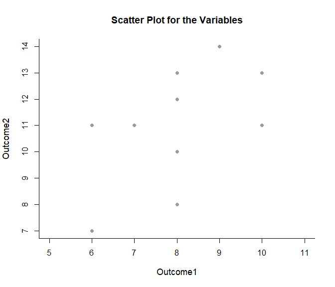
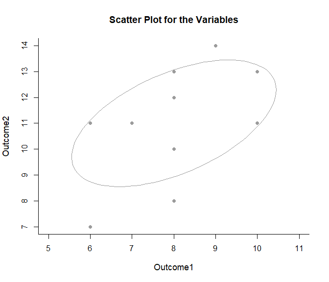
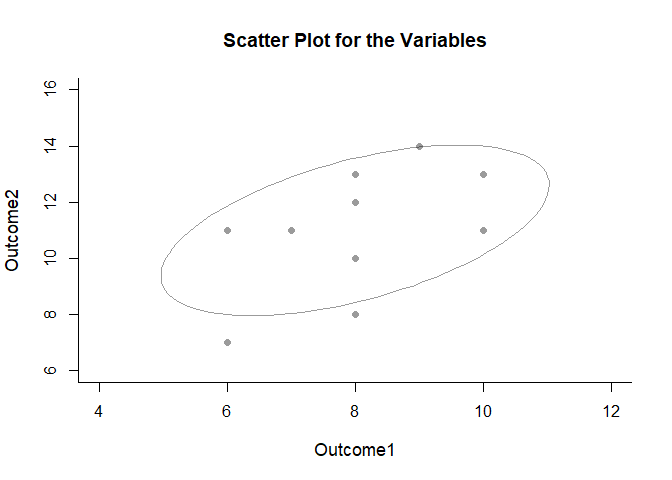
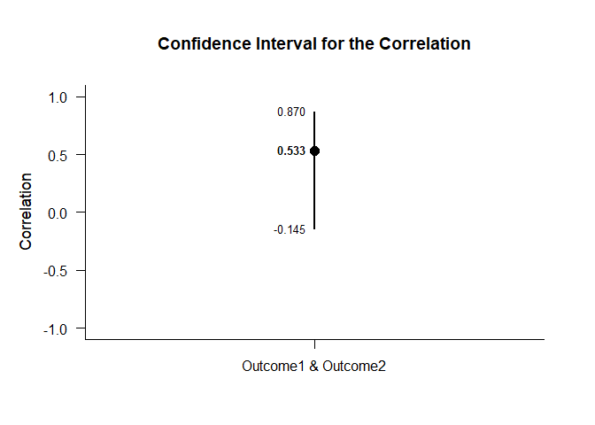
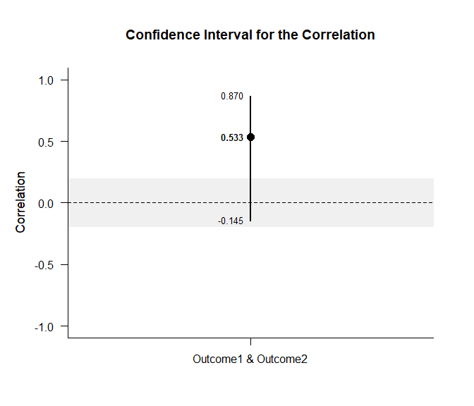

## Single Correlation Data Example

This page analyzes a single correlation between two variables using raw
data input.

- [Data Management](#data-management)
  - [Data Entry](#data-entry)
  - [Summary Statistics](#summary-statistics)
  - [Plot of the Data](#plot-of-the-data)
- [Analyses of a Correlation](#analyses-of-a-correlation)
  - [Confidence Interval](#confidence-interval)
  - [Significance Test](#significance-test)

------------------------------------------------------------------------

### Data Management

#### Data Entry

This code inputs the variable names and creates a viewable data frame.

``` r
Outcome1 <- c(6, 8, 6, 8, 10, 8, 10, 9, 8, 7)
Outcome2 <- c(7, 13, 11, 10, 13, 8, 11, 14, 12, 11)
PairedData <- construct(Outcome1, Outcome2)
```

#### Summary Statistics

This code obtains the descriptive statistics for the data frame.

``` r
(PairedData) |> describeSummary()
```

    ## $`Descriptive Statistics for the Data`
    ##                N       M      SD    Skew    Kurt
    ## Outcome1  10.000   8.000   1.414   0.000  -0.738
    ## Outcome2  10.000  11.000   2.211  -0.617  -0.212

``` r
(PairedData) |> describeCorrelations()
```

    ## $`Correlation Matrix for the Variables`
    ##          Outcome1 Outcome2
    ## Outcome1    1.000    0.533
    ## Outcome2    0.533    1.000

#### Plot of the Data

This code provides a scatterplot for the bivariate relationship.

``` r
(PairedData) |> plotScatter()
```

<!-- -->

This code provides a scatterplot along with a 95% confidence ellipse for
the data.

``` r
(PairedData) |> plotScatter(ellipse = TRUE)
```

<!-- -->

The ellipse can be altered for different confidence levels.

``` r
(PairedData) |> plotScatter(ellipse = TRUE, conf.level = .99)
```

<!-- -->

### Analyses of a Correlation

This section produces analyses of the correlation.

#### Confidence Interval

This code will provide the confidence interval for the correlation.

``` r
(PairedData) |> estimateCorrelations()
```

    ## $`Confidence Interval for the Correlation`
    ##                           R      SE      LL      UL
    ## Outcome1 & Outcome2   0.533   0.378  -0.145   0.870

This code will produce a graph of the confidence interval for the
correlation.

``` r
(PairedData) |> plotCorrelations()
```

<!-- -->

The code defaults to 95% confidence intervals. This can be changed if
desired.

``` r
(PairedData) |> estimateCorrelations(conf.level = .99)
```

    ## $`Confidence Interval for the Correlation`
    ##                           R      SE      LL      UL
    ## Outcome1 & Outcome2   0.533   0.378  -0.362   0.917

Of course, it is possible to change from the default confidence level
and to add a comparison line and a region of practical equivalence to
the graph.

``` r
(PairedData) |> plotCorrelations(conf.level = .99, line = 0, rope = c(-.2, .2))
```

<!-- -->

#### Significance Test

This code will produce a table of NHST for the correlation (against a
value of zero).

``` r
(PairedData) |> testCorrelations()
```

    ## $`Hypothesis Test for the Correlation`
    ##                           R      SE      df       t       p
    ## Outcome1 & Outcome2   0.533   0.299   8.000   1.782   0.113
