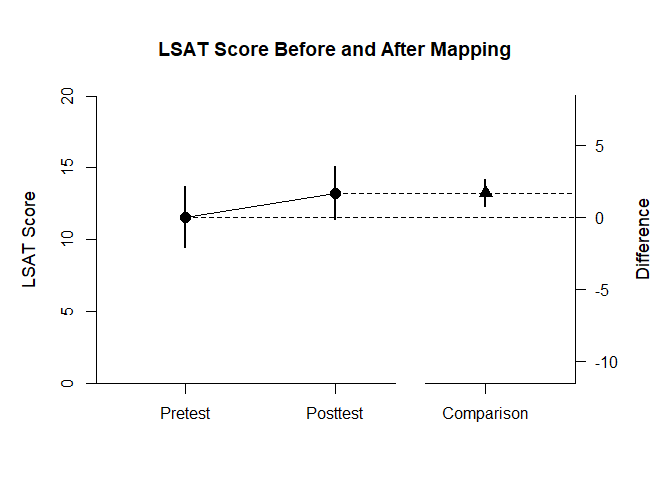
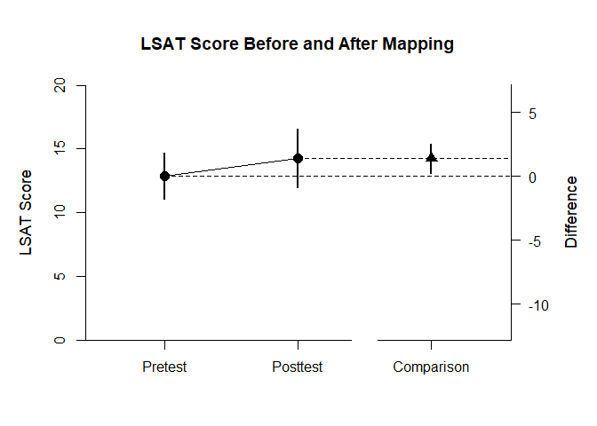
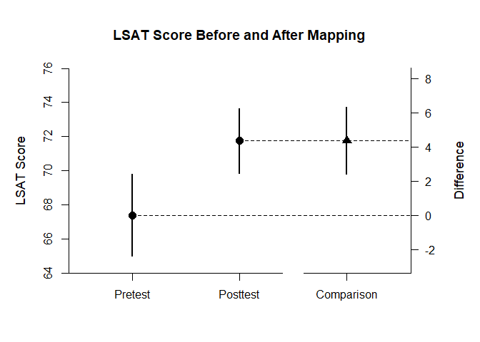

## Thomason Data Example

This page analyzes a within-subjects (paired samples) design for two time points using raw data input.

### Thomason1 Sample

Thomason1 focuses on the difference between pretest and posttest in the first sample. First, enter the data.


```r
Pretest <- c(13,12,12,9,14,17,14,9,6,7,11,15)
Posttest <- c(14,13,16,12,15,18,13,10,10,8,14,16)
Thomason1Data <- data.frame(Pretest,Posttest)
```

The primary emphasis of the analysis is to estimate and represent the difference between the two conditions.


```r
estimateMeanComparison(Thomason1Data)
```

```
## $`Confidence Intervals for the Means`
##                M      SE      df      LL      UL
## Pretest   11.583   0.957  11.000   9.477  13.690
## Posttest  13.250   0.836  11.000  11.410  15.090
## 
## $`Confidence Interval for the Mean Difference`
##               Diff      SE      df      LL      UL
## Comparison   1.667   0.432  11.000   0.715   2.618
```

```r
plotMeanComparison(Thomason1Data,main="LSAT Score Before and After Mapping",ylab="LSAT Score",ylim=c(0,20),values=FALSE)
```

<!-- -->

The secondary emphasis of the analysis is provide a standardized effect size for the difference.


```r
estimateStandardizedMeanDifference(Thomason1Data)
```

```
## $`Confidence Interval for the Standardized Mean Difference`
##                  d      SE      LL      UL
## Comparison   0.535   0.181   0.181   0.890
```

### Thomason2 Sample

Thomason2 focuses on the difference between pretest and posttest in the second sample. Thus, enter the data.


```r
Pretest <- c(10,14,7,12,11,11,15,14,9,16,10,11,13,19,19,15)
Posttest <- c(12,19,6,9,15,13,17,14,10,17,9,14,15,22,18,18)
Thomason2Data <- data.frame(Pretest,Posttest)
```

The primary emphasis of the analysis is to estimate and represent the difference between the two conditions.


```r
estimateMeanComparison(Thomason2Data)
```

```
## $`Confidence Intervals for the Means`
##                M      SE      df      LL      UL
## Pretest   12.875   0.851  15.000  11.061  14.689
## Posttest  14.250   1.070  15.000  11.968  16.532
## 
## $`Confidence Interval for the Mean Difference`
##               Diff      SE      df      LL      UL
## Comparison   1.375   0.531  15.000   0.243   2.507
```

```r
plotMeanComparison(Thomason2Data,main="LSAT Score Before and After Mapping",ylab="LSAT Score",ylim=c(0,20),values=FALSE)
```

<!-- -->

The secondary emphasis of the analysis is provide a standardized effect size for the difference.


```r
estimateStandardizedMeanDifference(Thomason2Data)
```

```
## $`Confidence Interval for the Standardized Mean Difference`
##                  d      SE      LL      UL
## Comparison   0.356   0.154   0.053   0.658
```

### Thomason3 Sample

Thomason3 focuses on the difference between pretest and posttest in the third sample. Thus, enter the data.


```r
Pretest <- c(41,50,71,70,74,75,64,72,77,53,60,73,72,62,68,63,69,71,70,70,75,71,76,64,70,65,75,66,70,70,64,72,63,68,64,61,63,76,71)
Posttest <- c(52,63,69,71,80,80,69,76,78,77,67,76,69,73,73,68,70,81,70,76,77,75,69,77,70,76,65,64,72,71,63,78,71,77,67,66,73,75,75)
Thomason3Data <- data.frame(Pretest,Posttest)
```

The primary emphasis of the analysis is to estimate and represent the difference between the two conditions.


```r
estimateMeanComparison(Thomason3Data)
```

```
## $`Confidence Intervals for the Means`
##                M      SE      df      LL      UL
## Pretest   67.410   1.188  38.000  65.005  69.815
## Posttest  71.769   0.937  38.000  69.873  73.666
## 
## $`Confidence Interval for the Mean Difference`
##               Diff      SE      df      LL      UL
## Comparison   4.359   0.975  38.000   2.385   6.333
```

```r
plotMeanComparison(Thomason3Data,main="LSAT Score Before and After Mapping",ylab="LSAT Score",values=FALSE)
```

<!-- -->

The secondary emphasis of the analysis is provide a standardized effect size for the difference.


```r
estimateStandardizedMeanDifference(Thomason3Data)
```

```
## $`Confidence Interval for the Standardized Mean Difference`
##                  d      SE      LL      UL
## Comparison   0.652   0.161   0.338   0.967
```
