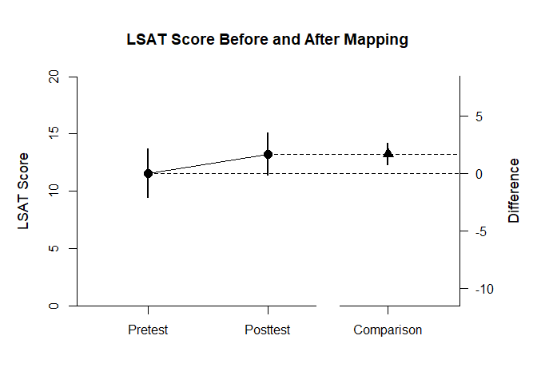
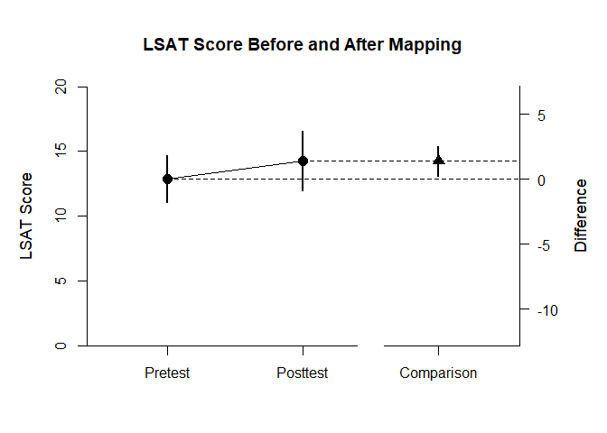
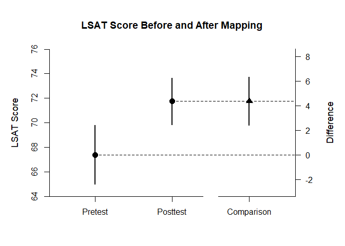

## Thomason Summary Statistics Example

### Thomason1 Sample

Thomason1 focuses on the difference between pretest and posttest in the first sample. First, create the tables of summary statistics.


```r
Pretest <- c(N=12,M=11.583,SD=3.315)
Posttest <- c(N=12,M=13.250,SD=2.896)
Thomason1Summary <- rbind(Pretest,Posttest)
class(Thomason1Summary) <- "wss"
Thomason1Corr <- data.frame()
Thomason1Corr["Pretest","Posttest"] <- .892
```

The primary emphasis of the analysis is to estimate and represent the difference between the two conditions.


```r
estimateMeanComparison(Thomason1Summary,Thomason1Corr)
```

```
## $`Confidence Intervals for the Means`
##                M      SE      df      LL      UL
## Pretest   11.583   0.957  11.000   9.477  13.689
## Posttest  13.250   0.836  11.000  11.410  15.090
## 
## $`Confidence Interval for the Mean Difference`
##               Diff      SE      df      LL      UL
## Comparison   1.667   0.433  11.000   0.714   2.620
```

```r
plotMeanComparison(Thomason1Summary,Thomason1Corr,main="LSAT Score Before and After Mapping",ylab="LSAT Score",ylim=c(0,20),values=FALSE)
```

<!-- -->

The secondary emphasis of the analysis is provide a standardized effect size for the difference.


```r
estimateStandardizedMeanDifference(Thomason1Summary,Thomason1Corr)
```

```
## $`Confidence Interval for the Standardized Mean Difference`
##                  d      SE      LL      UL
## Comparison   0.536   0.181   0.180   0.891
```

### Thomason2 Sample

Thomason2 focuses on the difference between pretest and posttest in the second sample. Thus, create the tables of summary statistics.


```r
Pretest <- c(N=16,M=12.875,SD=3.403)
Posttest <- c(N=16,M=14.250,SD=4.282)
Thomason2Summary <- rbind(Pretest,Posttest)
class(Thomason2Summary) <- "wss"
Thomason2Corr <- data.frame()
Thomason2Corr["Pretest","Posttest"] <- .871
```

The primary emphasis of the analysis is to estimate and represent the difference between the two conditions.


```r
estimateMeanComparison(Thomason2Summary,Thomason2Corr)
```

```
## $`Confidence Intervals for the Means`
##                M      SE      df      LL      UL
## Pretest   12.875   0.851  15.000  11.062  14.688
## Posttest  14.250   1.070  15.000  11.968  16.532
## 
## $`Confidence Interval for the Mean Difference`
##               Diff      SE      df      LL      UL
## Comparison   1.375   0.532  15.000   0.241   2.509
```

```r
plotMeanComparison(Thomason2Summary,Thomason2Corr,main="LSAT Score Before and After Mapping",ylab="LSAT Score",ylim=c(0,20),values=FALSE)
```

<!-- -->

The secondary emphasis of the analysis is provide a standardized effect size for the difference.


```r
estimateStandardizedMeanDifference(Thomason2Summary,Thomason2Corr)
```

```
## $`Confidence Interval for the Standardized Mean Difference`
##                  d      SE      LL      UL
## Comparison   0.356   0.155   0.052   0.659
```

### Thomason3 Sample

Thomason3 focuses on the difference between pretest and posttest in the third sample. Thus, create the tables of summary statistics.


```r
Pretest <- c(N=39,M=67.410,SD=7.419)
Posttest <- c(N=39,M=71.769,SD=5.851)
Thomason3Summary <- rbind(Pretest,Posttest)
class(Thomason3Summary) <- "wss"
Thomason3Corr <- data.frame()
Thomason3Corr["Pretest","Posttest"] <- .601
```

The primary emphasis of the analysis is to estimate and represent the difference between the two conditions.


```r
estimateMeanComparison(Thomason3Summary,Thomason3Corr)
```

```
## $`Confidence Intervals for the Means`
##                M      SE      df      LL      UL
## Pretest   67.410   1.188  38.000  65.005  69.815
## Posttest  71.769   0.937  38.000  69.872  73.666
## 
## $`Confidence Interval for the Mean Difference`
##               Diff      SE      df      LL      UL
## Comparison   4.359   0.975  38.000   2.385   6.333
```

```r
plotMeanComparison(Thomason3Summary,Thomason3Corr,main="LSAT Score Before and After Mapping",ylab="LSAT Score",values=FALSE)
```

<!-- -->

The secondary emphasis of the analysis is provide a standardized effect size for the difference.


```r
estimateStandardizedMeanDifference(Thomason3Summary,Thomason3Corr)
```

```
## $`Confidence Interval for the Standardized Mean Difference`
##                  d      SE      LL      UL
## Comparison   0.652   0.161   0.338   0.967
```
