## Factorial (Between-Subjects) Data Tutorial

### Data Management

#### Data Entry

This code inputs the variable names and creates a viewable data frame.

```r
FactorA <- c(1,1,1,1,2,2,2,2,3,3,3,3,1,1,1,1,2,2,2,2,3,3,3,3)
FactorB <- c(1,1,1,1,1,1,1,1,1,1,1,1,2,2,2,2,2,2,2,2,2,2,2,2)
Outcome <- c(0,0,3,5,4,7,4,9,4,9,6,9,9,4,6,9,6,3,3,8,5,3,8,8)
FactorA <- factor(FactorA,levels=c(1,2,3),labels=c("A1","A2","A3"))
FactorB <- factor(FactorB,levels=c(1,2),labels=c("B1","B2"))
FactorialData <- data.frame(FactorA,FactorB,Outcome)
```

This code subsets the data into two different data frames (for simple effects analysis).

```r
FactorialDataB1 <- subset(FactorialData,FactorB=="B1")
FactorialDataB2 <- subset(FactorialData,FactorB=="B2")
```

#### Descriptive Statistics

This code obtains the descriptive statistics for the two data frames.

```r
with(FactorialDataB1,describeMeans(Outcome~FactorA))
```

```
## $`Descriptive Statistics for the Data`
##          N       M      SD    Skew    Kurt
## A1   4.000   2.000   2.449   0.544  -2.944
## A2   4.000   6.000   2.449   0.544  -2.944
## A3   4.000   7.000   2.449  -0.544  -2.944
```

```r
with(FactorialDataB2,describeMeans(Outcome~FactorA))
```

```
## $`Descriptive Statistics for the Data`
##          N       M      SD    Skew    Kurt
## A1   4.000   7.000   2.449  -0.544  -2.944
## A2   4.000   5.000   2.449   0.544  -2.944
## A3   4.000   6.000   2.449  -0.544  -2.944
```

### Analyses of the Means

This section produces analyses that are equivalent to one-sample analyses separately for each level of a factor.

#### Confidence Intervals

This code will provide tables of confidence intervals for each level of the factor.

```r
with(FactorialDataB1,estimateMeans(Outcome~FactorA))
```

```
## $`Confidence Intervals for the Means`
##          M      SE      df      LL      UL
## A1   2.000   1.225   3.000  -1.898   5.898
## A2   6.000   1.225   3.000   2.102   9.898
## A3   7.000   1.225   3.000   3.102  10.898
```

```r
with(FactorialDataB2,estimateMeans(Outcome~FactorA))
```

```
## $`Confidence Intervals for the Means`
##          M      SE      df      LL      UL
## A1   7.000   1.225   3.000   3.102  10.898
## A2   5.000   1.225   3.000   1.102   8.898
## A3   6.000   1.225   3.000   2.102   9.898
```

This code will produce a graph of the confidence intervals for each level of the factor.

```r
with(FactorialDataB1,plotMeans(Outcome~FactorA))
```

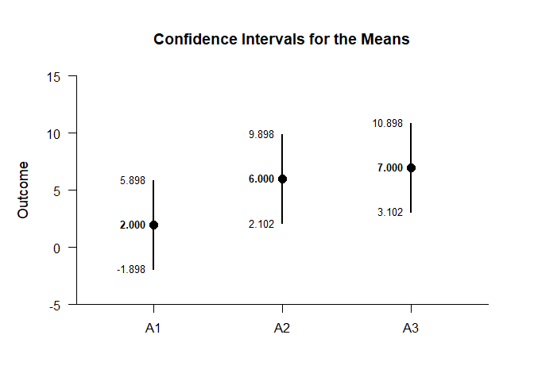<!-- -->

```r
with(FactorialDataB2,plotMeans(Outcome~FactorA))
```

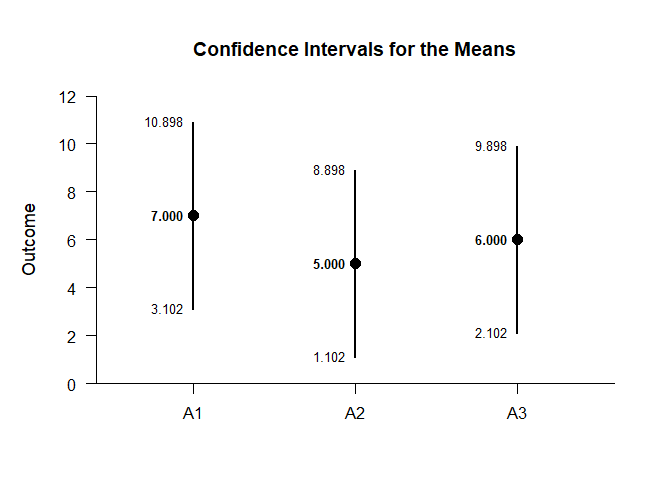<!-- -->

The code defaults to 95% confidence intervals. This can be changed if desired.

```r
with(FactorialDataB1,estimateMeans(Outcome~FactorA,conf.level=.99))
```

```
## $`Confidence Intervals for the Means`
##          M      SE      df      LL      UL
## A1   2.000   1.225   3.000  -5.154   9.154
## A2   6.000   1.225   3.000  -1.154  13.154
## A3   7.000   1.225   3.000  -0.154  14.154
```

```r
with(FactorialDataB2,estimateMeans(Outcome~FactorA,conf.level=.99))
```

```
## $`Confidence Intervals for the Means`
##          M      SE      df      LL      UL
## A1   7.000   1.225   3.000  -0.154  14.154
## A2   5.000   1.225   3.000  -2.154  12.154
## A3   6.000   1.225   3.000  -1.154  13.154
```

For the graph, it is possible to add a comparison line to represent a population (or test) value and a region of practical equivalence in addition to changing the confidence level.

```r
with(FactorialDataB1,plotMeans(Outcome~FactorA,conf.level=.99,line=5,rope=c(3,7)))
```

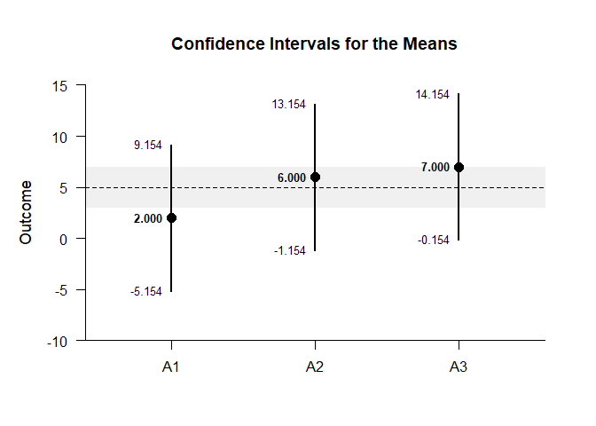<!-- -->

```r
with(FactorialDataB2,plotMeans(Outcome~FactorA,conf.level=.99,line=5,rope=c(3,7)))
```

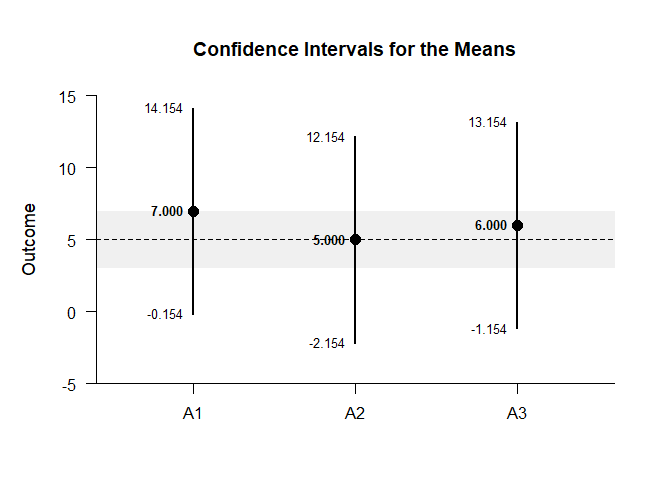<!-- -->

#### Significance Tests

This code will produce a table of NHST separately for each level of the factor. In this case, all the means are tested against a value of zero.

```r
with(FactorialDataB1,testMeans(Outcome~FactorA))
```

```
## $`Hypothesis Tests for the Means`
##       Diff      SE      df       t       p
## A1   2.000   1.225   3.000   1.633   0.201
## A2   6.000   1.225   3.000   4.899   0.016
## A3   7.000   1.225   3.000   5.715   0.011
```

```r
with(FactorialDataB2,testMeans(Outcome~FactorA))
```

```
## $`Hypothesis Tests for the Means`
##       Diff      SE      df       t       p
## A1   7.000   1.225   3.000   5.715   0.011
## A2   5.000   1.225   3.000   4.082   0.027
## A3   6.000   1.225   3.000   4.899   0.016
```

Often, the default test value of zero is not meaningful or plausible. This too can be altered (often in conjunction with what is presented in the plot).

```r
with(FactorialDataB1,testMeans(Outcome~FactorA,mu=5))
```

```
## $`Hypothesis Tests for the Means`
##       Diff      SE      df       t       p
## A1  -3.000   1.225   3.000  -2.449   0.092
## A2   1.000   1.225   3.000   0.816   0.474
## A3   2.000   1.225   3.000   1.633   0.201
```

```r
with(FactorialDataB2,testMeans(Outcome~FactorA,mu=5))
```

```
## $`Hypothesis Tests for the Means`
##       Diff      SE      df       t       p
## A1   2.000   1.225   3.000   1.633   0.201
## A2   0.000   1.225   3.000   0.000   1.000
## A3   1.000   1.225   3.000   0.816   0.474
```

#### Standardized Effect Sizes

This code will produce a table of standardized mean differences separately for each level of the factor. In this case, the mean is compared to zero to form the effect size.

```r
with(FactorialDataB1,estimateStandardizedMeans(Outcome~FactorA))
```

```
## $`Confidence Intervals for the Standardized Means`
##          d      SE      LL      UL
## A1   0.816   0.616  -0.387   1.934
## A2   2.449   0.955   0.325   4.531
## A3   2.858   1.063   0.464   5.226
```

```r
with(FactorialDataB2,estimateStandardizedMeans(Outcome~FactorA))
```

```
## $`Confidence Intervals for the Standardized Means`
##          d      SE      LL      UL
## A1   2.858   1.063   0.464   5.226
## A2   2.041   0.854   0.176   3.846
## A3   2.449   0.955   0.325   4.531
```

Here too it is possible to alter the width of the confidence intervals and to establish a more plausible comparison value for the mean.

```r
with(FactorialDataB1,estimateStandardizedMeans(Outcome~FactorA,mu=5,conf.level=.99))
```

```
## $`Confidence Intervals for the Standardized Means`
##          d      SE      LL      UL
## A1  -1.225   0.680  -3.010   0.547
## A2   0.408   0.574  -0.969   1.734
## A3   0.816   0.616  -0.732   2.319
```

```r
with(FactorialDataB1,estimateStandardizedMeans(Outcome~FactorA,mu=5,conf.level=.99))
```

```
## $`Confidence Intervals for the Standardized Means`
##          d      SE      LL      UL
## A1  -1.225   0.680  -3.010   0.547
## A2   0.408   0.574  -0.969   1.734
## A3   0.816   0.616  -0.732   2.319
```

### Analyses of a Comparison

This section produces analyses that are equivalent to comparisons of two levels of a factor.

This code creates a new factor that identifies the two levels for comparison.

```r
CompDataB1 <- with(FactorialDataB1,factor(FactorA,c("A1","A2")))
CompDataB2 <- with(FactorialDataB2,factor(FactorA,c("A1","A2")))
```

#### Confidence Intervals

This code estimates the confidence interval of the difference.

```r
with(FactorialDataB1,estimateMeanDifference(Outcome~CompDataB1))
```

```
## $`Confidence Interval for the Mean Difference`
##               Diff      SE      df      LL      UL
## Comparison   4.000   1.732   6.000  -0.238   8.238
```

```r
with(FactorialDataB2,estimateMeanDifference(Outcome~CompDataB2))
```

```
## $`Confidence Interval for the Mean Difference`
##               Diff      SE      df      LL      UL
## Comparison  -2.000   1.732   6.000  -6.238   2.238
```

This code obtains and plots the confidence intervals for the mean difference in the identified comparison.

```r
with(FactorialDataB1,plotMeanDifference(Outcome~CompDataB1))
```

<!-- -->

```r
with(FactorialDataB2,plotMeanDifference(Outcome~CompDataB2))
```

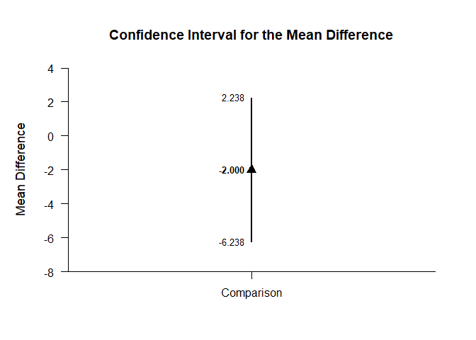<!-- -->

Of course, you can change the confidence level from the default 95% if desired.

```r
with(FactorialDataB1,estimateMeanDifference(Outcome~CompDataB1,conf.level=.99))
```

```
## $`Confidence Interval for the Mean Difference`
##               Diff      SE      df      LL      UL
## Comparison   4.000   1.732   6.000  -2.421  10.421
```

```r
with(FactorialDataB2,estimateMeanDifference(Outcome~CompDataB2,conf.level=.99))
```

```
## $`Confidence Interval for the Mean Difference`
##               Diff      SE      df      LL      UL
## Comparison  -2.000   1.732   6.000  -8.421   4.421
```

Once again, the confidence levels can be changed away from the default and a comparison line to represent a population (or test) value and a region of practical equivalence can be added to the graph.

```r
with(FactorialDataB1,plotMeanDifference(Outcome~CompDataB1,conf.level=.99,line=0,rope=c(-2,2)))
```

<!-- -->

```r
with(FactorialDataB2,plotMeanDifference(Outcome~CompDataB2,conf.level=.99,line=0,rope=c(-2,2)))
```

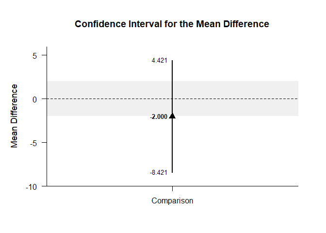<!-- -->

If you wish, you can get the confidence intervals for the means and the mean difference in one command.

```r
with(FactorialDataB1,estimateMeanComparison(Outcome~CompDataB1))
```

```
## $`Confidence Intervals for the Means`
##          M      SE      df      LL      UL
## A1   2.000   1.225   3.000  -1.898   5.898
## A2   6.000   1.225   3.000   2.102   9.898
## 
## $`Confidence Interval for the Mean Difference`
##               Diff      SE      df      LL      UL
## Comparison   4.000   1.732   6.000  -0.238   8.238
```

```r
with(FactorialDataB2,estimateMeanComparison(Outcome~CompDataB2))
```

```
## $`Confidence Intervals for the Means`
##          M      SE      df      LL      UL
## A1   7.000   1.225   3.000   3.102  10.898
## A2   5.000   1.225   3.000   1.102   8.898
## 
## $`Confidence Interval for the Mean Difference`
##               Diff      SE      df      LL      UL
## Comparison  -2.000   1.732   6.000  -6.238   2.238
```

This code produces a difference plot using the confidence intervals for the means and the mean difference.

```r
with(FactorialDataB1,plotMeanComparison(Outcome~CompDataB1))
```

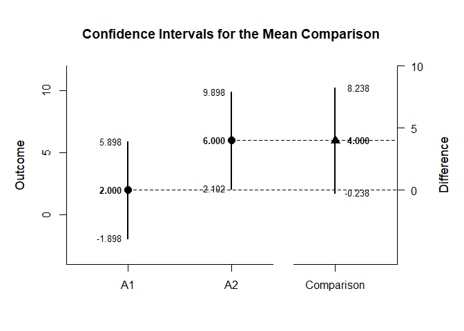<!-- -->

```r
with(FactorialDataB2,plotMeanComparison(Outcome~CompDataB2))
```

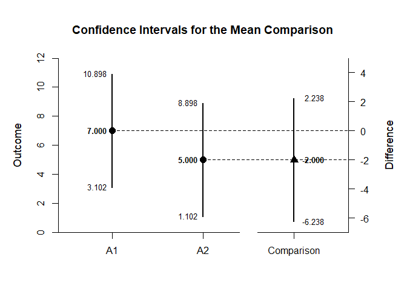<!-- -->

Of course, you can change the confidence level from the default 95% if desired.

```r
with(FactorialDataB1,estimateMeanComparison(Outcome~CompDataB1,conf.level=.99))
```

```
## $`Confidence Intervals for the Means`
##          M      SE      df      LL      UL
## A1   2.000   1.225   3.000  -5.154   9.154
## A2   6.000   1.225   3.000  -1.154  13.154
## 
## $`Confidence Interval for the Mean Difference`
##               Diff      SE      df      LL      UL
## Comparison   4.000   1.732   6.000  -2.421  10.421
```

```r
with(FactorialDataB2,estimateMeanComparison(Outcome~CompDataB2,conf.level=.99))
```

```
## $`Confidence Intervals for the Means`
##          M      SE      df      LL      UL
## A1   7.000   1.225   3.000  -0.154  14.154
## A2   5.000   1.225   3.000  -2.154  12.154
## 
## $`Confidence Interval for the Mean Difference`
##               Diff      SE      df      LL      UL
## Comparison  -2.000   1.732   6.000  -8.421   4.421
```

Once again, the confidence levels can be changed away from the default and a region of practical equivalence can be added to the graph.

```r
with(FactorialDataB1,plotMeanComparison(Outcome~CompDataB1,conf.level=.99,rope=c(-2,2)))
```

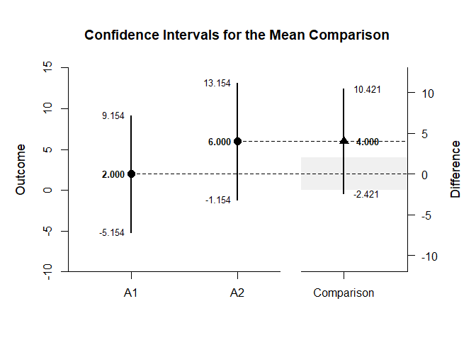<!-- -->

```r
with(FactorialDataB2,plotMeanComparison(Outcome~CompDataB2,conf.level=.99,rope=c(-2,2)))
```

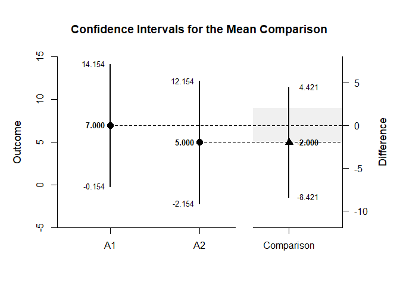<!-- -->

#### Significance Test

This code produces NHST for the identified comparison (using a default test value of zero).

```r
with(FactorialDataB1,testMeanDifference(Outcome~CompDataB1))
```

```
## $`Hypothesis Test for the Mean Difference`
##               Diff      SE      df       t       p
## Comparison   4.000   1.732   6.000   2.309   0.060
```

```r
with(FactorialDataB2,testMeanDifference(Outcome~CompDataB2))
```

```
## $`Hypothesis Test for the Mean Difference`
##               Diff      SE      df       t       p
## Comparison  -2.000   1.732   6.000  -1.155   0.292
```

If the default value of zero is not plausible, it too can be changed.

```r
with(FactorialDataB1,testMeanDifference(Outcome~CompDataB1,mu=-2))
```

```
## $`Hypothesis Test for the Mean Difference`
##               Diff      SE      df       t       p
## Comparison   6.000   1.732   6.000   3.464   0.013
```

```r
with(FactorialDataB2,testMeanDifference(Outcome~CompDataB2,mu=-2))
```

```
## $`Hypothesis Test for the Mean Difference`
##               Diff      SE      df       t       p
## Comparison   0.000   1.732   6.000   0.000   1.000
```

#### Standardized Effect Size

This code calculates a standardized mean difference for the comparison and its confidence interval.

```r
with(FactorialDataB1,estimateStandardizedMeanDifference(Outcome~CompDataB1))
```

```
## $`Confidence Interval for the Standardized Mean Difference`
##                  d      SE      LL      UL
## Comparison   1.633   0.943  -0.215   3.481
```

```r
with(FactorialDataB2,estimateStandardizedMeanDifference(Outcome~CompDataB2))
```

```
## $`Confidence Interval for the Standardized Mean Difference`
##                  d      SE      LL      UL
## Comparison  -0.816   0.850  -2.482   0.849
```

The width of the confidence interval for the effect size can be altered if desired.

```r
with(FactorialDataB1,estimateStandardizedMeanDifference(Outcome~CompDataB1,conf.level=.99))
```

```
## $`Confidence Interval for the Standardized Mean Difference`
##                  d      SE      LL      UL
## Comparison   1.633   0.943  -0.796   4.062
```

```r
with(FactorialDataB2,estimateStandardizedMeanDifference(Outcome~CompDataB2,conf.level=.99))
```

```
## $`Confidence Interval for the Standardized Mean Difference`
##                  d      SE      LL      UL
## Comparison  -0.816   0.850  -3.006   1.373
```

### Analyses of a Contrast

This section produces analyses that are equivalent to analyses involving multiple levels of a factor.

This code identifies a contrast among the groups.

```r
A1vsOthers <- c(-1,.5,.5)
```

#### Confidence Intervals

This code produces a confidence interval for that contrast.

```r
with(FactorialDataB1,estimateMeanContrast(Outcome~FactorA,contrast=A1vsOthers))
```

```
## $`Confidence Interval for the Mean Contrast`
##              Est      SE      df      LL      UL
## Contrast   4.500   1.500   6.000   0.830   8.170
```

```r
with(FactorialDataB2,estimateMeanContrast(Outcome~FactorA,contrast=A1vsOthers))
```

```
## $`Confidence Interval for the Mean Contrast`
##              Est      SE      df      LL      UL
## Contrast  -1.500   1.500   6.000  -5.170   2.170
```

This code obtains and plots the confidence intervals for the groups and the mean difference in the identified contrast.

```r
with(FactorialDataB1,plotMeanContrast(Outcome~FactorA,contrast=A1vsOthers))
```

<!-- -->

```r
with(FactorialDataB2,plotMeanContrast(Outcome~FactorA,contrast=A1vsOthers))
```

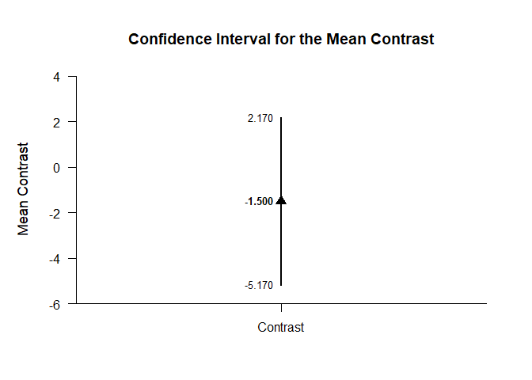<!-- -->

As in all other cases, the default value of the confidence interval can be changed.

```r
with(FactorialDataB1,estimateMeanContrast(Outcome~FactorA,contrast=A1vsOthers,conf.level=.99))
```

```
## $`Confidence Interval for the Mean Contrast`
##              Est      SE      df      LL      UL
## Contrast   4.500   1.500   6.000  -1.061  10.061
```

```r
with(FactorialDataB2,estimateMeanContrast(Outcome~FactorA,contrast=A1vsOthers,conf.level=.99))
```

```
## $`Confidence Interval for the Mean Contrast`
##              Est      SE      df      LL      UL
## Contrast  -1.500   1.500   6.000  -7.061   4.061
```

The width of the confidence interval for the contrast can be altered and a comparison line to represent a population (or test) value and a region of practical equivalence can be added to the graph.

```r
with(FactorialDataB1,plotMeanContrast(Outcome~FactorA,contrast=A1vsOthers,conf.level=.99,line=0,rope=c(-2,2)))
```

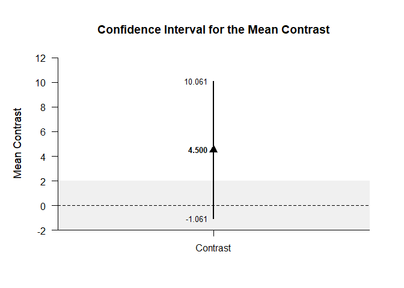<!-- -->

```r
with(FactorialDataB2,plotMeanContrast(Outcome~FactorA,contrast=A1vsOthers,conf.level=.99,line=0,rope=c(-2,2)))
```

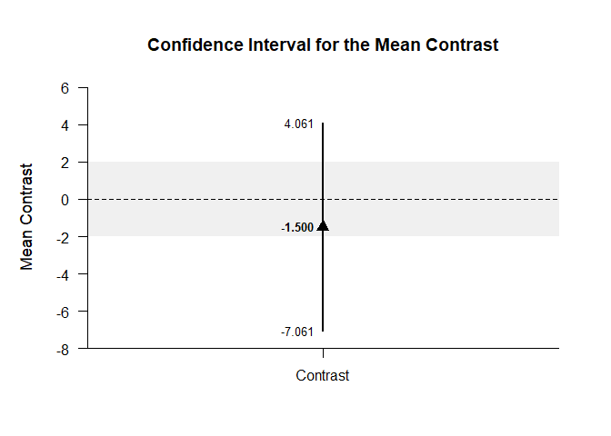<!-- -->

If you wish, you can get the confidence intervals for the mean subsets and the mean contrast in one command.

```r
with(FactorialDataB1,estimateMeanSubsets(Outcome~FactorA,contrast=A1vsOthers))
```

```
## $`Confidence Intervals for the Mean Subsets`
##                  Est      SE      df      LL      UL
## Neg Weighted   2.000   1.225   3.000  -1.898   5.898
## Pos Weighted   6.500   0.866   6.000   4.381   8.619
## 
## $`Confidence Interval for the Mean Contrast`
##              Est      SE      df      LL      UL
## Contrast   4.500   1.500   6.000   0.830   8.170
```

```r
with(FactorialDataB2,estimateMeanSubsets(Outcome~FactorA,contrast=A1vsOthers))
```

```
## $`Confidence Intervals for the Mean Subsets`
##                  Est      SE      df      LL      UL
## Neg Weighted   7.000   1.225   3.000   3.102  10.898
## Pos Weighted   5.500   0.866   6.000   3.381   7.619
## 
## $`Confidence Interval for the Mean Contrast`
##              Est      SE      df      LL      UL
## Contrast  -1.500   1.500   6.000  -5.170   2.170
```

This code produces a difference plot using the confidence intervals for the mean subsets and the mean contrast.

```r
with(FactorialDataB1,plotMeanSubsets(Outcome~FactorA,contrast=A1vsOthers))
```

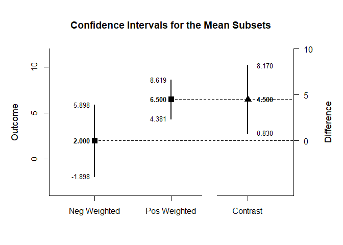<!-- -->

```r
with(FactorialDataB2,plotMeanSubsets(Outcome~FactorA,contrast=A1vsOthers))
```

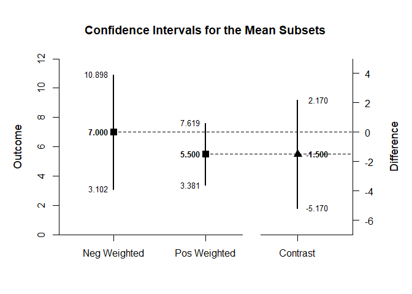<!-- -->

Of course, you can change the confidence level from the default 95% if desired.

```r
with(FactorialDataB1,estimateMeanSubsets(Outcome~FactorA,contrast=A1vsOthers,conf.level=.99))
```

```
## $`Confidence Intervals for the Mean Subsets`
##                  Est      SE      df      LL      UL
## Neg Weighted   2.000   1.225   3.000  -5.154   9.154
## Pos Weighted   6.500   0.866   6.000   3.289   9.711
## 
## $`Confidence Interval for the Mean Contrast`
##              Est      SE      df      LL      UL
## Contrast   4.500   1.500   6.000  -1.061  10.061
```

```r
with(FactorialDataB2,estimateMeanSubsets(Outcome~FactorA,contrast=A1vsOthers,conf.level=.99))
```

```
## $`Confidence Intervals for the Mean Subsets`
##                  Est      SE      df      LL      UL
## Neg Weighted   7.000   1.225   3.000  -0.154  14.154
## Pos Weighted   5.500   0.866   6.000   2.289   8.711
## 
## $`Confidence Interval for the Mean Contrast`
##              Est      SE      df      LL      UL
## Contrast  -1.500   1.500   6.000  -7.061   4.061
```

Once again, the confidence levels can be changed away from the default and a region of practical equivalence can be added to the graph.

```r
with(FactorialDataB1,plotMeanSubsets(Outcome~FactorA,contrast=A1vsOthers,labels=c("Level1","Others"),conf.level=.99,rope=c(-2,2)))
```

<!-- -->

```r
with(FactorialDataB2,plotMeanSubsets(Outcome~FactorA,contrast=A1vsOthers,labels=c("Level1","Others"),conf.level=.99,rope=c(-2,2)))
```

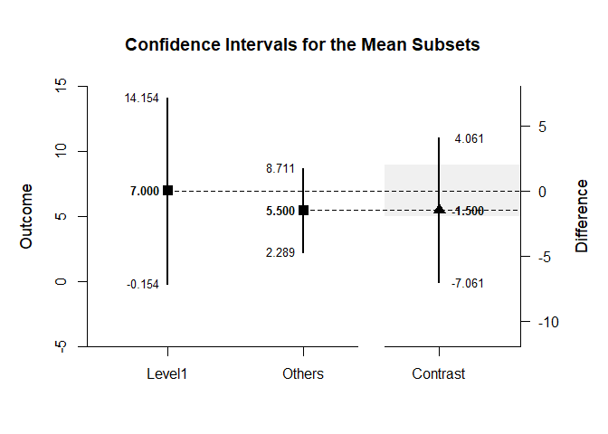<!-- -->

#### Significance Test

This code produces a NHST for the identified contrast. It tests the contrast against a value of zero by default.

```r
with(FactorialDataB1,testMeanContrast(Outcome~FactorA,contrast=A1vsOthers))
```

```
## $`Hypothesis Test for the Mean Contrast`
##              Est      SE      df       t       p
## Contrast   4.500   1.500   6.000   3.000   0.024
```

```r
with(FactorialDataB2,testMeanContrast(Outcome~FactorA,contrast=A1vsOthers))
```

```
## $`Hypothesis Test for the Mean Contrast`
##              Est      SE      df       t       p
## Contrast  -1.500   1.500   6.000  -1.000   0.356
```

If desired, the contrast can be tested against other values.

```r
with(FactorialDataB1,testMeanContrast(Outcome~FactorA,contrast=A1vsOthers,mu=4))
```

```
## $`Hypothesis Test for the Mean Contrast`
##              Est      SE      df       t       p
## Contrast   0.500   1.500   6.000   0.333   0.750
```

```r
with(FactorialDataB2,testMeanContrast(Outcome~FactorA,contrast=A1vsOthers,mu=4))
```

```
## $`Hypothesis Test for the Mean Contrast`
##              Est      SE      df       t       p
## Contrast  -5.500   1.500   6.000  -3.667   0.010
```

#### Standardized Effect Size

This code calculates a standardized contrast and its confidence interval.

```r
with(FactorialDataB1,estimateStandardizedMeanContrast(Outcome~FactorA,contrast=A1vsOthers))
```

```
## $`Confidence Interval for the Standardized Mean Contrast`
##              Est      SE      LL      UL
## Contrast   1.837   0.829   0.212   3.462
```

```r
with(FactorialDataB2,estimateStandardizedMeanContrast(Outcome~FactorA,contrast=A1vsOthers))
```

```
## $`Confidence Interval for the Standardized Mean Contrast`
##              Est      SE      LL      UL
## Contrast  -0.612   0.722  -2.027   0.802
```

The width of the confidence interval for the effect size can be altered if desired.

```r
with(FactorialDataB1,estimateStandardizedMeanContrast(Outcome~FactorA,contrast=A1vsOthers,conf.level=.99))
```

```
## $`Confidence Interval for the Standardized Mean Contrast`
##              Est      SE      LL      UL
## Contrast   1.837   0.829  -0.299   3.973
```

```r
with(FactorialDataB2,estimateStandardizedMeanContrast(Outcome~FactorA,contrast=A1vsOthers,conf.level=.99))
```

```
## $`Confidence Interval for the Standardized Mean Contrast`
##              Est      SE      LL      UL
## Contrast  -0.612   0.722  -2.471   1.247
```
