## Factorial (Between-Subjects) Summary Statistics Tutorial

This page analyzes a two-factor between-subjects (factorial) design using summary statistics input.

### Data Management

This code inputs the group summaries and creates a single summary table (for the first simple effect).

```r
A1 <- c(N=4,M=2.000,SD=2.449)
A2 <- c(N=4,M=6.000,SD=2.449)
A3 <- c(N=4,M=7.000,SD=2.449)
FactorialSummaryB1 <- rbind(A1,A2,A3)
class(FactorialSummaryB1) <- "bss"
```

And repeat the process to create the second subset.

```r
A1 <- c(N=4,M=7.000,SD=2.449)
A2 <- c(N=4,M=5.000,SD=2.449)
A3 <- c(N=4,M=6.000,SD=2.449)
FactorialSummaryB2 <- rbind(A1,A2,A3)
class(FactorialSummaryB2) <- "bss"
```

### Analyses of the Means

This section produces analyses that are equivalent to one-sample analyses separately for each level of a factor.

#### Confidence Intervals

This code will provide tables of confidence intervals for each level of the factor.

```r
estimateMeans(FactorialSummaryB1)
```

```
## $`Confidence Intervals for the Means`
##          M      SE      df      LL      UL
## A1   2.000   1.224   3.000  -1.897   5.897
## A2   6.000   1.224   3.000   2.103   9.897
## A3   7.000   1.224   3.000   3.103  10.897
```

```r
estimateMeans(FactorialSummaryB2)
```

```
## $`Confidence Intervals for the Means`
##          M      SE      df      LL      UL
## A1   7.000   1.224   3.000   3.103  10.897
## A2   5.000   1.224   3.000   1.103   8.897
## A3   6.000   1.224   3.000   2.103   9.897
```

This code will produce a graph of the confidence intervals for each level of the factor.

```r
plotMeans(FactorialSummaryB1)
```

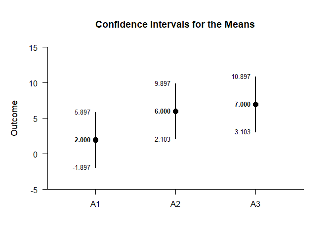<!-- -->

```r
plotMeans(FactorialSummaryB2)
```

<!-- -->

The code defaults to 95% confidence intervals. This can be changed if desired.

```r
estimateMeans(FactorialSummaryB1,conf.level=.99)
```

```
## $`Confidence Intervals for the Means`
##          M      SE      df      LL      UL
## A1   2.000   1.224   3.000  -5.152   9.152
## A2   6.000   1.224   3.000  -1.152  13.152
## A3   7.000   1.224   3.000  -0.152  14.152
```

```r
estimateMeans(FactorialSummaryB2,conf.level=.99)
```

```
## $`Confidence Intervals for the Means`
##          M      SE      df      LL      UL
## A1   7.000   1.224   3.000  -0.152  14.152
## A2   5.000   1.224   3.000  -2.152  12.152
## A3   6.000   1.224   3.000  -1.152  13.152
```

For the graph, it is possible to add a comparison line to represent a population (or test) value and a region of practical equivalence in addition to changing the confidence level.

```r
plotMeans(FactorialSummaryB1,conf.level=.99,line=5,rope=c(3,7))
```

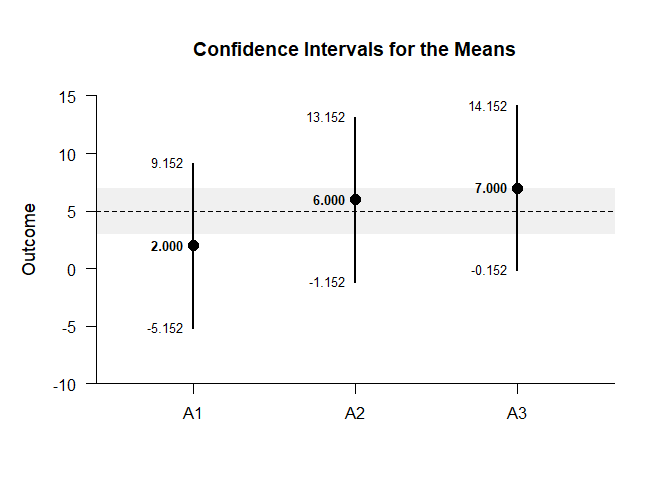<!-- -->

```r
plotMeans(FactorialSummaryB2,conf.level=.99,line=5,rope=c(3,7))
```

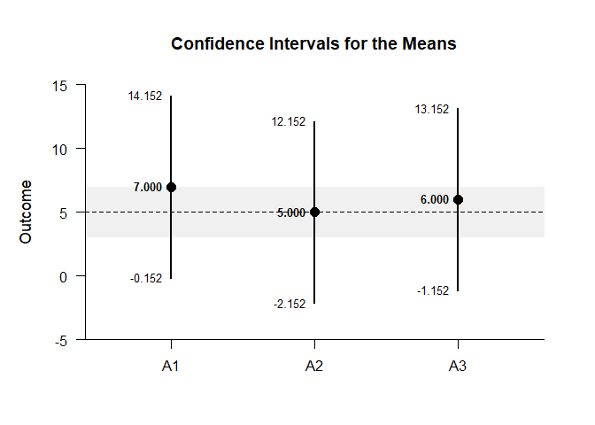<!-- -->

#### Significance Tests

This code will produce a table of NHST separately for each level of the factor. In this case, all the means are tested against a value of zero.

```r
testMeans(FactorialSummaryB1)
```

```
## $`Hypothesis Tests for the Means`
##       Diff      SE      df       t       p
## A1   2.000   1.224   3.000   1.633   0.201
## A2   6.000   1.224   3.000   4.900   0.016
## A3   7.000   1.224   3.000   5.717   0.011
```

```r
testMeans(FactorialSummaryB2)
```

```
## $`Hypothesis Tests for the Means`
##       Diff      SE      df       t       p
## A1   7.000   1.224   3.000   5.717   0.011
## A2   5.000   1.224   3.000   4.083   0.027
## A3   6.000   1.224   3.000   4.900   0.016
```

Often, the default test value of zero is not meaningful or plausible. This too can be altered (often in conjunction with what is presented in the plot).

```r
testMeans(FactorialSummaryB1,mu=5)
```

```
## $`Hypothesis Tests for the Means`
##       Diff      SE      df       t       p
## A1  -3.000   1.224   3.000  -2.450   0.092
## A2   1.000   1.224   3.000   0.817   0.474
## A3   2.000   1.224   3.000   1.633   0.201
```

```r
testMeans(FactorialSummaryB2,mu=5)
```

```
## $`Hypothesis Tests for the Means`
##       Diff      SE      df       t       p
## A1   2.000   1.224   3.000   1.633   0.201
## A2   0.000   1.224   3.000   0.000   1.000
## A3   1.000   1.224   3.000   0.817   0.474
```

#### Standardized Effect Sizes

This code will produce a table of standardized mean differences separately for each level of the factor. In this case, the mean is compared to zero to form the effect size.

```r
estimateStandardizedMeans(FactorialSummaryB1)
```

```
## $`Confidence Intervals for the Standardized Means`
##          d      SE      LL      UL
## A1   0.817   0.616  -0.387   1.934
## A2   2.450   0.955   0.325   4.532
## A3   2.858   1.063   0.464   5.227
```

```r
estimateStandardizedMeans(FactorialSummaryB2)
```

```
## $`Confidence Intervals for the Standardized Means`
##          d      SE      LL      UL
## A1   2.858   1.063   0.464   5.227
## A2   2.042   0.854   0.176   3.847
## A3   2.450   0.955   0.325   4.532
```

Here too it is possible to alter the width of the confidence intervals and to establish a more plausible comparison value for the mean.

```r
estimateStandardizedMeans(FactorialSummaryB1,mu=5,conf.level=.99)
```

```
## $`Confidence Intervals for the Standardized Means`
##          d      SE      LL      UL
## A1  -1.225   0.680  -3.011   0.547
## A2   0.408   0.574  -0.968   1.734
## A3   0.817   0.616  -0.732   2.320
```

```r
estimateStandardizedMeans(FactorialSummaryB2,mu=5,conf.level=.99)
```

```
## $`Confidence Intervals for the Standardized Means`
##          d      SE      LL      UL
## A1   0.817   0.616  -0.732   2.320
## A2   0.000   0.559  -1.288   1.288
## A3   0.408   0.574  -0.968   1.734
```

### Analyses of a Comparison

This section produces analyses that are equivalent to comparisons of two levels of a factor.

This code creates a new factor that identifies the two levels for comparison.

```r
CompSummaryB1 <- FactorialSummaryB1[c("A1","A2"),]
class(CompSummaryB1) <- "bss"
CompSummaryB2 <- FactorialSummaryB2[c("A1","A2"),]
class(CompSummaryB2) <- "bss"
```

#### Confidence Intervals

This code estimates the confidence interval of the difference.

```r
estimateMeanDifference(CompSummaryB1)
```

```
## $`Confidence Interval for the Mean Difference`
##               Diff      SE      df      LL      UL
## Comparison   4.000   1.732   6.000  -0.237   8.237
```

```r
estimateMeanDifference(CompSummaryB2)
```

```
## $`Confidence Interval for the Mean Difference`
##               Diff      SE      df      LL      UL
## Comparison  -2.000   1.732   6.000  -6.237   2.237
```

This code obtains and plots the confidence intervals for the mean difference in the identified comparison.

```r
plotMeanDifference(CompSummaryB1)
```

<!-- -->

```r
plotMeanDifference(CompSummaryB2)
```

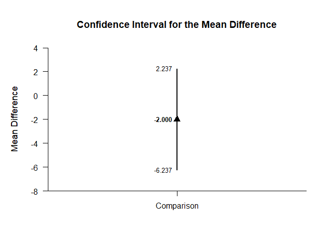<!-- -->

Of course, you can change the confidence level from the default 95% if desired.

```r
estimateMeanDifference(CompSummaryB1,conf.level=.99)
```

```
## $`Confidence Interval for the Mean Difference`
##               Diff      SE      df      LL      UL
## Comparison   4.000   1.732   6.000  -2.420  10.420
```

```r
estimateMeanDifference(CompSummaryB2,conf.level=.99)
```

```
## $`Confidence Interval for the Mean Difference`
##               Diff      SE      df      LL      UL
## Comparison  -2.000   1.732   6.000  -8.420   4.420
```

Once again, the confidence levels can be changed away from the default and a comparison line to represent a population (or test) value and a region of practical equivalence can be added to the graph.

```r
plotMeanDifference(CompSummaryB1,conf.level=.99,line=0,rope=c(-2,2))
```

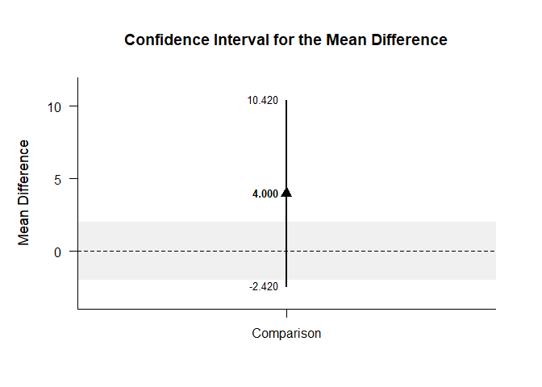<!-- -->

```r
plotMeanDifference(CompSummaryB2,conf.level=.99,line=0,rope=c(-2,2))
```

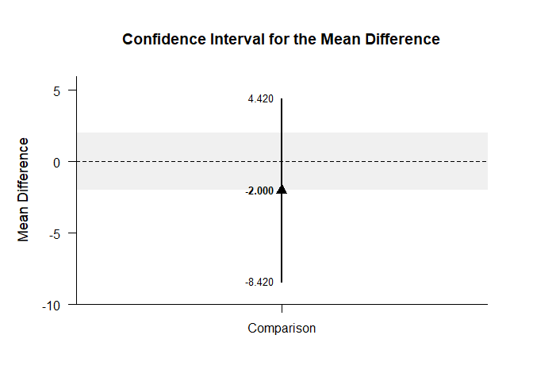<!-- -->

If you wish, you can get the confidence intervals for the means and the mean difference in one command.

```r
estimateMeanComparison(CompSummaryB1)
```

```
## $`Confidence Intervals for the Means`
##          M      SE      df      LL      UL
## A1   2.000   1.224   3.000  -1.897   5.897
## A2   6.000   1.224   3.000   2.103   9.897
## 
## $`Confidence Interval for the Mean Difference`
##               Diff      SE      df      LL      UL
## Comparison   4.000   1.732   6.000  -0.237   8.237
```

```r
estimateMeanComparison(CompSummaryB2)
```

```
## $`Confidence Intervals for the Means`
##          M      SE      df      LL      UL
## A1   7.000   1.224   3.000   3.103  10.897
## A2   5.000   1.224   3.000   1.103   8.897
## 
## $`Confidence Interval for the Mean Difference`
##               Diff      SE      df      LL      UL
## Comparison  -2.000   1.732   6.000  -6.237   2.237
```

This code produces a difference plot using the confidence intervals for the means and the mean difference.

```r
plotMeanComparison(CompSummaryB1)
```

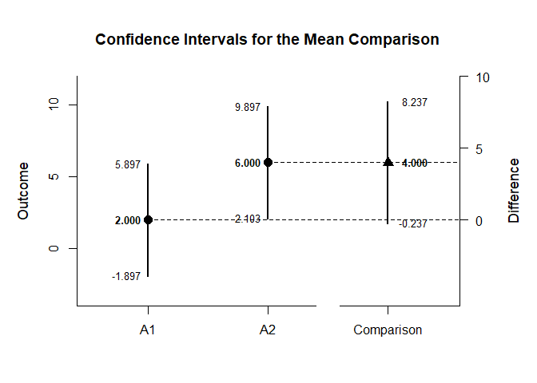<!-- -->

```r
plotMeanComparison(CompSummaryB2)
```

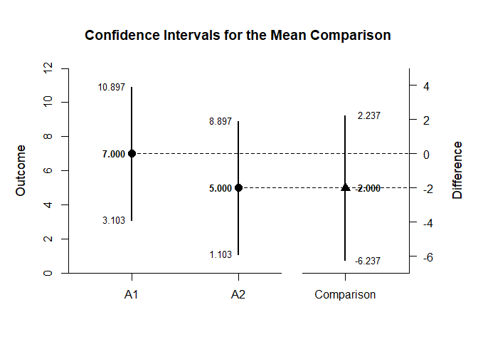<!-- -->

Of course, you can change the confidence level from the default 95% if desired.

```r
estimateMeanComparison(CompSummaryB1,conf.level=.99)
```

```
## $`Confidence Intervals for the Means`
##          M      SE      df      LL      UL
## A1   2.000   1.224   3.000  -5.152   9.152
## A2   6.000   1.224   3.000  -1.152  13.152
## 
## $`Confidence Interval for the Mean Difference`
##               Diff      SE      df      LL      UL
## Comparison   4.000   1.732   6.000  -2.420  10.420
```

```r
estimateMeanComparison(CompSummaryB2,conf.level=.99)
```

```
## $`Confidence Intervals for the Means`
##          M      SE      df      LL      UL
## A1   7.000   1.224   3.000  -0.152  14.152
## A2   5.000   1.224   3.000  -2.152  12.152
## 
## $`Confidence Interval for the Mean Difference`
##               Diff      SE      df      LL      UL
## Comparison  -2.000   1.732   6.000  -8.420   4.420
```

Once again, the confidence levels can be changed away from the default and a region of practical equivalence can be added to the graph.

```r
plotMeanComparison(CompSummaryB1,conf.level=.99,rope=c(-2,2))
```

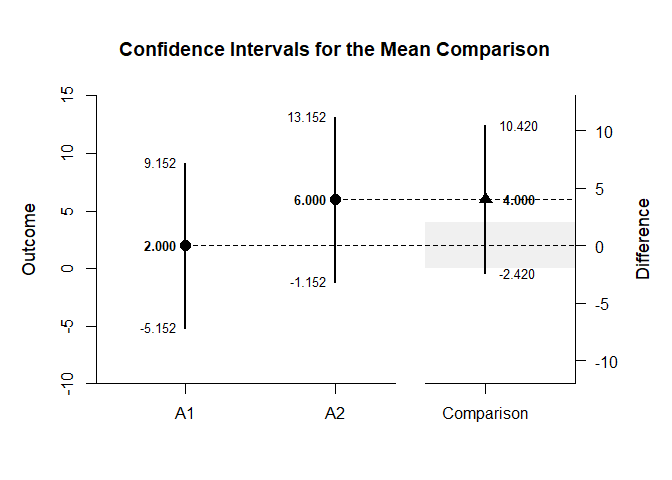<!-- -->

```r
plotMeanComparison(CompSummaryB2,conf.level=.99,rope=c(-2,2))
```

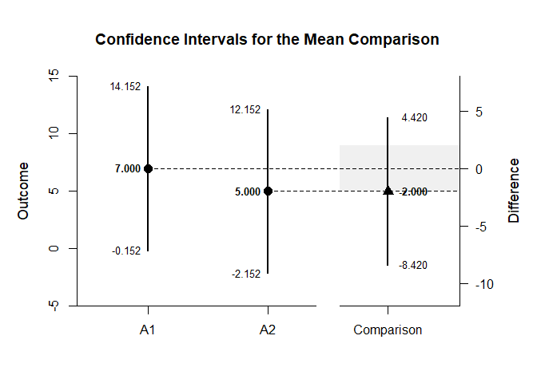<!-- -->

#### Significance Test

This code produces NHST for the identified comparison (using a default test value of zero).

```r
testMeanDifference(CompSummaryB1)
```

```
## $`Hypothesis Test for the Mean Difference`
##               Diff      SE      df       t       p
## Comparison   4.000   1.732   6.000   2.310   0.060
```

```r
testMeanDifference(CompSummaryB2)
```

```
## $`Hypothesis Test for the Mean Difference`
##               Diff      SE      df       t       p
## Comparison  -2.000   1.732   6.000  -1.155   0.292
```

If the default value of zero is not plausible, it too can be changed.

```r
testMeanDifference(CompSummaryB1,mu=-2)
```

```
## $`Hypothesis Test for the Mean Difference`
##               Diff      SE      df       t       p
## Comparison   6.000   1.732   6.000   3.465   0.013
```

```r
testMeanDifference(CompSummaryB2,mu=-2)
```

```
## $`Hypothesis Test for the Mean Difference`
##               Diff      SE      df       t       p
## Comparison   0.000   1.732   6.000   0.000   1.000
```

#### Standardized Effect Size

This code calculates a standardized mean difference for the comparison and its confidence interval.

```r
estimateStandardizedMeanDifference(CompSummaryB1)
```

```
## $`Confidence Interval for the Standardized Mean Difference`
##                  d      SE      LL      UL
## Comparison   1.633   0.943  -0.215   3.481
```

```r
estimateStandardizedMeanDifference(CompSummaryB2)
```

```
## $`Confidence Interval for the Standardized Mean Difference`
##                  d      SE      LL      UL
## Comparison  -0.817   0.850  -2.482   0.849
```

The width of the confidence interval for the effect size can be altered if desired.

```r
estimateStandardizedMeanDifference(CompSummaryB1,conf.level=.99)
```

```
## $`Confidence Interval for the Standardized Mean Difference`
##                  d      SE      LL      UL
## Comparison   1.633   0.943  -0.795   4.062
```

```r
estimateStandardizedMeanDifference(CompSummaryB2,conf.level=.99)
```

```
## $`Confidence Interval for the Standardized Mean Difference`
##                  d      SE      LL      UL
## Comparison  -0.817   0.850  -3.006   1.372
```

### Analyses of a Contrast

This section produces analyses that are equivalent to analyses involving multiple levels of a factor.

This code identifies a contrast among the groups.

```r
A1vsOthers <- c(-1,.5,.5)
```

#### Confidence Intervals

This code produces a confidence interval for that contrast.

```r
estimateMeanContrast(FactorialSummaryB1,contrast=A1vsOthers)
```

```
## $`Confidence Interval for the Mean Contrast`
##              Est      SE      df      LL      UL
## Contrast   4.500   1.500   6.000   0.830   8.170
```

```r
estimateMeanContrast(FactorialSummaryB2,contrast=A1vsOthers)
```

```
## $`Confidence Interval for the Mean Contrast`
##              Est      SE      df      LL      UL
## Contrast  -1.500   1.500   6.000  -5.170   2.170
```

This code obtains and plots the confidence intervals for the mean difference in the identified contrast.

```r
plotMeanContrast(FactorialSummaryB1,contrast=A1vsOthers)
```

<!-- -->

```r
plotMeanContrast(FactorialSummaryB2,contrast=A1vsOthers)
```

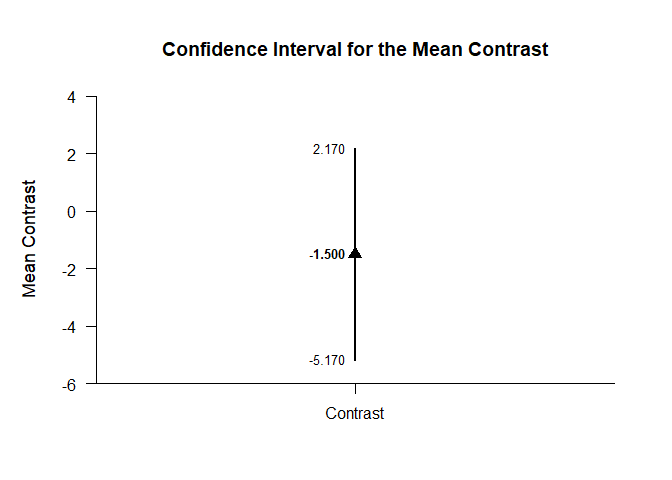<!-- -->

As in all other cases, the default value of the confidence interval can be changed.

```r
estimateMeanContrast(FactorialSummaryB1,contrast=A1vsOthers,conf.level=.99)
```

```
## $`Confidence Interval for the Mean Contrast`
##              Est      SE      df      LL      UL
## Contrast   4.500   1.500   6.000  -1.060  10.060
```

```r
estimateMeanContrast(FactorialSummaryB2,contrast=A1vsOthers,conf.level=.99)
```

```
## $`Confidence Interval for the Mean Contrast`
##              Est      SE      df      LL      UL
## Contrast  -1.500   1.500   6.000  -7.060   4.060
```

The width of the confidence interval for the contrast can be altered and a comparison line to represent a population (or test) value and a region of practical equivalence can be added to the graph.

```r
plotMeanContrast(FactorialSummaryB1,contrast=A1vsOthers,conf.level=.99,line=0,rope=c(-2,2))
```

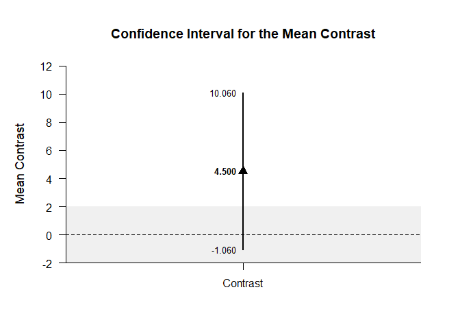<!-- -->

```r
plotMeanContrast(FactorialSummaryB2,contrast=A1vsOthers,conf.level=.99,line=0,rope=c(-2,2))
```

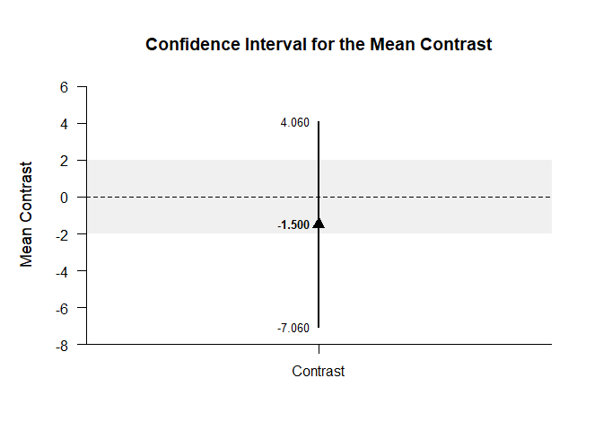<!-- -->

If you wish, you can get the confidence intervals for the mean subsets and the mean contrast in one command.

```r
estimateMeanSubsets(FactorialSummaryB1,contrast=A1vsOthers)
```

```
## $`Confidence Intervals for the Mean Subsets`
##                  Est      SE      df      LL      UL
## Neg Weighted   2.000   1.224   3.000  -1.897   5.897
## Pos Weighted   6.500   0.866   6.000   4.381   8.619
## 
## $`Confidence Interval for the Mean Contrast`
##              Est      SE      df      LL      UL
## Contrast   4.500   1.500   6.000   0.830   8.170
```

```r
estimateMeanSubsets(FactorialSummaryB2,contrast=A1vsOthers)
```

```
## $`Confidence Intervals for the Mean Subsets`
##                  Est      SE      df      LL      UL
## Neg Weighted   7.000   1.224   3.000   3.103  10.897
## Pos Weighted   5.500   0.866   6.000   3.381   7.619
## 
## $`Confidence Interval for the Mean Contrast`
##              Est      SE      df      LL      UL
## Contrast  -1.500   1.500   6.000  -5.170   2.170
```

This code produces a difference plot using the confidence intervals for the mean subsets and the mean contrast.

```r
plotMeanSubsets(FactorialSummaryB1,contrast=A1vsOthers)
```

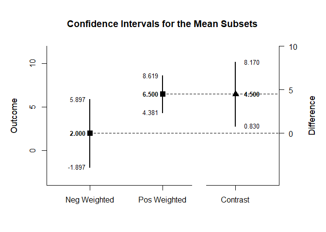<!-- -->

```r
plotMeanSubsets(FactorialSummaryB2,contrast=A1vsOthers)
```

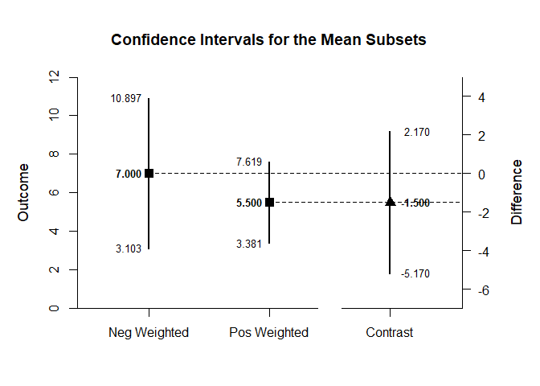<!-- -->

Of course, you can change the confidence level from the default 95% if desired.

```r
estimateMeanSubsets(FactorialSummaryB1,contrast=A1vsOthers,conf.level=.99)
```

```
## $`Confidence Intervals for the Mean Subsets`
##                  Est      SE      df      LL      UL
## Neg Weighted   2.000   1.224   3.000  -5.152   9.152
## Pos Weighted   6.500   0.866   6.000   3.290   9.710
## 
## $`Confidence Interval for the Mean Contrast`
##              Est      SE      df      LL      UL
## Contrast   4.500   1.500   6.000  -1.060  10.060
```

```r
estimateMeanSubsets(FactorialSummaryB2,contrast=A1vsOthers,conf.level=.99)
```

```
## $`Confidence Intervals for the Mean Subsets`
##                  Est      SE      df      LL      UL
## Neg Weighted   7.000   1.224   3.000  -0.152  14.152
## Pos Weighted   5.500   0.866   6.000   2.290   8.710
## 
## $`Confidence Interval for the Mean Contrast`
##              Est      SE      df      LL      UL
## Contrast  -1.500   1.500   6.000  -7.060   4.060
```

Once again, the confidence levels can be changed away from the default and a region of practical equivalence can be added to the graph.

```r
plotMeanSubsets(FactorialSummaryB1,contrast=A1vsOthers,labels=c("Level1","Others"),conf.level=.99,rope=c(-2,2))
```

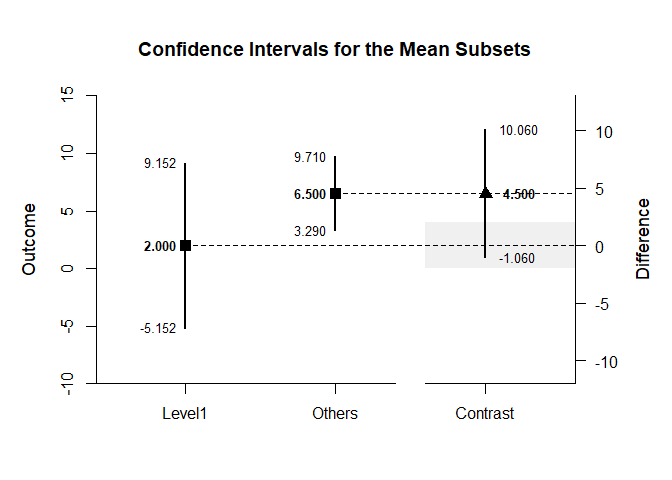<!-- -->

```r
plotMeanSubsets(FactorialSummaryB2,contrast=A1vsOthers,labels=c("Level1","Others"),conf.level=.99,rope=c(-2,2))
```

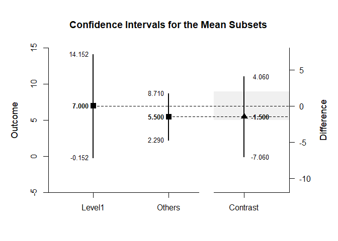<!-- -->

#### Significance Test

This code produces a NHST for the identified contrast. It tests the contrast against a value of zero by default.

```r
testMeanContrast(FactorialSummaryB1,contrast=A1vsOthers)
```

```
## $`Hypothesis Test for the Mean Contrast`
##              Est      SE      df       t       p
## Contrast   4.500   1.500   6.000   3.001   0.024
```

```r
testMeanContrast(FactorialSummaryB2,contrast=A1vsOthers)
```

```
## $`Hypothesis Test for the Mean Contrast`
##              Est      SE      df       t       p
## Contrast  -1.500   1.500   6.000  -1.000   0.356
```

If desired, the contrast can be tested against other values.

```r
testMeanContrast(FactorialSummaryB1,contrast=A1vsOthers,mu=4)
```

```
## $`Hypothesis Test for the Mean Contrast`
##              Est      SE      df       t       p
## Contrast   0.500   1.500   6.000   0.333   0.750
```

```r
testMeanContrast(FactorialSummaryB2,contrast=A1vsOthers,mu=4)
```

```
## $`Hypothesis Test for the Mean Contrast`
##              Est      SE      df       t       p
## Contrast  -5.500   1.500   6.000  -3.667   0.010
```

#### Standardized Effect Size

This code calculates a standardized contrast and its confidence interval.

```r
estimateStandardizedMeanContrast(FactorialSummaryB1,contrast=A1vsOthers)
```

```
## $`Confidence Interval for the Standardized Mean Contrast`
##              Est      SE      LL      UL
## Contrast   1.837   0.829   0.212   3.463
```

```r
estimateStandardizedMeanContrast(FactorialSummaryB2,contrast=A1vsOthers)
```

```
## $`Confidence Interval for the Standardized Mean Contrast`
##              Est      SE      LL      UL
## Contrast  -0.612   0.722  -2.027   0.802
```

The width of the confidence interval for the effect size can be altered if desired.

```r
estimateStandardizedMeanContrast(FactorialSummaryB1,contrast=A1vsOthers,conf.level=.99)
```

```
## $`Confidence Interval for the Standardized Mean Contrast`
##              Est      SE      LL      UL
## Contrast   1.837   0.829  -0.298   3.973
```

```r
estimateStandardizedMeanContrast(FactorialSummaryB2,contrast=A1vsOthers,conf.level=.99)
```

```
## $`Confidence Interval for the Standardized Mean Contrast`
##              Est      SE      LL      UL
## Contrast  -0.612   0.722  -2.471   1.246
```
