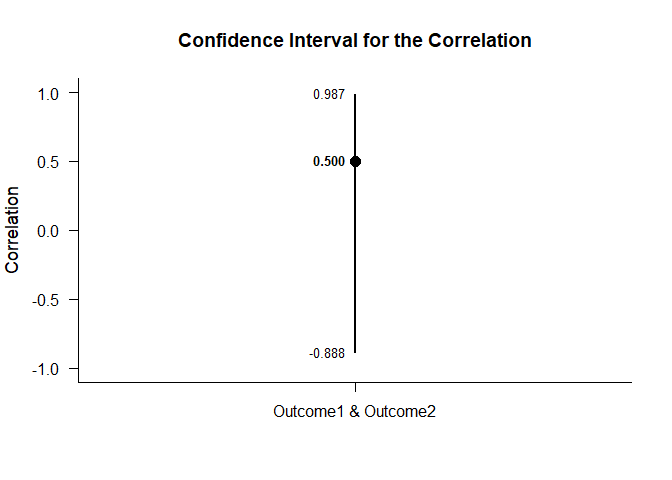
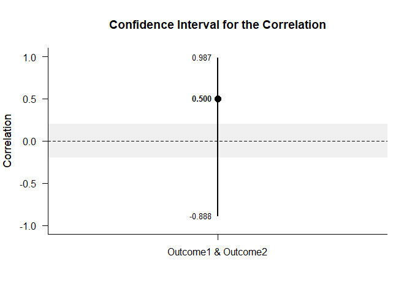
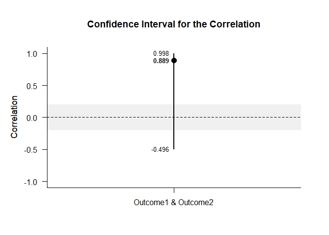
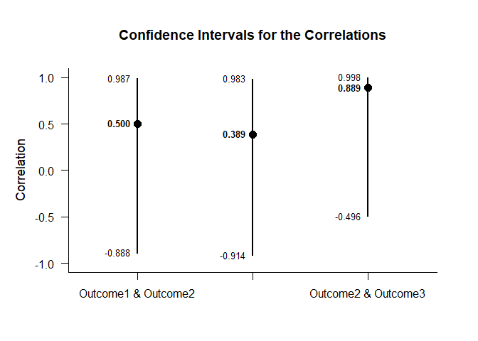
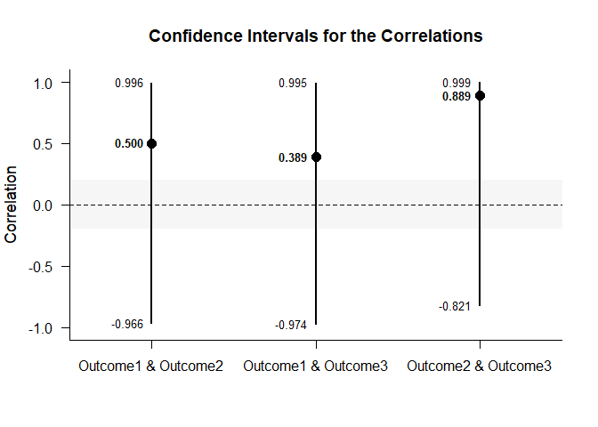
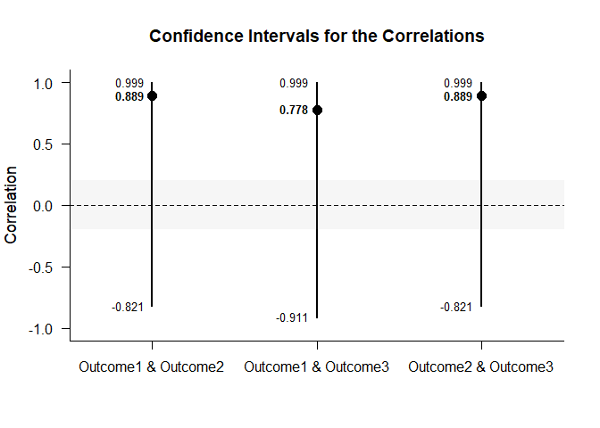
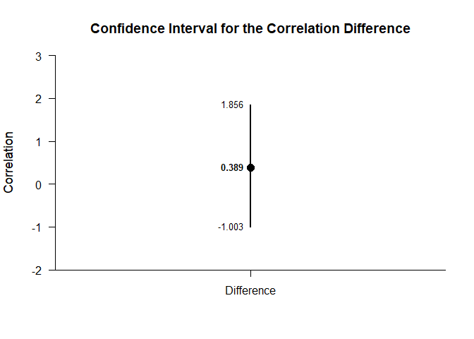
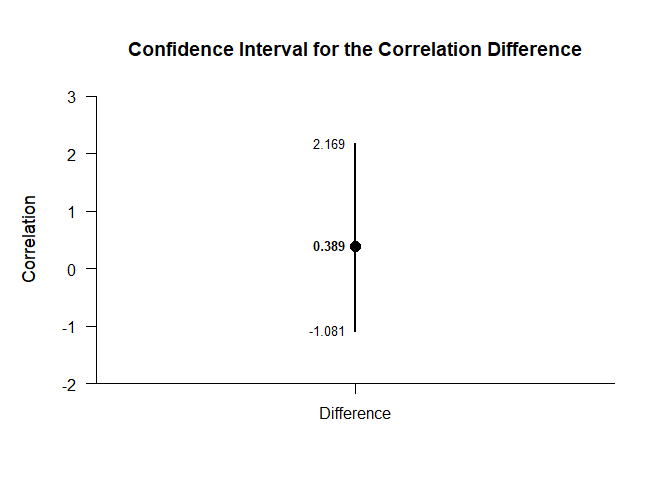
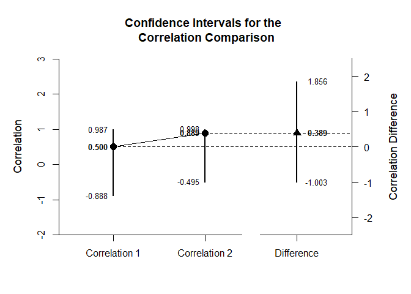
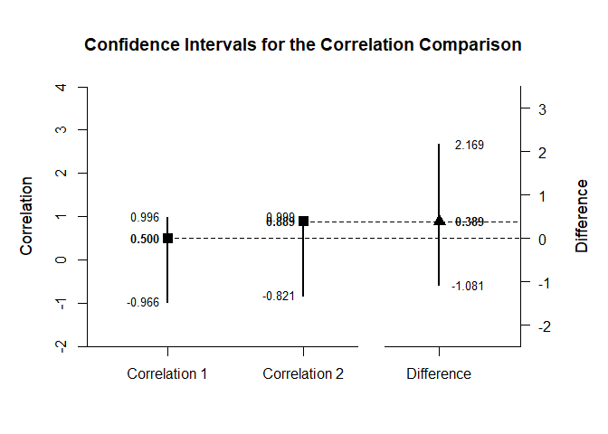

## Mixed Design Correlations Data Tutorial

### Data Management

#### Data Entry

This code inputs the variable names and creates a viewable data frame.

```r
Factor <- c(1,1,1,1,2,2,2,2)
Outcome1 <- c(0,0,3,5,9,4,6,9)
Outcome2 <- c(4,7,4,9,6,3,3,8)
Outcome3 <- c(4,9,6,9,5,3,8,8)
Factor <- factor(Factor,levels=c(1,2),labels=c("Level1","Level2"))
MixedData <- data.frame(Factor,Outcome1,Outcome2,Outcome3)
```

This code subsets the data into two different data frames (for simple effects analysis).

```r
MixedDataL1 <- subset(MixedData,Factor=="Level1")
MixedDataL2 <- subset(MixedData,Factor=="Level2")
```

#### Descriptive Statistics

This code obtains the descriptive statistics for the two data frames.

```r
with(MixedDataL1,describeMeans(cbind(Outcome1,Outcome2,Outcome3)))
```

```
## $`Descriptive Statistics for the Data`
##                N       M      SD    Skew    Kurt
## Outcome1   4.000   2.000   2.449   0.544  -2.944
## Outcome2   4.000   6.000   2.449   0.544  -2.944
## Outcome3   4.000   7.000   2.449  -0.544  -2.944
```

```r
with(MixedDataL2,describeMeans(cbind(Outcome1,Outcome2,Outcome3)))
```

```
## $`Descriptive Statistics for the Data`
##                N       M      SD    Skew    Kurt
## Outcome1   4.000   7.000   2.449  -0.544  -2.944
## Outcome2   4.000   5.000   2.449   0.544  -2.944
## Outcome3   4.000   6.000   2.449  -0.544  -2.944
```

This code obtains a table of correlations for the two data frames.

```r
with(MixedDataL1,describeCorrelations(cbind(Outcome1,Outcome2,Outcome3)))
```

```
## $`Correlation Matrix for the Variables`
##          Outcome1 Outcome2 Outcome3
## Outcome1    1.000    0.500    0.389
## Outcome2    0.500    1.000    0.889
## Outcome3    0.389    0.889    1.000
```

```r
with(MixedDataL2,describeCorrelations(cbind(Outcome1,Outcome2,Outcome3)))
```

```
## $`Correlation Matrix for the Variables`
##          Outcome1 Outcome2 Outcome3
## Outcome1    1.000    0.889    0.500
## Outcome2    0.889    1.000    0.389
## Outcome3    0.500    0.389    1.000
```

### Analyses of a Correlation

This section produces analyses of a single correlation in each of the frames.

#### Confidence Intervals

This code will provide the confidence interval for the correlation.

```r
with(MixedDataL1,estimateCorrelations(cbind(Outcome1,Outcome2)))
```

```
## $`Confidence Interval for the Correlation`
##                           R      SE      LL      UL
## Outcome1 & Outcome2   0.500   1.000  -0.888   0.987
```

```r
with(MixedDataL2,estimateCorrelations(cbind(Outcome1,Outcome2)))
```

```
## $`Confidence Interval for the Correlation`
##                           R      SE      LL      UL
## Outcome1 & Outcome2   0.889   1.000  -0.496   0.998
```

This code will produce a graph of the confidence interval for the correlation.

```r
with(MixedDataL1,plotCorrelations(cbind(Outcome1,Outcome2)))
```

<!-- -->

```r
with(MixedDataL2,plotCorrelations(cbind(Outcome1,Outcome2)))
```

<!-- -->

The code defaults to 95% confidence intervals. This can be changed if desired.

```r
with(MixedDataL1,estimateCorrelations(cbind(Outcome1,Outcome2),conf.level=.99))
```

```
## $`Confidence Interval for the Correlation`
##                           R      SE      LL      UL
## Outcome1 & Outcome2   0.500   1.000  -0.966   0.996
```

```r
with(MixedDataL2,estimateCorrelations(cbind(Outcome1,Outcome2),conf.level=.99))
```

```
## $`Confidence Interval for the Correlation`
##                           R      SE      LL      UL
## Outcome1 & Outcome2   0.889   1.000  -0.821   0.999
```

Of course, it is possible to change from the default confidence level in the graph. It is also possible to add a comparison value and a region of practical equivalence.

```r
with(MixedDataL1,plotCorrelations(cbind(Outcome1,Outcome2),conf.level=.99,line=0,rope=c(-.2,.2)))
```

<!-- -->

```r
with(MixedDataL2,plotCorrelations(cbind(Outcome1,Outcome2),conf.level=.99,line=0,rope=c(-.2,.2)))
```

<!-- -->

#### Significance Tests

This code will produce a table of NHST for the correlation (against a value of zero).

```r
with(MixedDataL1,testCorrelations(cbind(Outcome1,Outcome2)))
```

```
## $`Hypothesis Test for the Correlation`
##                           R      SE      df       t       p
## Outcome1 & Outcome2   0.500   0.612   2.000   0.816   0.500
```

```r
with(MixedDataL2,testCorrelations(cbind(Outcome1,Outcome2)))
```

```
## $`Hypothesis Test for the Correlation`
##                           R      SE      df       t       p
## Outcome1 & Outcome2   0.889   0.324   2.000   2.744   0.111
```

### Analyses of Several Correlations

This section analyzes the correlations among multiple variables.

#### Confidence Intervals

This code will provide the confidence intervals for the correlations.

```r
with(MixedDataL1,estimateCorrelations(cbind(Outcome1,Outcome2,Outcome3)))
```

```
## $`Confidence Intervals for the Correlations`
##                           R      SE      LL      UL
## Outcome1 & Outcome2   0.500   1.000  -0.888   0.987
## Outcome1 & Outcome3   0.389   1.000  -0.914   0.983
## Outcome2 & Outcome3   0.889   1.000  -0.496   0.998
```

```r
with(MixedDataL2,estimateCorrelations(cbind(Outcome1,Outcome2,Outcome3)))
```

```
## $`Confidence Intervals for the Correlations`
##                           R      SE      LL      UL
## Outcome1 & Outcome2   0.889   1.000  -0.496   0.998
## Outcome1 & Outcome3   0.500   1.000  -0.888   0.987
## Outcome2 & Outcome3   0.389   1.000  -0.914   0.983
```

This code will produce a graph of the confidence intervals for the correlations.

```r
with(MixedDataL1,plotCorrelations(cbind(Outcome1,Outcome2,Outcome3)))
```

<!-- -->

```r
with(MixedDataL2,plotCorrelations(cbind(Outcome1,Outcome2,Outcome3)))
```

<!-- -->

The code defaults to 95% confidence intervals. This can be changed if desired.

```r
with(MixedDataL1,estimateCorrelations(cbind(Outcome1,Outcome2,Outcome3),conf.level=.99))
```

```
## $`Confidence Intervals for the Correlations`
##                           R      SE      LL      UL
## Outcome1 & Outcome2   0.500   1.000  -0.966   0.996
## Outcome1 & Outcome3   0.389   1.000  -0.974   0.995
## Outcome2 & Outcome3   0.889   1.000  -0.821   0.999
```

```r
with(MixedDataL2,estimateCorrelations(cbind(Outcome1,Outcome2,Outcome3),conf.level=.99))
```

```
## $`Confidence Intervals for the Correlations`
##                           R      SE      LL      UL
## Outcome1 & Outcome2   0.889   1.000  -0.821   0.999
## Outcome1 & Outcome3   0.500   1.000  -0.966   0.996
## Outcome2 & Outcome3   0.389   1.000  -0.974   0.995
```

Of course, it is possible to change from the default confidence level in the graph. It is also possible to add a comparison value and a region of practical equivalence.

```r
with(MixedDataL1,plotCorrelations(cbind(Outcome1,Outcome2,Outcome3),conf.level=.99,line=0,rope=c(-.2,.2)))
```

<!-- -->

```r
with(MixedDataL2,plotCorrelations(cbind(Outcome1,Outcome2,Outcome3),conf.level=.99,line=0,rope=c(-.2,.2)))
```

<!-- -->

#### Significance Tests

This code will produce a table of NHST for the correlations (against a value of zero).

```r
with(MixedDataL1,testCorrelations(cbind(Outcome1,Outcome2,Outcome3)))
```

```
## $`Hypothesis Tests for the Correlations`
##                           R      SE      df       t       p
## Outcome1 & Outcome2   0.500   0.612   2.000   0.816   0.500
## Outcome1 & Outcome3   0.389   0.651   2.000   0.597   0.611
## Outcome2 & Outcome3   0.889   0.324   2.000   2.744   0.111
```

```r
with(MixedDataL2,testCorrelations(cbind(Outcome1,Outcome2,Outcome3)))
```

```
## $`Hypothesis Tests for the Correlations`
##                           R      SE      df       t       p
## Outcome1 & Outcome2   0.889   0.324   2.000   2.744   0.111
## Outcome1 & Outcome3   0.500   0.612   2.000   0.816   0.500
## Outcome2 & Outcome3   0.389   0.651   2.000   0.597   0.611
```

### Analyses of a Correlation Difference

This section analyzes the difference in the correlations from the two frames.

#### Confidence Intervals

First it is necessary to estimate the confidence intervals for each of the correlations.

```r
CorrEstimateL1 <- with(MixedDataL1,estimateCorrelations(cbind(Outcome1,Outcome2)))
CorrEstimateL2 <- with(MixedDataL2,estimateCorrelations(cbind(Outcome1,Outcome2)))
```

Then we can estimate the difference in the correlations and get its confidence interval.

```r
estimateCorrelationDifference(CorrEstimateL1,CorrEstimateL2)
```

```
## $`Confidence Interval for the Correlation Difference`
##               Diff      LL      UL
## Difference   0.389  -1.003   1.857
```

Of course, it is also possible to the plot this estimate.

```r
plotCorrelationDifference(CorrEstimateL1,CorrEstimateL2)
```

<!-- -->

The code defaults to 95% confidence intervals. This can be changed if desired by first re-estimating the confidence intervals for each correlation.

```r
CorrEstimateL1 <- with(MixedDataL1,estimateCorrelations(cbind(Outcome1,Outcome2),conf.level=.99))
CorrEstimateL2 <- with(MixedDataL2,estimateCorrelations(cbind(Outcome1,Outcome2),conf.level=.99))
```

Then we can estimate the difference in the correlations and get its confidence interval.

```r
estimateCorrelationDifference(CorrEstimateL1,CorrEstimateL2)
```

```
## $`Confidence Interval for the Correlation Difference`
##               Diff      LL      UL
## Difference   0.389  -1.081   2.169
```

Finally, we can re-plot the estimate.

```r
plotCorrelationDifference(CorrEstimateL1,CorrEstimateL2)
```

<!-- -->

If you wish, you can get the confidence intervals for the correlations and the correlation difference combined.

First it is necessary to estimate the confidence intervals for each of the correlations.

```r
CorrEstimateL1 <- with(MixedDataL1,estimateCorrelations(cbind(Outcome1,Outcome2)))
CorrEstimateL2 <- with(MixedDataL2,estimateCorrelations(cbind(Outcome1,Outcome2)))
```

Then we can estimate the correlations and the difference in the correlations.

```r
estimateCorrelationComparison(CorrEstimateL1,CorrEstimateL2)
```

```
## $`Confidence Intervals for the Correlations`
##                     R      SE      LL      UL
## Correlation 1   0.500   1.000  -0.888   0.987
## Correlation 2   0.889   1.000  -0.496   0.998
## 
## $`Confidence Interval for the Correlation Difference`
##               Diff      LL      UL
## Difference   0.389  -1.003   1.857
```

This code produces a difference plot using the confidence intervals for the correlations and the correlation difference.

```r
plotCorrelationComparison(CorrEstimateL1,CorrEstimateL2)
```

<!-- -->

The code defaults to 95% confidence intervals. This can be changed if desired by first re-estimating the confidence intervals for each correlation.

```r
CorrEstimateL1 <- with(MixedDataL1,estimateCorrelations(cbind(Outcome1,Outcome2),conf.level=.99))
CorrEstimateL2 <- with(MixedDataL2,estimateCorrelations(cbind(Outcome1,Outcome2),conf.level=.99))
```

Then we can estimate the correlations and the difference in the correlations.

```r
estimateCorrelationComparison(CorrEstimateL1,CorrEstimateL2)
```

```
## $`Confidence Intervals for the Correlations`
##                     R      SE      LL      UL
## Correlation 1   0.500   1.000  -0.966   0.996
## Correlation 2   0.889   1.000  -0.821   0.999
## 
## $`Confidence Interval for the Correlation Difference`
##               Diff      LL      UL
## Difference   0.389  -1.081   2.169
```

Finally, we can re-plot the comparison.

```r
plotCorrelationComparison(CorrEstimateL1,CorrEstimateL2)
```

<!-- -->
