## Mixed Design Data Tutorial

### Data Management

#### Data Entry

This code inputs the variable names and creates a viewable data frame.

```r
Factor <- c(1,1,1,1,2,2,2,2)
Outcome1 <- c(0,0,3,5,9,4,6,9)
Outcome2 <- c(4,7,4,9,6,3,3,8)
Outcome3 <- c(4,9,6,9,5,3,8,8)
Factor <- factor(Factor,levels=c(1,2),labels=c("Level1","Level2"))
MixedData <- data.frame(Factor,Outcome1,Outcome2,Outcome3)
```

This code subsets the data into two different data frames (for simple effects analysis).

```r
MixedDataL1 <- subset(MixedData,Factor=="Level1")
MixedDataL2 <- subset(MixedData,Factor=="Level2")
```

#### Descriptive Statistics

This code obtains the descriptive statistics for the two data frames.

```r
with(MixedDataL1,describeMeans(Outcome1,Outcome2,Outcome3))
```

```
## $`Descriptive Statistics for the Data`
##                N       M      SD    Skew    Kurt
## Outcome1   4.000   2.000   2.449   0.544  -2.944
## Outcome2   4.000   6.000   2.449   0.544  -2.944
## Outcome3   4.000   7.000   2.449  -0.544  -2.944
```

```r
with(MixedDataL2,describeMeans(Outcome1,Outcome2,Outcome3))
```

```
## $`Descriptive Statistics for the Data`
##                N       M      SD    Skew    Kurt
## Outcome1   4.000   7.000   2.449  -0.544  -2.944
## Outcome2   4.000   5.000   2.449   0.544  -2.944
## Outcome3   4.000   6.000   2.449  -0.544  -2.944
```

### Analyses of the Means

This section produces analyses that are equivalent to one-sample analyses separately for each level of a factor.

#### Confidence Intervals

This code will provide tables of confidence intervals for each level of the factor.

```r
with(MixedDataL1,estimateMeans(Outcome1,Outcome2,Outcome3))
```

```
## $`Confidence Intervals for the Means`
##                M      SE      df      LL      UL
## Outcome1   2.000   1.225   3.000  -1.898   5.898
## Outcome2   6.000   1.225   3.000   2.102   9.898
## Outcome3   7.000   1.225   3.000   3.102  10.898
```

```r
with(MixedDataL2,estimateMeans(Outcome1,Outcome2,Outcome3))
```

```
## $`Confidence Intervals for the Means`
##                M      SE      df      LL      UL
## Outcome1   7.000   1.225   3.000   3.102  10.898
## Outcome2   5.000   1.225   3.000   1.102   8.898
## Outcome3   6.000   1.225   3.000   2.102   9.898
```

This code will produce a graph of the confidence intervals for each level of the factor.

```r
with(MixedDataL1,plotMeans(Outcome1,Outcome2,Outcome3))
```

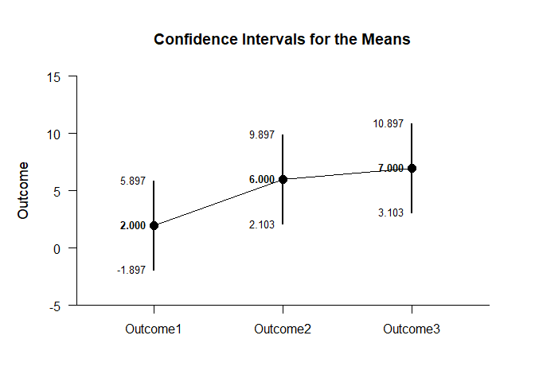<!-- -->

```r
with(MixedDataL2,plotMeans(Outcome1,Outcome2,Outcome3))
```

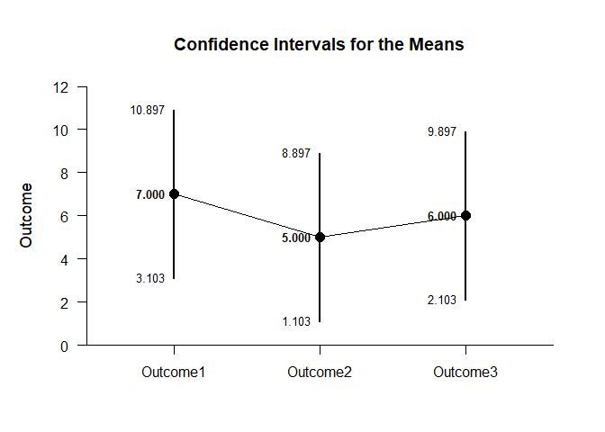<!-- -->

The code defaults to 95% confidence intervals. This can be changed if desired.

```r
with(MixedDataL1,estimateMeans(Outcome1,Outcome2,Outcome3,conf.level=.99))
```

```
## $`Confidence Intervals for the Means`
##                M      SE      df      LL      UL
## Outcome1   2.000   1.225   3.000  -5.154   9.154
## Outcome2   6.000   1.225   3.000  -1.154  13.154
## Outcome3   7.000   1.225   3.000  -0.154  14.154
```

```r
with(MixedDataL2,estimateMeans(Outcome1,Outcome2,Outcome3,conf.level=.99))
```

```
## $`Confidence Intervals for the Means`
##                M      SE      df      LL      UL
## Outcome1   7.000   1.225   3.000  -0.154  14.154
## Outcome2   5.000   1.225   3.000  -2.154  12.154
## Outcome3   6.000   1.225   3.000  -1.154  13.154
```

For the graph, it is possible to add a comparison line to represent a population (or test) value and a region of practical equivalence in addition to changing the confidence level.

```r
with(MixedDataL1,plotMeans(Outcome1,Outcome2,Outcome3,conf.level=.99,line=5,rope=c(3,7)))
```

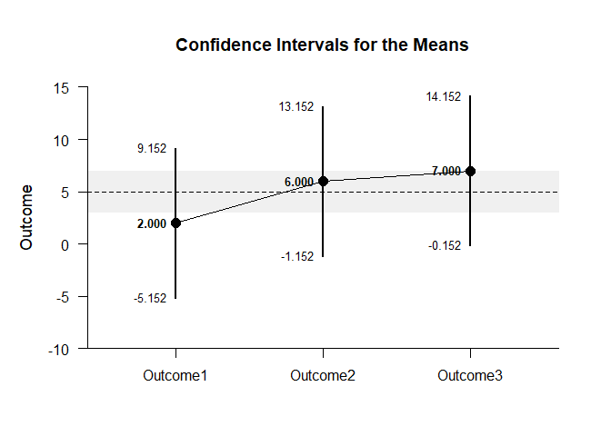<!-- -->

```r
with(MixedDataL2,plotMeans(Outcome1,Outcome2,Outcome3,conf.level=.99,line=5,rope=c(3,7)))
```

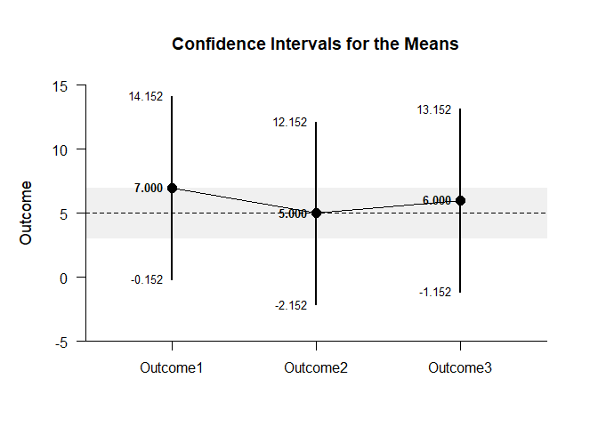<!-- -->

#### Significance Tests

This code will produce a table of NHST separately for each level of the factor. In this case, all the means are tested against a value of zero.

```r
with(MixedDataL1,testMeans(Outcome1,Outcome2,Outcome3))
```

```
## $`Hypothesis Tests for the Means`
##             Diff      SE      df       t       p
## Outcome1   2.000   1.225   3.000   1.633   0.201
## Outcome2   6.000   1.225   3.000   4.899   0.016
## Outcome3   7.000   1.225   3.000   5.715   0.011
```

```r
with(MixedDataL2,testMeans(Outcome1,Outcome2,Outcome3))
```

```
## $`Hypothesis Tests for the Means`
##             Diff      SE      df       t       p
## Outcome1   7.000   1.225   3.000   5.715   0.011
## Outcome2   5.000   1.225   3.000   4.082   0.027
## Outcome3   6.000   1.225   3.000   4.899   0.016
```

Often, the default test value of zero is not meaningful or plausible. This too can be altered (often in conjunction with what is presented in the plot).

```r
with(MixedDataL1,testMeans(Outcome1,Outcome2,Outcome3,mu=5))
```

```
## $`Hypothesis Tests for the Means`
##             Diff      SE      df       t       p
## Outcome1  -3.000   1.225   3.000  -2.449   0.092
## Outcome2   1.000   1.225   3.000   0.816   0.474
## Outcome3   2.000   1.225   3.000   1.633   0.201
```

```r
with(MixedDataL2,testMeans(Outcome1,Outcome2,Outcome3,mu=5))
```

```
## $`Hypothesis Tests for the Means`
##             Diff      SE      df       t       p
## Outcome1   2.000   1.225   3.000   1.633   0.201
## Outcome2   0.000   1.225   3.000   0.000   1.000
## Outcome3   1.000   1.225   3.000   0.816   0.474
```

#### Standardized Effect Sizes

This code will produce a table of standardized mean differences separately for each level of the factor. In this case, the mean is compared to zero to form the effect size.

```r
with(MixedDataL1,estimateStandardizedMeans(Outcome1,Outcome2,Outcome3))
```

```
## $`Confidence Intervals for the Standardized Means`
##                d      SE      LL      UL
## Outcome1   0.816   0.616  -0.387   1.934
## Outcome2   2.449   0.955   0.325   4.531
## Outcome3   2.858   1.063   0.464   5.226
```

```r
with(MixedDataL2,estimateStandardizedMeans(Outcome1,Outcome2,Outcome3))
```

```
## $`Confidence Intervals for the Standardized Means`
##                d      SE      LL      UL
## Outcome1   2.858   1.063   0.464   5.226
## Outcome2   2.041   0.854   0.176   3.846
## Outcome3   2.449   0.955   0.325   4.531
```

Here too it is possible to alter the width of the confidence intervals and to establish a more plausible comparison value for the mean.

```r
with(MixedDataL1,estimateStandardizedMeans(Outcome1,Outcome2,Outcome3,mu=5,conf.level=.99))
```

```
## $`Confidence Intervals for the Standardized Means`
##                d      SE      LL      UL
## Outcome1  -1.225   0.680  -3.010   0.547
## Outcome2   0.408   0.574  -0.969   1.734
## Outcome3   0.816   0.616  -0.732   2.319
```

```r
with(MixedDataL2,estimateStandardizedMeans(Outcome1,Outcome2,Outcome3,mu=5,conf.level=.99))
```

```
## $`Confidence Intervals for the Standardized Means`
##                d      SE      LL      UL
## Outcome1   0.816   0.616  -0.732   2.319
## Outcome2   0.000   0.559  -1.288   1.288
## Outcome3   0.408   0.574  -0.969   1.734
```

### Analyses of a Comparison

This section produces analyses that are equivalent to comparisons of two levels of a factor.

#### Confidence Intervals

This code identifies the two levels for comparison and estimates the confidence interval of the difference.

```r
with(MixedDataL1,estimateMeanDifference(Outcome1,Outcome2))
```

```
## $`Confidence Interval for the Mean Difference`
##               Diff      SE      df      LL      UL
## Comparison   4.000   1.225   3.000   0.102   7.898
```

```r
with(MixedDataL2,estimateMeanDifference(Outcome1,Outcome2))
```

```
## $`Confidence Interval for the Mean Difference`
##               Diff      SE      df      LL      UL
## Comparison  -2.000   0.577   3.000  -3.837  -0.163
```

This code obtains and plots the confidence intervals for the mean difference in the identified comparison.

```r
with(MixedDataL1,plotMeanDifference(Outcome1,Outcome2))
```

<!-- -->

```r
with(MixedDataL2,plotMeanDifference(Outcome1,Outcome2))
```

<!-- -->

Of course, you can change the confidence level from the default 95% if desired.

```r
with(MixedDataL1,estimateMeanDifference(Outcome1,Outcome2,conf.level=.99))
```

```
## $`Confidence Interval for the Mean Difference`
##               Diff      SE      df      LL      UL
## Comparison   4.000   1.225   3.000  -3.154  11.154
```

```r
with(MixedDataL2,estimateMeanDifference(Outcome1,Outcome2,conf.level=.99))
```

```
## $`Confidence Interval for the Mean Difference`
##               Diff      SE      df      LL      UL
## Comparison  -2.000   0.577   3.000  -5.372   1.372
```

Once again, the confidence levels can be changed away from the default and a comparison line to represent a population (or test) value and a region of practical equivalence can be added to the graph.

```r
with(MixedDataL1,plotMeanDifference(Outcome1,Outcome2,conf.level=.99,line=0,rope=c(-2,2)))
```

<!-- -->

```r
with(MixedDataL2,plotMeanDifference(Outcome1,Outcome2,conf.level=.99,line=0,rope=c(-2,2)))
```

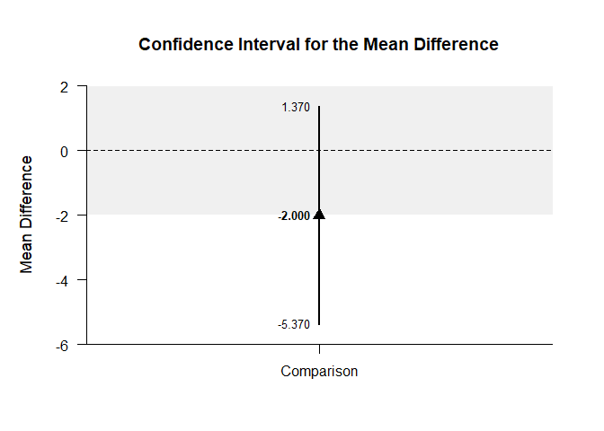<!-- -->

If you wish, you can get the confidence intervals for the means and the mean difference in one command.

```r
with(MixedDataL1,estimateMeanComparison(Outcome1,Outcome2))
```

```
## $`Confidence Intervals for the Means`
##                M      SE      df      LL      UL
## Outcome1   2.000   1.225   3.000  -1.898   5.898
## Outcome2   6.000   1.225   3.000   2.102   9.898
## 
## $`Confidence Interval for the Mean Difference`
##               Diff      SE      df      LL      UL
## Comparison   4.000   1.225   3.000   0.102   7.898
```

```r
with(MixedDataL2,estimateMeanComparison(Outcome1,Outcome2))
```

```
## $`Confidence Intervals for the Means`
##                M      SE      df      LL      UL
## Outcome1   7.000   1.225   3.000   3.102  10.898
## Outcome2   5.000   1.225   3.000   1.102   8.898
## 
## $`Confidence Interval for the Mean Difference`
##               Diff      SE      df      LL      UL
## Comparison  -2.000   0.577   3.000  -3.837  -0.163
```

This code produces a difference plot using the confidence intervals for the means and the mean difference.

```r
with(MixedDataL1,plotMeanComparison(Outcome1,Outcome2))
```

<!-- -->

```r
with(MixedDataL2,plotMeanComparison(Outcome1,Outcome2))
```

<!-- -->

Of course, you can change the confidence level from the default 95% if desired.

```r
with(MixedDataL1,estimateMeanComparison(Outcome1,Outcome2,conf.level=.99))
```

```
## $`Confidence Intervals for the Means`
##                M      SE      df      LL      UL
## Outcome1   2.000   1.225   3.000  -5.154   9.154
## Outcome2   6.000   1.225   3.000  -1.154  13.154
## 
## $`Confidence Interval for the Mean Difference`
##               Diff      SE      df      LL      UL
## Comparison   4.000   1.225   3.000  -3.154  11.154
```

```r
with(MixedDataL2,estimateMeanComparison(Outcome1,Outcome2,conf.level=.99))
```

```
## $`Confidence Intervals for the Means`
##                M      SE      df      LL      UL
## Outcome1   7.000   1.225   3.000  -0.154  14.154
## Outcome2   5.000   1.225   3.000  -2.154  12.154
## 
## $`Confidence Interval for the Mean Difference`
##               Diff      SE      df      LL      UL
## Comparison  -2.000   0.577   3.000  -5.372   1.372
```

Once again, the confidence levels can be changed away from the default and a region of practical equivalence can be added to the graph.

```r
with(MixedDataL1,plotMeanComparison(Outcome1,Outcome2,conf.level=.99,rope=c(-2,2)))
```

<!-- -->

```r
with(MixedDataL2,plotMeanComparison(Outcome1,Outcome2,conf.level=.99,rope=c(-2,2)))
```

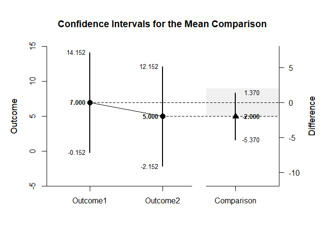<!-- -->

#### Significance Tests

This code produces NHST for the identified comparison (using a default test value of zero).

```r
with(MixedDataL1,testMeanDifference(Outcome1,Outcome2))
```

```
## $`Hypothesis Test for the Mean Difference`
##               Diff      SE      df       t       p
## Comparison   4.000   1.225   3.000   3.266   0.047
```

```r
with(MixedDataL2,testMeanDifference(Outcome1,Outcome2))
```

```
## $`Hypothesis Test for the Mean Difference`
##               Diff      SE      df       t       p
## Comparison  -2.000   0.577   3.000  -3.464   0.041
```

If the default value of zero is not plausible, it too can be changed.

```r
with(MixedDataL1,testMeanDifference(Outcome1,Outcome2,mu=-2))
```

```
## $`Hypothesis Test for the Mean Difference`
##               Diff      SE      df       t       p
## Comparison   6.000   1.225   3.000   4.899   0.016
```

```r
with(MixedDataL2,testMeanDifference(Outcome1,Outcome2,mu=-2))
```

```
## $`Hypothesis Test for the Mean Difference`
##               Diff      SE      df       t       p
## Comparison   0.000   0.577   3.000   0.000   1.000
```

#### Standardized Effect Sizes

This code calculates a standardized mean difference for the comparison and its confidence interval.

```r
with(MixedDataL1,estimateStandardizedMeanDifference(Outcome1,Outcome2))
```

```
## $`Confidence Interval for the Standardized Mean Difference`
##                  d      SE      LL      UL
## Comparison   1.633   0.782   0.101   3.165
```

```r
with(MixedDataL2,estimateStandardizedMeanDifference(Outcome1,Outcome2))
```

```
## $`Confidence Interval for the Standardized Mean Difference`
##                  d      SE      LL      UL
## Comparison  -0.816   0.417  -1.633   0.000
```

The width of the confidence interval for the effect size can be altered if desired.

```r
with(MixedDataL1,estimateStandardizedMeanDifference(Outcome1,Outcome2,conf.level=.99))
```

```
## $`Confidence Interval for the Standardized Mean Difference`
##                  d      SE      LL      UL
## Comparison   1.633   0.782  -0.381   3.647
```

```r
with(MixedDataL2,estimateStandardizedMeanDifference(Outcome1,Outcome2,conf.level=.99))
```

```
## $`Confidence Interval for the Standardized Mean Difference`
##                  d      SE      LL      UL
## Comparison  -0.816   0.417  -1.889   0.257
```

### Analyses of a Contrast

This section produces analyses that are equivalent to analyses involving multiple levels of a factor.

This code identifies a contrast among the levels.

```r
O1vsOthers <- c(-1,.5,.5)
```

#### Confidence Intervals

This code produces a confidence interval for that contrast.

```r
with(MixedDataL1,estimateMeanContrast(Outcome1,Outcome2,Outcome3,contrast=O1vsOthers))
```

```
## $`Confidence Interval for the Mean Contrast`
##              Est      SE      df      LL      UL
## Contrast   4.500   1.258   3.000   0.496   8.504
```

```r
with(MixedDataL2,estimateMeanContrast(Outcome1,Outcome2,Outcome3,contrast=O1vsOthers))
```

```
## $`Confidence Interval for the Mean Contrast`
##              Est      SE      df      LL      UL
## Contrast  -1.500   0.677   3.000  -3.655   0.655
```

This code obtains and plots the confidence intervals for the mean difference in the identified contrast.

```r
with(MixedDataL1,plotMeanContrast(Outcome1,Outcome2,Outcome3,contrast=O1vsOthers))
```

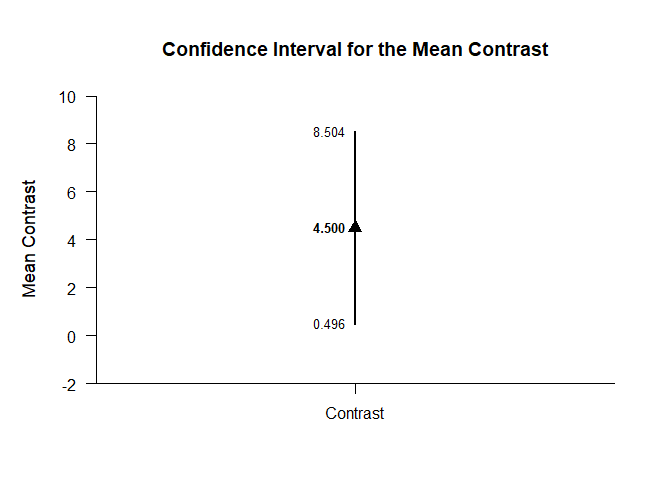<!-- -->

```r
with(MixedDataL2,plotMeanContrast(Outcome1,Outcome2,Outcome3,contrast=O1vsOthers))
```

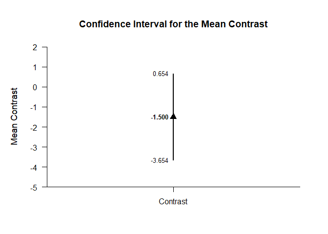<!-- -->

As in all other cases, the default value of the confidence interval can be changed.

```r
with(MixedDataL1,estimateMeanContrast(Outcome1,Outcome2,Outcome3,contrast=O1vsOthers,conf.level=.99))
```

```
## $`Confidence Interval for the Mean Contrast`
##              Est      SE      df      LL      UL
## Contrast   4.500   1.258   3.000  -2.850  11.850
```

```r
with(MixedDataL2,estimateMeanContrast(Outcome1,Outcome2,Outcome3,contrast=O1vsOthers,conf.level=.99))
```

```
## $`Confidence Interval for the Mean Contrast`
##              Est      SE      df      LL      UL
## Contrast  -1.500   0.677   3.000  -5.454   2.454
```

The width of the confidence interval for the contrast can be altered and a comparison line to represent a population (or test) value and a region of practical equivalence can be added to the graph.

```r
with(MixedDataL1,plotMeanContrast(Outcome1,Outcome2,Outcome3,contrast=O1vsOthers,conf.level=.99,line=0,rope=c(-2,2)))
```

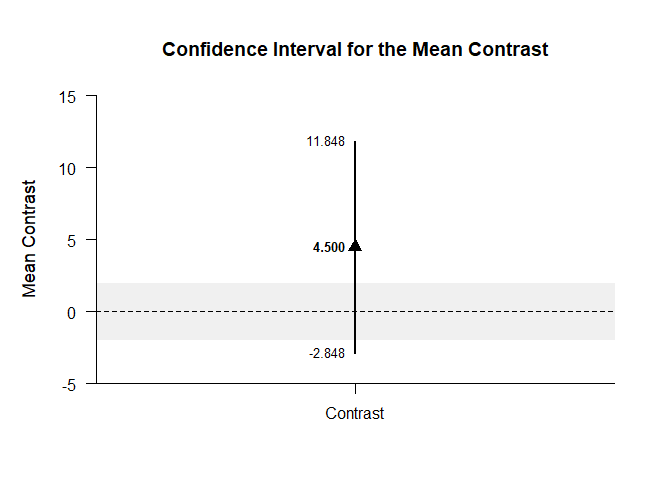<!-- -->

```r
with(MixedDataL2,plotMeanContrast(Outcome1,Outcome2,Outcome3,contrast=O1vsOthers,conf.level=.99,line=0,rope=c(-2,2)))
```

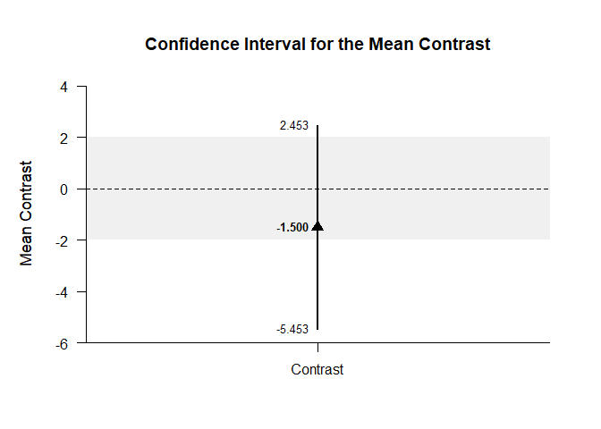<!-- -->

If you wish, you can get the confidence intervals for the mean subsets and the mean contrast in one command.

```r
with(MixedDataL1,estimateMeanSubsets(Outcome1,Outcome2,Outcome3,contrast=O1vsOthers))
```

```
## $`Confidence Intervals for the Mean Subsets`
##                  Est      SE      df      LL      UL
## Neg Weighted   2.000   1.225   3.000  -1.898   5.898
## Pos Weighted   6.500   1.190   3.000   2.712  10.288
## 
## $`Confidence Interval for the Mean Contrast`
##              Est      SE      df      LL      UL
## Contrast   4.500   1.258   3.000   0.496   8.504
```

```r
with(MixedDataL2,estimateMeanSubsets(Outcome1,Outcome2,Outcome3,contrast=O1vsOthers))
```

```
## $`Confidence Intervals for the Mean Subsets`
##                  Est      SE      df      LL      UL
## Neg Weighted   7.000   1.225   3.000   3.102  10.898
## Pos Weighted   5.500   1.021   3.000   2.252   8.748
## 
## $`Confidence Interval for the Mean Contrast`
##              Est      SE      df      LL      UL
## Contrast  -1.500   0.677   3.000  -3.655   0.655
```

This code produces a difference plot using the confidence intervals for the mean subsets and the mean contrast.

```r
with(MixedDataL1,plotMeanSubsets(Outcome1,Outcome2,Outcome3,contrast=O1vsOthers))
```

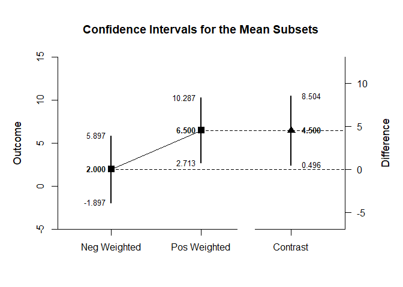<!-- -->

```r
with(MixedDataL2,plotMeanSubsets(Outcome1,Outcome2,Outcome3,contrast=O1vsOthers))
```

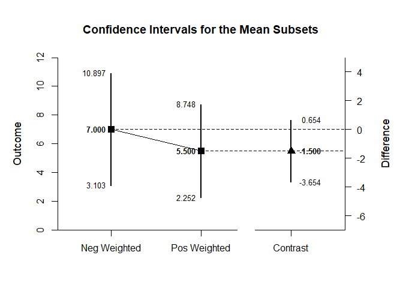<!-- -->

Of course, you can change the confidence level from the default 95% if desired.

```r
with(MixedDataL1,estimateMeanSubsets(Outcome1,Outcome2,Outcome3,contrast=O1vsOthers,conf.level=.99))
```

```
## $`Confidence Intervals for the Mean Subsets`
##                  Est      SE      df      LL      UL
## Neg Weighted   2.000   1.225   3.000  -5.154   9.154
## Pos Weighted   6.500   1.190   3.000  -0.452  13.452
## 
## $`Confidence Interval for the Mean Contrast`
##              Est      SE      df      LL      UL
## Contrast   4.500   1.258   3.000  -2.850  11.850
```

```r
with(MixedDataL2,estimateMeanSubsets(Outcome1,Outcome2,Outcome3,contrast=O1vsOthers,conf.level=.99))
```

```
## $`Confidence Intervals for the Mean Subsets`
##                  Est      SE      df      LL      UL
## Neg Weighted   7.000   1.225   3.000  -0.154  14.154
## Pos Weighted   5.500   1.021   3.000  -0.461  11.461
## 
## $`Confidence Interval for the Mean Contrast`
##              Est      SE      df      LL      UL
## Contrast  -1.500   0.677   3.000  -5.454   2.454
```

Once again, the confidence levels can be changed away from the default and a region of practical equivalence can be added to the graph.

```r
with(MixedDataL1,plotMeanSubsets(Outcome1,Outcome2,Outcome3,contrast=O1vsOthers,labels=c("Outcome1","Others"),conf.level=.99,rope=c(-2,2)))
```

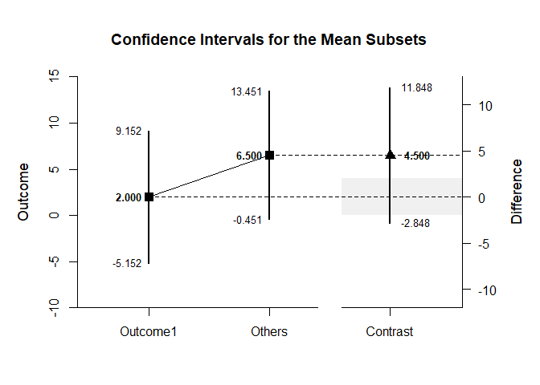<!-- -->

```r
with(MixedDataL2,plotMeanSubsets(Outcome1,Outcome2,Outcome3,contrast=O1vsOthers,labels=c("Outcome1","Others"),conf.level=.99,rope=c(-2,2)))
```

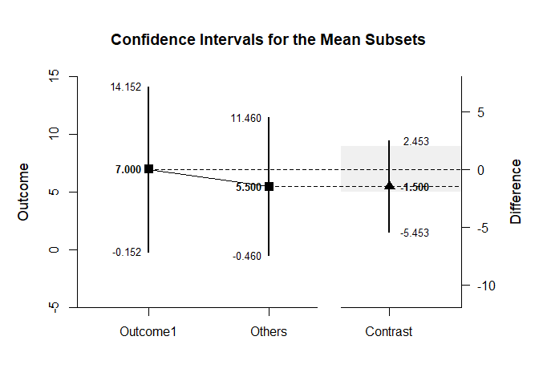<!-- -->

#### Significance Tests

This code produces a NHST for the identified contrast. It tests the contrast against a value of zero by default.

```r
with(MixedDataL1,testMeanContrast(Outcome1,Outcome2,Outcome3,contrast=O1vsOthers))
```

```
## $`Hypothesis Test for the Mean Contrast`
##              Est      SE      df       t       p
## Contrast   4.500   1.258   3.000   3.576   0.037
```

```r
with(MixedDataL2,testMeanContrast(Outcome1,Outcome2,Outcome3,contrast=O1vsOthers))
```

```
## $`Hypothesis Test for the Mean Contrast`
##              Est      SE      df       t       p
## Contrast  -1.500   0.677   3.000  -2.216   0.114
```

If desired, the contrast can be tested against other values.

```r
with(MixedDataL1,testMeanContrast(Outcome1,Outcome2,Outcome3,contrast=O1vsOthers,mu=4))
```

```
## $`Hypothesis Test for the Mean Contrast`
##              Est      SE      df       t       p
## Contrast   0.500   1.258   3.000   0.397   0.718
```

```r
with(MixedDataL2,testMeanContrast(Outcome1,Outcome2,Outcome3,contrast=O1vsOthers,mu=4))
```

```
## $`Hypothesis Test for the Mean Contrast`
##              Est      SE      df       t       p
## Contrast  -5.500   0.677   3.000  -8.124   0.004
```

#### Standardized Effect Sizes

This code calculates a standardized contrast and its confidence interval.

```r
with(MixedDataL1,estimateStandardizedMeanContrast(Outcome1,Outcome2,Outcome3,contrast=O1vsOthers))
```

```
## $`Confidence Interval for the Standardized Mean Contrast`
##              Est      SE      LL      UL
## Contrast   1.837   0.676   0.512   3.162
```

```r
with(MixedDataL2,estimateStandardizedMeanContrast(Outcome1,Outcome2,Outcome3,contrast=O1vsOthers))
```

```
## $`Confidence Interval for the Standardized Mean Contrast`
##              Est      SE      LL      UL
## Contrast  -0.612   0.482  -1.556   0.331
```

The width of the confidence interval for the effect size can be altered if desired.

```r
with(MixedDataL1,estimateStandardizedMeanContrast(Outcome1,Outcome2,Outcome3,contrast=O1vsOthers,conf.level=.99))
```

```
## $`Confidence Interval for the Standardized Mean Contrast`
##              Est      SE      LL      UL
## Contrast   1.837   0.676   0.096   3.579
```

```r
with(MixedDataL2,estimateStandardizedMeanContrast(Outcome1,Outcome2,Outcome3,contrast=O1vsOthers,conf.level=.99))
```

```
## $`Confidence Interval for the Standardized Mean Contrast`
##              Est      SE      LL      UL
## Contrast  -0.612   0.482  -1.853   0.628
```
