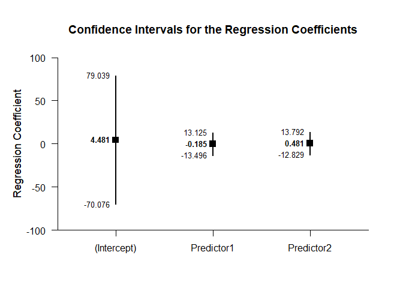
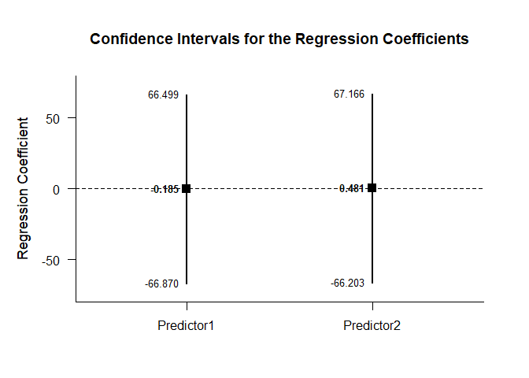
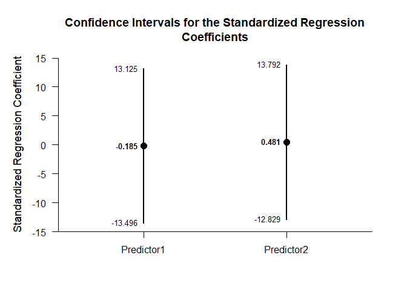
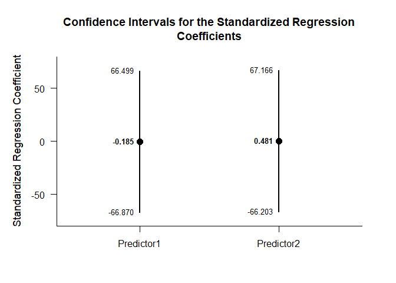

## Multiple Regression Data Tutorial

This page analyzes multiple regression models using raw data input.

- [Data Management](#data-management)
  - [Data Entry](#data-entry)
  - [Descriptive Statistics](#descriptive-statistics)
- [Analyses of the Overall Model](#analyses-of-the-overall-model)
  - [Confidence Interval](#confidence-interval)
  - [Significance Test](#significance-test)
- [Analyses of the Regression
  Coefficients](#analyses-of-the-regression-coefficients)
  - [Confidence Intervals](#confidence-intervals)
  - [Significance Tests](#significance-tests)
  - [Standardized Coefficients](#standardized-coefficients)

------------------------------------------------------------------------

### Data Management

#### Data Entry

This code inputs the variable names and creates a viewable data frame.

``` r
Predictor1 <- c(0,0,3,5)
Predictor2 <- c(4,7,4,9)
Criterion <- c(9,6,4,9)
RegressionData <- data.frame(Predictor1,Predictor2,Criterion)
```

#### Descriptive Statistics

This code obtains the descriptive statistics for the data frame.

``` r
describeMeans(RegressionData)
```

    ## $`Descriptive Statistics for the Data`
    ##                  N       M      SD    Skew    Kurt
    ## Predictor1   4.000   2.000   2.449   0.544  -2.944
    ## Predictor2   4.000   6.000   2.449   0.544  -2.944
    ## Criterion    4.000   7.000   2.449  -0.544  -2.944

### Analyses of the Overall Model

This section produces analyses of the overall regression model.

#### Confidence Interval

This code will produce the confidence interval for R Squared.

``` r
estimateRegressionOmnibus(RegressionData)
```

    ## $`Proportion of Variance Accounted For by the Regression Model`
    ##           Est      LL      UL
    ## Model   0.177   0.000   0.263

The code defaults to 90% confidence intervals. This can be changed if
desired.

``` r
estimateRegressionOmnibus(RegressionData,conf.level=.95)
```

    ## $`Proportion of Variance Accounted For by the Regression Model`
    ##           Est      LL      UL
    ## Model   0.177   0.000   0.432

#### Significance Test

This code will produce a source table associated with the regression
model.

``` r
describeRegressionOmnibus(RegressionData)
```

    ## $`Source Table for the Regression Model`
    ##            SS      df      MS
    ## Model   3.185   2.000   1.593
    ## Error  14.815   1.000  14.815
    ## Total  18.000   3.000   6.000

This code will calculate NHST for the regression model.

``` r
testRegressionOmnibus(RegressionData)
```

    ## $`Hypothesis Test for the Regression Model`
    ##             F     df1     df2       p
    ## Model   0.108   2.000   1.000   0.907

### Analyses of the Regression Coefficients

This section analyses the regression coefficients obtained from the
overall model.

#### Confidence Intervals

This code will provide a table of confidence intervals for each of the
regression coefficients.

``` r
estimateRegressionCoefficients(RegressionData)
```

    ## $`Confidence Intervals for the Regression Coefficients`
    ##                 Est      SE      LL      UL
    ## (Intercept)   4.481   5.868 -70.076  79.039
    ## Predictor1   -0.185   1.048 -13.496  13.125
    ## Predictor2    0.481   1.048 -12.829  13.792

This code will produce a graph of the confidence intervals for each of
the regression coefficients.

``` r
plotRegressionCoefficients(RegressionData)
```

<!-- -->

The code defaults to 95% confidence intervals. This can be changed if
desired.

``` r
estimateRegressionCoefficients(RegressionData,conf.level=.99)
```

    ## $`Confidence Intervals for the Regression Coefficients`
    ##                 Est      SE       LL      UL
    ## (Intercept)   4.481   5.868 -369.042 378.005
    ## Predictor1   -0.185   1.048  -66.870  66.499
    ## Predictor2    0.481   1.048  -66.203  67.166

For the graph, it is possible to plot just coefficients for the
predictors (minus the intercept) in addition to changing the confidence
level.

``` r
plotRegressionCoefficients(RegressionData,conf.level=.99,line=0,intercept=FALSE)
```

<!-- -->

#### Significance Tests

This code will produce a table of NHST separately for each of the
regression coefficients. In this case, all the coefficients are tested
against a value of zero.

``` r
testRegressionCoefficients(RegressionData)
```

    ## $`Hypothesis Tests for the Regression Coefficients`
    ##                 Est      SE       t       p
    ## (Intercept)   4.481   5.868   0.764   0.585
    ## Predictor1   -0.185   1.048  -0.177   0.889
    ## Predictor2    0.481   1.048   0.460   0.726

#### Standardized Coefficients

This code will provide a table of confidence intervals for each of the
standardized coefficients.

``` r
estimateStandardizedRegressionCoefficients(RegressionData)
```

    ## $`Confidence Intervals for the Standardized Regression Coefficients`
    ##                Est      SE      LL      UL
    ## Predictor1  -0.185   1.048 -13.496  13.125
    ## Predictor2   0.481   1.048 -12.829  13.792

This code will produce a graph of the confidence intervals for each of
the standardized coefficients.

``` r
plotStandardizedRegressionCoefficients(RegressionData)
```

<!-- -->

As in other places, the code defaults to 95% confidence intervals. This
can be changed if desired.

``` r
estimateStandardizedRegressionCoefficients(RegressionData,conf.level=.99)
```

    ## $`Confidence Intervals for the Standardized Regression Coefficients`
    ##                Est      SE      LL      UL
    ## Predictor1  -0.185   1.048 -66.870  66.499
    ## Predictor2   0.481   1.048 -66.203  67.166

For the graph, it is possible to change the confidence level.

``` r
plotStandardizedRegressionCoefficients(RegressionData,conf.level=.99)
```

<!-- -->
