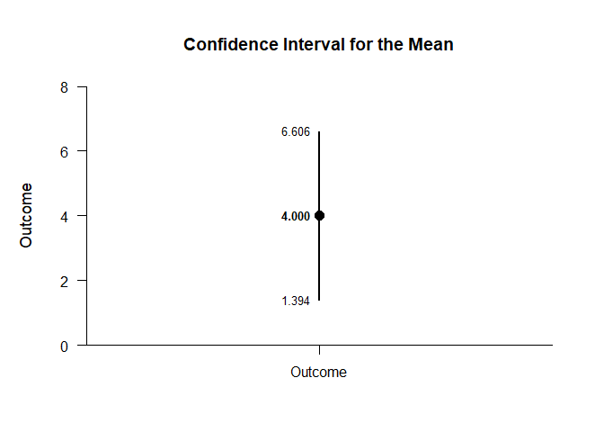
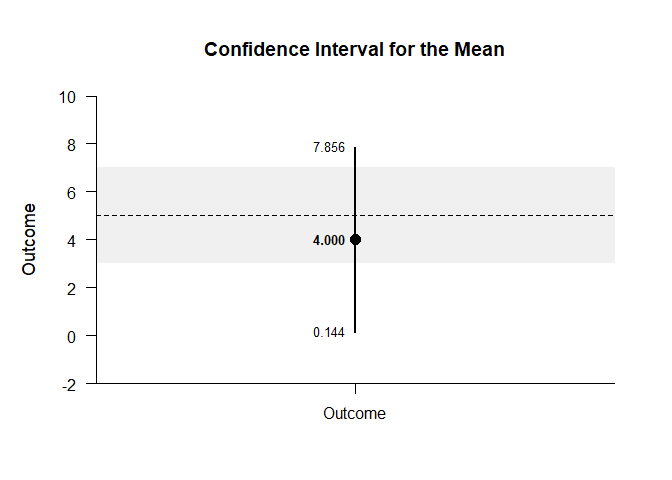

## One Sample Tutorial with Summary Statistics

### Data Management

This code inputs the variable and creates a single summary table.

```r
Outcome <- c(N=8,M=4.000,SD=3.117)
OneSampleSummary <- rbind(Outcome)
class(OneSampleSummary) <- "wss"
```

### Analyses of the Mean

This section produces analyses that are equivalent to one-sample analyses for the variable.

#### Confidence Interval

This code will provide a confidence interval for the variable.

```r
estimateMeans(OneSampleSummary)
```

```
## $`Confidence Interval for the Mean`
##               M      SE      df      LL      UL
## Outcome   4.000   1.102   7.000   1.394   6.606
```

This code will produce a graph of the confidence interval for the variable.

```r
plotMeans(OneSampleSummary)
```

<!-- -->

The code defaults to 95% confidence intervals. This can be changed if desired.

```r
estimateMeans(OneSampleSummary,conf.level=.99)
```

```
## $`Confidence Interval for the Mean`
##               M      SE      df      LL      UL
## Outcome   4.000   1.102   7.000   0.143   7.857
```

For the graph, it is possible to add a comparison line to represent a population (or test) value and a region of practical equivalence in addition to changing the confidence level.

```r
plotMeans(OneSampleSummary,conf.level=.99,mu=5,rope=c(3,7))
```

<!-- -->

#### Significance Test

This code will produce a table of NHST for the variable. In this case, the mean is tested against a value of zero.

```r
testMeans(OneSampleSummary)
```

```
## $`Hypothesis Test for the Mean`
##            Diff      SE      df       t       p
## Outcome   4.000   1.102   7.000   3.630   0.008
```

Often, the default test value of zero is not meaningful or plausible. This too can be altered (often in conjunction with what is presented in the plot).

```r
testMeans(OneSampleSummary,mu=5)
```

```
## $`Hypothesis Test for the Mean`
##            Diff      SE      df       t       p
## Outcome  -1.000   1.102   7.000  -0.907   0.394
```

#### Standardized Effect Size

This code will provide the standardized mean difference for the variable. In this case, the mean is compared to zero to form the effect size.

```r
estimateStandardizedMeans(OneSampleSummary)
```

```
## $`Confidence Interval for the Standardized Mean`
##               d      SE      LL      UL
## Outcome   1.283   0.482   0.304   2.217
```

Here too it is possible to alter the width of the confidence interval and to establish a more plausible comparison value for the mean.

```r
estimateStandardizedMeans(OneSampleSummary,mu=5,conf.level=.99)
```

```
## $`Confidence Interval for the Standardized Mean`
##               d      SE      LL      UL
## Outcome  -0.321   0.383  -1.247   0.625
```
