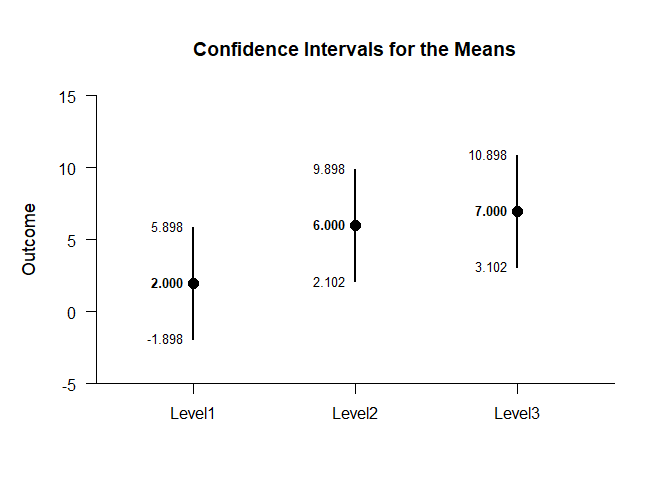
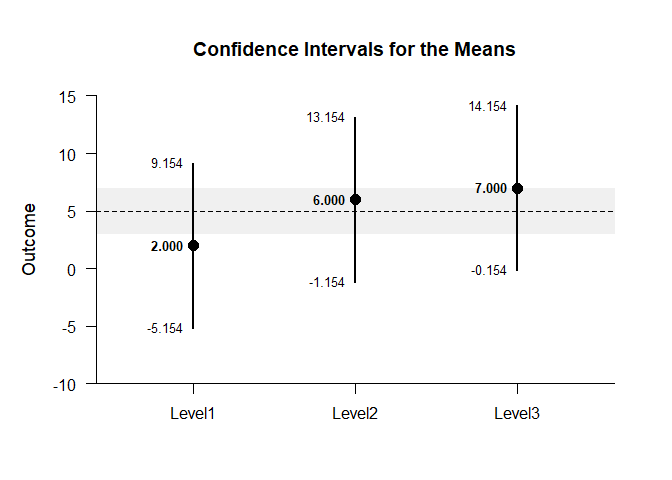
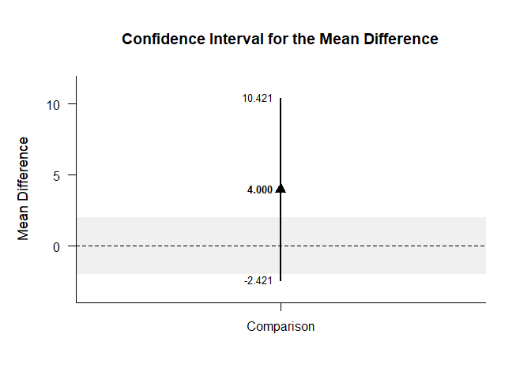
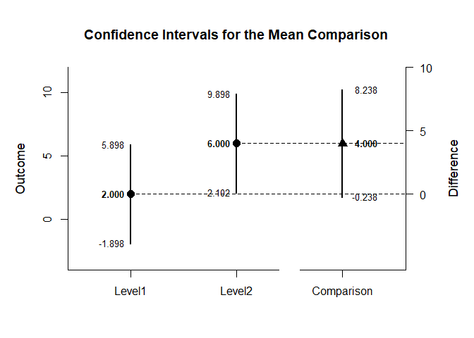
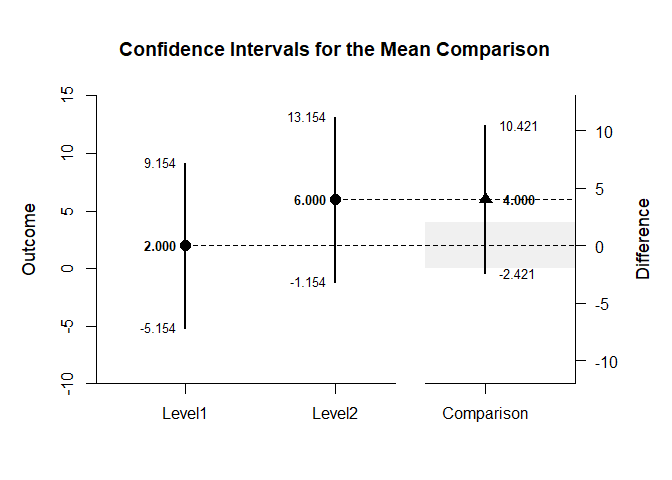
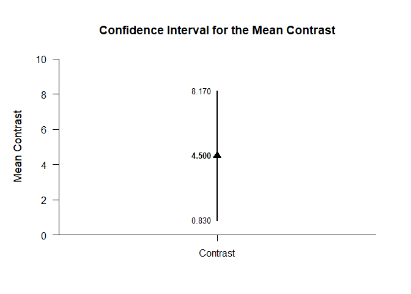
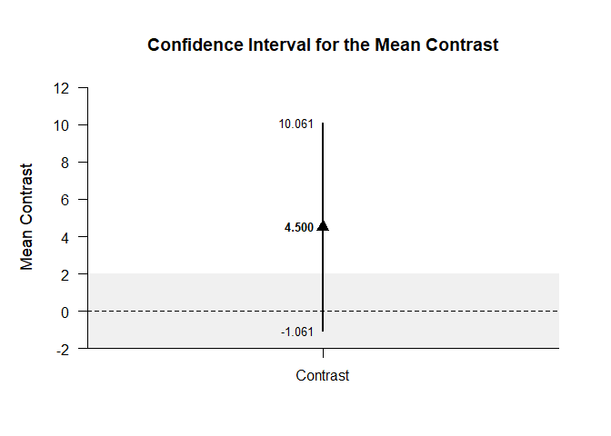
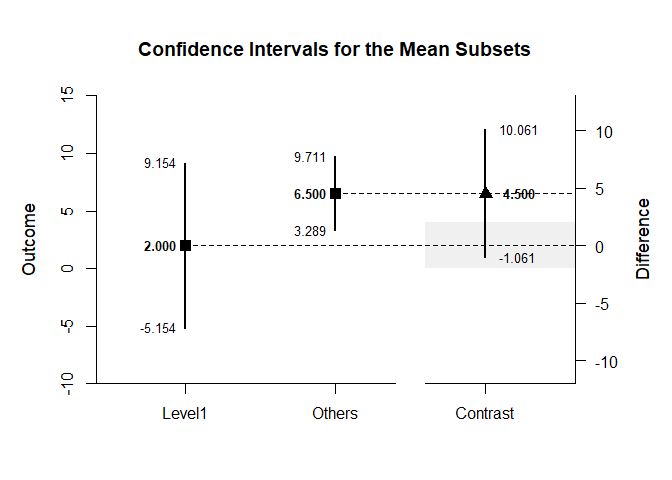

## OneWay (Between-Subjects) Data Tutorial

### Data Management

#### Data Entry

This code inputs the variable names and creates a viewable data frame.

```r
Factor <- c(rep(1,4),rep(2,4),rep(3,4))
Outcome <- c(0,0,3,5,4,7,4,9,9,6,4,9)
Factor <- factor(Factor,levels=c(1,2,3),labels=c("Level1","Level2","Level3"))
OneWayData <- data.frame(Factor,Outcome)
```

#### Descriptive Statistics

This code obtains the descriptive statistics for the data frame.

```r
describeMeans(Outcome~Factor)
```

```
## $`Descriptive Statistics for the Data`
##              N       M      SD    Skew    Kurt
## Level1   4.000   2.000   2.449   0.544  -2.944
## Level2   4.000   6.000   2.449   0.544  -2.944
## Level3   4.000   7.000   2.449  -0.544  -2.944
```

### Analyses of the Means

This section produces analyses that are equivalent to one-sample analyses separately for each level of a factor.

#### Confidence Intervals

This code will provide a table of confidence intervals for each level of the factor.

```r
estimateMeans(Outcome~Factor)
```

```
## $`Confidence Intervals for the Means`
##              M      SE      df      LL      UL
## Level1   2.000   1.225   3.000  -1.898   5.898
## Level2   6.000   1.225   3.000   2.102   9.898
## Level3   7.000   1.225   3.000   3.102  10.898
```

This code will produce a graph of the confidence intervals for each level of the factor.

```r
plotMeans(Outcome~Factor)
```

<!-- -->

The code defaults to 95% confidence intervals. This can be changed if desired.

```r
estimateMeans(Outcome~Factor,conf.level=.99)
```

```
## $`Confidence Intervals for the Means`
##              M      SE      df      LL      UL
## Level1   2.000   1.225   3.000  -5.154   9.154
## Level2   6.000   1.225   3.000  -1.154  13.154
## Level3   7.000   1.225   3.000  -0.154  14.154
```

For the graph, it is possible to add a comparison line to represent a population (or test) value and a region of practical equivalence in addition to changing the confidence level.

```r
plotMeans(Outcome~Factor,conf.level=.99,line=5,rope=c(3,7))
```

<!-- -->

#### Significance Tests

This code will produce a table of NHST separately for each level of the factor. In this case, all the means are tested against a value of zero.

```r
testMeans(Outcome~Factor)
```

```
## $`Hypothesis Tests for the Means`
##           Diff      SE      df       t       p
## Level1   2.000   1.225   3.000   1.633   0.201
## Level2   6.000   1.225   3.000   4.899   0.016
## Level3   7.000   1.225   3.000   5.715   0.011
```

Often, the default test value of zero is not meaningful or plausible. This too can be altered (often in conjunction with what is presented in the plot).

```r
testMeans(Outcome~Factor,mu=5)
```

```
## $`Hypothesis Tests for the Means`
##           Diff      SE      df       t       p
## Level1  -3.000   1.225   3.000  -2.449   0.092
## Level2   1.000   1.225   3.000   0.816   0.474
## Level3   2.000   1.225   3.000   1.633   0.201
```

#### Standardized Effect Sizes

This code will produce a table of standardized mean differences separately for each level of the factor. In this case, the mean is compared to zero to form the effect size.

```r
estimateStandardizedMeans(Outcome~Factor)
```

```
## $`Confidence Intervals for the Standardized Means`
##              d      SE      LL      UL
## Level1   0.816   0.616  -0.387   1.934
## Level2   2.449   0.955   0.325   4.531
## Level3   2.858   1.063   0.464   5.226
```

Here too it is possible to alter the width of the confidence intervals and to establish a more plausible comparison value for the mean.

```r
estimateStandardizedMeans(Outcome~Factor,mu=5,conf.level=.99)
```

```
## $`Confidence Intervals for the Standardized Means`
##              d      SE      LL      UL
## Level1  -1.225   0.680  -3.010   0.547
## Level2   0.408   0.574  -0.969   1.734
## Level3   0.816   0.616  -0.732   2.319
```

### Analyses of a Comparison

This section produces analyses that are equivalent to comparisons of two levels of a factor.

This code creates a new factor that identifies the two levels for comparison.

```r
Comparison=factor(Factor,c("Level1","Level2"))
```

#### Confidence Intervals

This code estimates the confidence interval of the difference.

```r
estimateMeanDifference(Outcome~Comparison)
```

```
## $`Confidence Interval for the Mean Difference`
##               Diff      SE      df      LL      UL
## Comparison   4.000   1.732   6.000  -0.238   8.238
```

This code obtains and plots the confidence interval for the mean difference in the identified comparison.

```r
plotMeanDifference(Outcome~Comparison)
```

<!-- -->

Of course, you can change the confidence level from the default 95% if desired.

```r
estimateMeanDifference(Outcome~Comparison,conf.level=.99)
```

```
## $`Confidence Interval for the Mean Difference`
##               Diff      SE      df      LL      UL
## Comparison   4.000   1.732   6.000  -2.421  10.421
```

Once again, the confidence levels can be changed away from the default and a comparison line to represent a population (or test) value and a region of practical equivalence can be added to the graph.

```r
plotMeanDifference(Outcome~Comparison,conf.level=.99,line=0,rope=c(-2,2))
```

<!-- -->

If you wish, you can get the confidence intervals for the means and the mean difference in one command.

```r
estimateMeanComparison(Outcome~Comparison)
```

```
## $`Confidence Intervals for the Means`
##              M      SE      df      LL      UL
## Level1   2.000   1.225   3.000  -1.898   5.898
## Level2   6.000   1.225   3.000   2.102   9.898
## 
## $`Confidence Interval for the Mean Difference`
##               Diff      SE      df      LL      UL
## Comparison   4.000   1.732   6.000  -0.238   8.238
```

This code produces a difference plot using the confidence intervals for the means and the mean difference.

```r
plotMeanComparison(Outcome~Comparison)
```

<!-- -->

Of course, you can change the confidence level from the default 95% if desired.

```r
estimateMeanComparison(Outcome~Comparison,conf.level=.99)
```

```
## $`Confidence Intervals for the Means`
##              M      SE      df      LL      UL
## Level1   2.000   1.225   3.000  -5.154   9.154
## Level2   6.000   1.225   3.000  -1.154  13.154
## 
## $`Confidence Interval for the Mean Difference`
##               Diff      SE      df      LL      UL
## Comparison   4.000   1.732   6.000  -2.421  10.421
```

Once again, the confidence levels can be changed away from the default and a region of practical equivalence can be added to the graph.

```r
plotMeanComparison(Outcome~Comparison,conf.level=.99,rope=c(-2,2))
```

<!-- -->

#### Significance Test

This code produces NHST for the identified comparison (using a default test value of zero).

```r
testMeanDifference(Outcome~Comparison)
```

```
## $`Hypothesis Test for the Mean Difference`
##               Diff      SE      df       t       p
## Comparison   4.000   1.732   6.000   2.309   0.060
```

If the default value of zero is not plausible, it too can be changed.

```r
testMeanDifference(Outcome~Comparison,mu=-2)
```

```
## $`Hypothesis Test for the Mean Difference`
##               Diff      SE      df       t       p
## Comparison   6.000   1.732   6.000   3.464   0.013
```

#### Standardized Effect Size

This code calculates a standardized mean difference for the comparison and its confidence interval.

```r
estimateStandardizedMeanDifference(Outcome~Comparison)
```

```
## $`Confidence Interval for the Standardized Mean Difference`
##                  d      SE      LL      UL
## Comparison   1.633   0.943  -0.215   3.481
```

The width of the confidence interval for the effect size can be altered if desired.

```r
estimateStandardizedMeanDifference(Outcome~Comparison,conf.level=.99)
```

```
## $`Confidence Interval for the Standardized Mean Difference`
##                  d      SE      LL      UL
## Comparison   1.633   0.943  -0.796   4.062
```

### Analyses of a Contrast

This section produces analyses that are equivalent to analyses involving multiple levels of a factor.

This code identifies a contrast among the groups.

```r
L1vsOthers <- c(-1,.5,.5)
```

#### Confidence Intervals

This code produces a confidence interval for that contrast.

```r
estimateMeanContrast(Outcome~Factor,contrast=L1vsOthers)
```

```
## $`Confidence Interval for the Mean Contrast`
##              Est      SE      df      LL      UL
## Contrast   4.500   1.500   6.000   0.830   8.170
```

This code obtains and plots the confidence intervals for the mean difference in the identified contrast.

```r
plotMeanContrast(Outcome~Factor,contrast=L1vsOthers)
```

<!-- -->

As in all other cases, the default value of the confidence interval can be changed.

```r
estimateMeanContrast(Outcome~Factor,contrast=L1vsOthers,conf.level=.99)
```

```
## $`Confidence Interval for the Mean Contrast`
##              Est      SE      df      LL      UL
## Contrast   4.500   1.500   6.000  -1.061  10.061
```

The width of the confidence interval for the contrast can be altered and a comparison line to represent a population (or test) value and a region of practical equivalence can be added to the graph.

```r
plotMeanContrast(Outcome~Factor,contrast=L1vsOthers,conf.level=.99,line=0,rope=c(-2,2))
```

<!-- -->

If you wish, you can get the confidence intervals for the mean subsets and the mean contrast in one command.

```r
estimateMeanSubsets(Outcome~Factor,contrast=L1vsOthers)
```

```
## $`Confidence Intervals for the Mean Subsets`
##                  Est      SE      df      LL      UL
## Neg Weighted   2.000   1.225   3.000  -1.898   5.898
## Pos Weighted   6.500   0.866   6.000   4.381   8.619
## 
## $`Confidence Interval for the Mean Contrast`
##              Est      SE      df      LL      UL
## Contrast   4.500   1.500   6.000   0.830   8.170
```

This code produces a difference plot using the confidence intervals for the mean subsets and the mean contrast.

```r
plotMeanSubsets(Outcome~Factor,contrast=L1vsOthers)
```

<!-- -->

Of course, you can change the confidence level from the default 95% if desired.

```r
estimateMeanSubsets(Outcome~Factor,contrast=L1vsOthers,conf.level=.99)
```

```
## $`Confidence Intervals for the Mean Subsets`
##                  Est      SE      df      LL      UL
## Neg Weighted   2.000   1.225   3.000  -5.154   9.154
## Pos Weighted   6.500   0.866   6.000   3.289   9.711
## 
## $`Confidence Interval for the Mean Contrast`
##              Est      SE      df      LL      UL
## Contrast   4.500   1.500   6.000  -1.061  10.061
```

Once again, the confidence levels can be changed away from the default and a region of practical equivalence can be added to the graph.

```r
plotMeanSubsets(Outcome~Factor,contrast=L1vsOthers,labels=c("Level1","Others"),conf.level=.99,rope=c(-2,2))
```

<!-- -->

#### Significance Test

This code produces a NHST for the identified contrast. It tests the contrast against a value of zero by default.

```r
testMeanContrast(Outcome~Factor,contrast=L1vsOthers)
```

```
## $`Hypothesis Test for the Mean Contrast`
##              Est      SE      df       t       p
## Contrast   4.500   1.500   6.000   3.000   0.024
```

If desired, the contrast can be tested against other values.

```r
testMeanContrast(Outcome~Factor,contrast=L1vsOthers,mu=4)
```

```
## $`Hypothesis Test for the Mean Contrast`
##              Est      SE      df       t       p
## Contrast   0.500   1.500   6.000   0.333   0.750
```

#### Standardized Effect Size

This code calculates a standardized contrast and its confidence interval.

```r
estimateStandardizedMeanContrast(Outcome~Factor,contrast=L1vsOthers)
```

```
## $`Confidence Interval for the Standardized Mean Contrast`
##              Est      SE      LL      UL
## Contrast   1.837   0.829   0.212   3.462
```

The width of the confidence interval for the effect size can be altered if desired.

```r
estimateStandardizedMeanContrast(Outcome~Factor,contrast=L1vsOthers,conf.level=.99)
```

```
## $`Confidence Interval for the Standardized Mean Contrast`
##              Est      SE      LL      UL
## Contrast   1.837   0.829  -0.299   3.973
```
