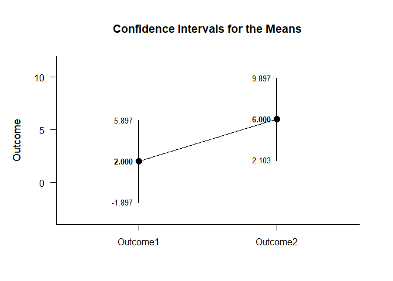

## Paired Samples Data Tutorial

### Data Management

#### Data Entry

This code inputs the variable names and creates a viewable data frame.

```r
Outcome1 <- c(0,0,3,5)
Outcome2 <- c(4,7,4,9)
PairedData <- data.frame(Outcome1,Outcome2)
```

#### Descriptive Statistics

This code obtains the descriptive statistics for the data frame.

```r
describeMeans(PairedData)
```

```
## $`Descriptive Statistics for the Data`
##                N       M      SD    Skew    Kurt
## Outcome1   4.000   2.000   2.449   0.544  -2.944
## Outcome2   4.000   6.000   2.449   0.544  -2.944
```

### Analyses of the Means

This section produces analyses that are equivalent to one-sample analyses separately for each level of a factor.

#### Confidence Intervals

This code will provide a table of confidence intervals for each level of the factor.

```r
estimateMeans(PairedData)
```

```
## $`Confidence Intervals for the Means`
##                M      SE      df      LL      UL
## Outcome1   2.000   1.225   3.000  -1.898   5.898
## Outcome2   6.000   1.225   3.000   2.102   9.898
```

This code will produce a graph of the confidence intervals for each level of the factor.

```r
plotMeans(PairedData)
```

<!-- -->

The code defaults to 95% confidence intervals. This can be changed if desired.

```r
estimateMeans(PairedData,conf.level=.99)
```

```
## $`Confidence Intervals for the Means`
##                M      SE      df      LL      UL
## Outcome1   2.000   1.225   3.000  -5.154   9.154
## Outcome2   6.000   1.225   3.000  -1.154  13.154
```

For the graph, it is possible to add a comparison line to represent a population (or test) value and a region of practical equivalence in addition to changing the confidence level.

```r
plotMeans(PairedData,conf.level=.99,line=6,rope=c(4,8))
```

<!-- -->

#### Significance Tests

This code will produce a table of NHST separately for each level of the factor. In this case, all the means are tested against a value of zero.

```r
testMeans(PairedData)
```

```
## $`Hypothesis Tests for the Means`
##             Diff      SE      df       t       p
## Outcome1   2.000   1.225   3.000   1.633   0.201
## Outcome2   6.000   1.225   3.000   4.899   0.016
```

Often, the default test value of zero is not meaningful or plausible. This too can be altered (often in conjunction with what is presented in the plot).

```r
testMeans(PairedData,mu=6)
```

```
## $`Hypothesis Tests for the Means`
##             Diff      SE      df       t       p
## Outcome1  -4.000   1.225   3.000  -3.266   0.047
## Outcome2   0.000   1.225   3.000   0.000   1.000
```

#### Standardized Effect Sizes

This code will produce a table of standardized mean differences separately for each level of the factor. In this case, the mean is compared to zero to form the effect size.

```r
estimateStandardizedMeans(PairedData)
```

```
## $`Confidence Intervals for the Standardized Means`
##                d      SE      LL      UL
## Outcome1   0.816   0.616  -0.387   1.934
## Outcome2   2.449   0.955   0.325   4.531
```

Here too it is possible to alter the width of the confidence intervals and to establish a more plausible comparison value for the mean.

```r
estimateStandardizedMeans(PairedData,mu=6,conf.level=.99)
```

```
## $`Confidence Intervals for the Standardized Means`
##                d      SE      LL      UL
## Outcome1  -1.633   0.761  -3.764   0.398
## Outcome2   0.000   0.559  -1.288   1.288
```

### Analyses of the Comparison

This section produces analyses that examine the difference among the two levels of the factor.

#### Confidence Intervals

This code estimates the confidence interval of the difference.

```r
estimateMeanDifference(PairedData)
```

```
## $`Confidence Interval for the Mean Difference`
##               Diff      SE      df      LL      UL
## Comparison   4.000   1.225   3.000   0.102   7.898
```

This code obtains and plots the confidence intervals for the mean difference.

```r
plotMeanDifference(PairedData)
```

<!-- -->

Of course, you can change the confidence level from the default 95% if desired.

```r
estimateMeanDifference(PairedData,conf.level=.99)
```

```
## $`Confidence Interval for the Mean Difference`
##               Diff      SE      df      LL      UL
## Comparison   4.000   1.225   3.000  -3.154  11.154
```

Once again, the confidence levels can be changed away from the default and a comparison line to represent a population (or test) value and a region of practical equivalence can be added to the graph.

```r
plotMeanDifference(PairedData,conf.level=.99,line=0,rope=c(-2,2))
```

<!-- -->

If you wish, you can get the confidence intervals for the means and the mean difference in one command.

```r
estimateMeanComparison(PairedData)
```

```
## $`Confidence Intervals for the Means`
##                M      SE      df      LL      UL
## Outcome1   2.000   1.225   3.000  -1.898   5.898
## Outcome2   6.000   1.225   3.000   2.102   9.898
## 
## $`Confidence Interval for the Mean Difference`
##               Diff      SE      df      LL      UL
## Comparison   4.000   1.225   3.000   0.102   7.898
```

This code produces a difference plot using the confidence intervals for the means and the mean difference.

```r
plotMeanComparison(PairedData)
```

<!-- -->

Of course, you can change the confidence level from the default 95% if desired.

```r
estimateMeanComparison(PairedData,conf.level=.99)
```

```
## $`Confidence Intervals for the Means`
##                M      SE      df      LL      UL
## Outcome1   2.000   1.225   3.000  -5.154   9.154
## Outcome2   6.000   1.225   3.000  -1.154  13.154
## 
## $`Confidence Interval for the Mean Difference`
##               Diff      SE      df      LL      UL
## Comparison   4.000   1.225   3.000  -3.154  11.154
```

Once again, the confidence levels can be changed away from the default and a region of practical equivalence can be added to the graph.

```r
plotMeanComparison(PairedData,conf.level=.99,rope=c(-2,2))
```

<!-- -->

#### Significance Test

This code produces NHST for the mean difference (using a default test value of zero).

```r
testMeanDifference(PairedData)
```

```
## $`Hypothesis Test for the Mean Difference`
##               Diff      SE      df       t       p
## Comparison   4.000   1.225   3.000   3.266   0.047
```

If the default value of zero is not plausible, it too can be changed.

```r
testMeanDifference(PairedData,mu=-2)
```

```
## $`Hypothesis Test for the Mean Difference`
##               Diff      SE      df       t       p
## Comparison   6.000   1.225   3.000   4.899   0.016
```

#### Standardized Effect Size

This code calculates a standardized mean difference and its confidence interval.

```r
estimateStandardizedMeanDifference(PairedData)
```

```
## $`Confidence Interval for the Standardized Mean Difference`
##                  d      SE      LL      UL
## Comparison   1.633   0.782   0.101   3.165
```

The width of the confidence interval for the effect size can be altered if desired.

```r
estimateStandardizedMeanDifference(PairedData,conf.level=.99)
```

```
## $`Confidence Interval for the Standardized Mean Difference`
##                  d      SE      LL      UL
## Comparison   1.633   0.782  -0.381   3.647
```
