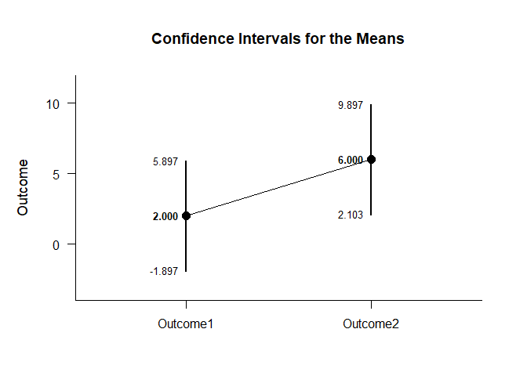
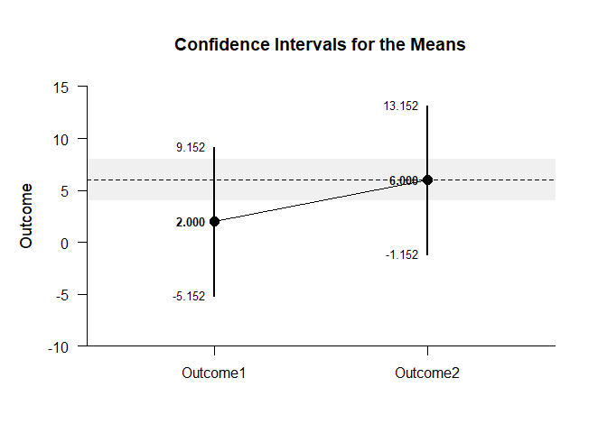
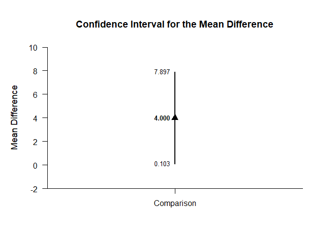
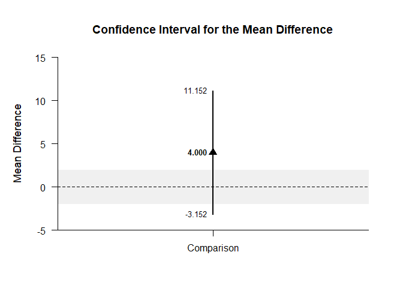
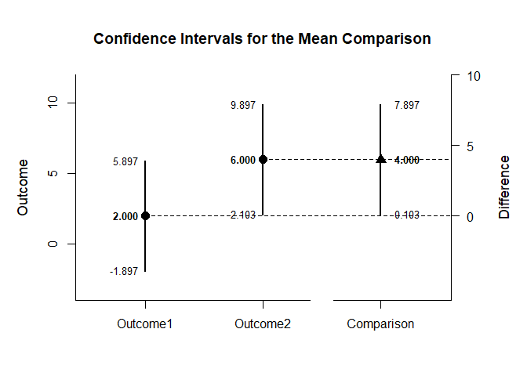
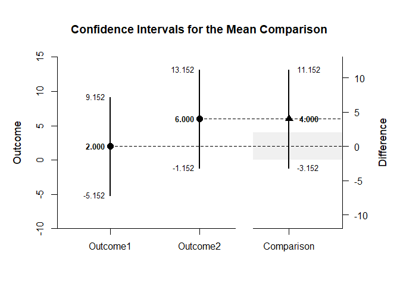

## Paired Samples Summary Statistics Tutorial

This page analyzes a within-subjects (paired samples) design for two
time points using summary statistics input.

- [Data Management](#data-management)
- [Analyses of the Means](#analyses-of-the-means)
  - [Confidence Intervals](#confidence-intervals)
  - [Significance Tests](#significance-tests)
  - [Standardized Effect Sizes](#standardized-effect-sizes)
- [Analyses of the Comparison](#analyses-of-the-comparison)
  - [Confidence Intervals](#confidence-intervals)
  - [Significance Test](#significance-test)
  - [Standardized Effect Size](#standardized-effect-size)

------------------------------------------------------------------------

### Data Management

This code inputs the variable summaries and creates a summary table.

``` r
Outcome1 <- c(N=4,M=2.000,SD=2.449)
Outcome2 <- c(N=4,M=6.000,SD=2.449)
PairedSummary <- rbind(Outcome1,Outcome2)
class(PairedSummary) <- "wss"
```

This code creates a correlation matrix and enters single correlation.

``` r
PairedCorr <- declareCorrelations("Outcome1","Outcome2")
PairedCorr["Outcome1","Outcome2"] <- .500
```

### Analyses of the Means

This section produces analyses that are equivalent to one-sample
analyses separately for each level of a factor.

#### Confidence Intervals

This code will provide a table of confidence intervals for each level of
the factor.

``` r
estimateMeans(PairedSummary)
```

    ## $`Confidence Intervals for the Means`
    ##                M      SE      df      LL      UL
    ## Outcome1   2.000   1.224   3.000  -1.897   5.897
    ## Outcome2   6.000   1.224   3.000   2.103   9.897

This code will produce a graph of the confidence intervals for each
level of the factor.

``` r
plotMeans(PairedSummary)
```

<!-- -->

The code defaults to 95% confidence intervals. This can be changed if
desired.

``` r
estimateMeans(PairedSummary,conf.level=.99)
```

    ## $`Confidence Intervals for the Means`
    ##                M      SE      df      LL      UL
    ## Outcome1   2.000   1.224   3.000  -5.152   9.152
    ## Outcome2   6.000   1.224   3.000  -1.152  13.152

For the graph, it is possible to add a comparison line to represent a
population (or test) value and a region of practical equivalence in
addition to changing the confidence level.

``` r
plotMeans(PairedSummary,conf.level=.99,line=6,rope=c(4,8))
```

<!-- -->

#### Significance Tests

This code will produce a table of NHST separately for each level of the
factor. In this case, all the means are tested against a value of zero.

``` r
testMeans(PairedSummary)
```

    ## $`Hypothesis Tests for the Means`
    ##             Diff      SE      df       t       p
    ## Outcome1   2.000   1.224   3.000   1.633   0.201
    ## Outcome2   6.000   1.224   3.000   4.900   0.016

Often, the default test value of zero is not meaningful or plausible.
This too can be altered (often in conjunction with what is presented in
the plot).

``` r
testMeans(PairedSummary,mu=6)
```

    ## $`Hypothesis Tests for the Means`
    ##             Diff      SE      df       t       p
    ## Outcome1  -4.000   1.224   3.000  -3.267   0.047
    ## Outcome2   0.000   1.224   3.000   0.000   1.000

#### Standardized Effect Sizes

This code will produce a table of standardized mean differences
separately for each level of the factor. In this case, the mean is
compared to zero to form the effect size.

``` r
estimateStandardizedMeans(PairedSummary)
```

    ## $`Confidence Intervals for the Standardized Means`
    ##                d      SE      LL      UL
    ## Outcome1   0.817   0.616  -0.387   1.934
    ## Outcome2   2.450   0.955   0.325   4.532

Here too it is possible to alter the width of the confidence intervals
and to establish a more plausible comparison value for the mean.

``` r
estimateStandardizedMeans(PairedSummary,mu=6,conf.level=.99)
```

    ## $`Confidence Intervals for the Standardized Means`
    ##                d      SE      LL      UL
    ## Outcome1  -1.633   0.761  -3.765   0.398
    ## Outcome2   0.000   0.559  -1.288   1.288

### Analyses of the Comparison

This section produces analyses that examine the difference among the two
levels of the factor.

#### Confidence Intervals

This code estimates the confidence interval of the difference.

``` r
estimateMeanDifference(PairedSummary,PairedCorr)
```

    ## $`Confidence Interval for the Mean Difference`
    ##               Diff      SE      df      LL      UL
    ## Comparison   4.000   1.224   3.000   0.103   7.897

This code obtains and plots the confidence intervals for the mean
difference.

``` r
plotMeanDifference(PairedSummary,PairedCorr)
```

<!-- -->

Of course, you can change the confidence level from the default 95% if
desired.

``` r
estimateMeanDifference(PairedSummary,PairedCorr,conf.level=.99)
```

    ## $`Confidence Interval for the Mean Difference`
    ##               Diff      SE      df      LL      UL
    ## Comparison   4.000   1.224   3.000  -3.152  11.152

Once again, the confidence levels can be changed away from the default
and a comparison line to represent a population (or test) value and a
region of practical equivalence can be added to the graph.

``` r
plotMeanDifference(PairedSummary,PairedCorr,conf.level=.99,line=0,rope=c(-2,2))
```

<!-- -->

If you wish, you can get the confidence intervals for the means and the
mean difference in one command.

``` r
estimateMeanComparison(PairedSummary,PairedCorr)
```

    ## $`Confidence Intervals for the Means`
    ##                M      SE      df      LL      UL
    ## Outcome1   2.000   1.224   3.000  -1.897   5.897
    ## Outcome2   6.000   1.224   3.000   2.103   9.897
    ## 
    ## $`Confidence Interval for the Mean Difference`
    ##               Diff      SE      df      LL      UL
    ## Comparison   4.000   1.224   3.000   0.103   7.897

This code produces a difference plot using the confidence intervals for
the means and the mean difference.

``` r
plotMeanComparison(PairedSummary,PairedCorr)
```

<!-- -->

Of course, you can change the confidence level from the default 95% if
desired.

``` r
estimateMeanComparison(PairedSummary,PairedCorr,conf.level=.99)
```

    ## $`Confidence Intervals for the Means`
    ##                M      SE      df      LL      UL
    ## Outcome1   2.000   1.224   3.000  -5.152   9.152
    ## Outcome2   6.000   1.224   3.000  -1.152  13.152
    ## 
    ## $`Confidence Interval for the Mean Difference`
    ##               Diff      SE      df      LL      UL
    ## Comparison   4.000   1.224   3.000  -3.152  11.152

Once again, the confidence levels can be changed away from the default
and a region of practical equivalence can be added to the graph.

``` r
plotMeanComparison(PairedSummary,PairedCorr,conf.level=.99,rope=c(-2,2))
```

<!-- -->

#### Significance Test

This code produces NHST for the mean difference (using a default test
value of zero).

``` r
testMeanDifference(PairedSummary,PairedCorr)
```

    ## $`Hypothesis Test for the Mean Difference`
    ##               Diff      SE      df       t       p
    ## Comparison   4.000   1.224   3.000   3.267   0.047

If the default value of zero is not plausible, it too can be changed.

``` r
testMeanDifference(PairedSummary,PairedCorr,mu=-2)
```

    ## $`Hypothesis Test for the Mean Difference`
    ##               Diff      SE      df       t       p
    ## Comparison   6.000   1.224   3.000   4.900   0.016

#### Standardized Effect Size

This code calculates a standardized mean difference and its confidence
interval.

``` r
estimateStandardizedMeanDifference(PairedSummary,PairedCorr)
```

    ## $`Confidence Interval for the Standardized Mean Difference`
    ##                  d      SE      LL      UL
    ## Comparison   1.633   0.782   0.101   3.166

The width of the confidence interval for the effect size can be altered
if desired.

``` r
estimateStandardizedMeanDifference(PairedSummary,PairedCorr,conf.level=.99)
```

    ## $`Confidence Interval for the Standardized Mean Difference`
    ##                  d      SE      LL      UL
    ## Comparison   1.633   0.782  -0.380   3.647
