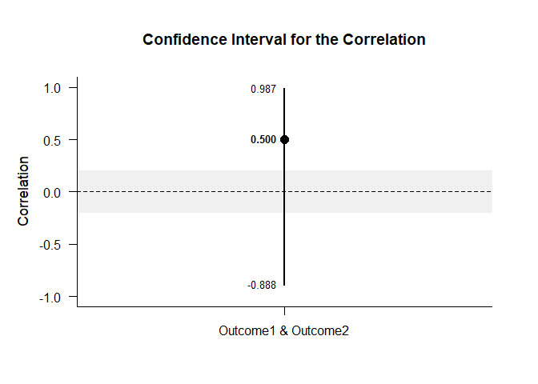

## Set of Correlations Data Tutorial

### Data Management

#### Data Entry

This code inputs the variable names and creates a viewable data frame.

```r
Outcome1 <- c(0,0,3,5)
Outcome2 <- c(4,7,4,9)
Outcome3 <- c(9,6,4,9)
RepeatedData <- data.frame(Outcome1,Outcome2,Outcome3)
```

#### Descriptive Statistics

This code obtains the descriptive statistics for the data frame.

```r
describeMeans(RepeatedData)
```

```
## $`Descriptive Statistics for the Data`
##                N       M      SD    Skew    Kurt
## Outcome1   4.000   2.000   2.449   0.544  -2.944
## Outcome2   4.000   6.000   2.449   0.544  -2.944
## Outcome3   4.000   7.000   2.449  -0.544  -2.944
```

This code obtains a table of correlations for the entire data frame.

```r
describeCorrelations(RepeatedData)
```

```
## $`Correlation Matrix for the Variables`
##          Outcome1 Outcome2 Outcome3
## Outcome1    1.000    0.500    0.056
## Outcome2    0.500    1.000    0.389
## Outcome3    0.056    0.389    1.000
```

### Analyses of a Correlation

This section produces analyses of a single correlation.


```r
ComparisonData <- cbind(Outcome1,Outcome2)
```

#### Confidence Interval

This code will provide the confidence interval for the correlation.

```r
estimateCorrelations(ComparisonData)
```

```
## $`Confidence Interval for the Correlation`
##                           R      SE      LL      UL
## Outcome1 & Outcome2   0.500   1.000  -0.888   0.987
```

This code will produce a graph of the confidence interval for the correlation.

```r
plotCorrelations(ComparisonData)
```

<!-- -->

The code defaults to 95% confidence intervals. This can be changed if desired.

```r
estimateCorrelations(ComparisonData,conf.level=.99)
```

```
## $`Confidence Interval for the Correlation`
##                           R      SE      LL      UL
## Outcome1 & Outcome2   0.500   1.000  -0.966   0.996
```

Of course, it is possible to change from the default confidence level in the graph. It is also possible to add a comparison value and a region of practical equivalence.

```r
plotCorrelations(ComparisonData,conf.level=.99,line=0,rope=c(-.2,.2))
```

<!-- -->

#### Significance Test

This code will produce a table of NHST for the correlation (against a value of zero).

```r
testCorrelations(ComparisonData)
```

```
## $`Hypothesis Test for the Correlation`
##                           R      SE      df       t       p
## Outcome1 & Outcome2   0.500   0.612   2.000   0.816   0.500
```

### Analyses of Several Correlations

This section analyzes the correlations among multiple variables.

#### Confidence Intervals

This code will provide the confidence intervals for the correlations.

```r
estimateCorrelations(RepeatedData)
```

```
## $`Confidence Intervals for the Correlations`
##                           R      SE      LL      UL
## Outcome1 & Outcome2   0.500   1.000  -0.888   0.987
## Outcome1 & Outcome3   0.056   1.000  -0.957   0.965
## Outcome2 & Outcome3   0.389   1.000  -0.914   0.983
```

This code will produce a graph of the confidence intervals for the correlations.

```r
plotCorrelations(RepeatedData)
```

<!-- -->

The code defaults to 95% confidence intervals. This can be changed if desired.

```r
estimateCorrelations(RepeatedData,conf.level=.99)
```

```
## $`Confidence Intervals for the Correlations`
##                           R      SE      LL      UL
## Outcome1 & Outcome2   0.500   1.000  -0.966   0.996
## Outcome1 & Outcome3   0.056   1.000  -0.987   0.990
## Outcome2 & Outcome3   0.389   1.000  -0.974   0.995
```

Of course, it is possible to change from the default confidence level in the graph. It is also possible to add a comparison value and a region of practical equivalence.

```r
plotCorrelations(RepeatedData,conf.level=.99,line=0,rope=c(-.2,.2))
```

<!-- -->

#### Significance Tests

This code will produce a table of NHST for the correlations (against a value of zero).

```r
testCorrelations(RepeatedData)
```

```
## $`Hypothesis Tests for the Correlations`
##                           R      SE      df       t       p
## Outcome1 & Outcome2   0.500   0.612   2.000   0.816   0.500
## Outcome1 & Outcome3   0.056   0.706   2.000   0.079   0.944
## Outcome2 & Outcome3   0.389   0.651   2.000   0.597   0.611
```
