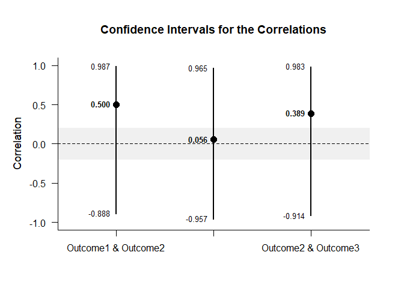

## Set of Correlations Tutorial with Summary Statistics

### Data Management

This code inputs the variable summaries and creates a summary table.

```r
Outcome1 <- c(N=4,M=2.000,SD=2.449)
Outcome2 <- c(N=4,M=6.000,SD=2.449)
Outcome3 <- c(N=4,M=7.000,SD=2.449)
RepeatedSummary <- rbind(Outcome1,Outcome2,Outcome3)
class(RepeatedSummary) <- "wss"
```

This code creates a correlation matrix, enters just the top triangle, and then uses a function to fill in the whole matrix.

```r
RepeatedCorr <- declareCorrelations("Outcome1","Outcome2","Outcome3")
RepeatedCorr["Outcome1","Outcome2"] <- .500
RepeatedCorr["Outcome1","Outcome3"] <- .056
RepeatedCorr["Outcome2","Outcome3"] <- .389
RepeatedCorr <- fillCorrelations(RepeatedCorr)
```

### Analyses of a Correlation

This section produces analyses of a single correlation.

This code creates a tables that identify the two variables for correlating.

```r
CompSummary <- RepeatedSummary[c("Outcome1","Outcome2"),]
class(CompSummary) <- "wss"
CompCorr <- RepeatedCorr[c("Outcome1","Outcome2"),c("Outcome1","Outcome2")]
```

#### Confidence Interval

This code will provide the confidence interval for the correlation.

```r
estimateCorrelations(CompSummary,CompCorr)
```

```
## $`Confidence Interval for the Correlation`
##                           R      SE      LL      UL
## Outcome1 & Outcome2   0.500   1.000  -0.888   0.987
```

This code will produce a graph of the confidence interval for the correlation.

```r
plotCorrelations(CompSummary,CompCorr)
```

<!-- -->

The code defaults to 95% confidence intervals. This can be changed if desired.

```r
estimateCorrelations(CompSummary,CompCorr,conf.level=.99)
```

```
## $`Confidence Interval for the Correlation`
##                           R      SE      LL      UL
## Outcome1 & Outcome2   0.500   1.000  -0.966   0.996
```

Of course, it is possible to change from the default confidence level in the graph. It is also possible to add a comparison value and a region of practical equivalence.

```r
plotCorrelations(CompSummary,CompCorr,conf.level=.99,line=0,rope=c(-.2,.2))
```

<!-- -->

#### Significance Test

This code will produce a table of NHST for the correlation (against a value of zero).

```r
testCorrelations(CompSummary,CompCorr)
```

```
## $`Hypothesis for the Correlation`
##                           R      SE      df       t       p
## Outcome1 & Outcome2   0.500   0.612   2.000   0.816   0.500
```

### Analyses of Several Correlations

This section analyzes the correlations among multiple variables.

#### Confidence Intervals

This code will provide the confidence intervals for the correlations.

```r
estimateCorrelations(RepeatedSummary,RepeatedCorr)
```

```
## $`Confidence Intervals for the Correlations`
##                           R      SE      LL      UL
## Outcome1 & Outcome2   0.500   1.000  -0.888   0.987
## Outcome1 & Outcome3   0.056   1.000  -0.957   0.965
## Outcome2 & Outcome3   0.389   1.000  -0.914   0.983
```

This code will produce a graph of the confidence intervals for the correlations.

```r
plotCorrelations(RepeatedSummary,RepeatedCorr)
```

<!-- -->

The code defaults to 95% confidence intervals. This can be changed if desired.

```r
estimateCorrelations(RepeatedSummary,RepeatedCorr,conf.level=.99)
```

```
## $`Confidence Intervals for the Correlations`
##                           R      SE      LL      UL
## Outcome1 & Outcome2   0.500   1.000  -0.966   0.996
## Outcome1 & Outcome3   0.056   1.000  -0.987   0.990
## Outcome2 & Outcome3   0.389   1.000  -0.974   0.995
```

Of course, it is possible to change from the default confidence level in the graph. It is also possible to add a comparison value and a region of practical equivalence.

```r
plotCorrelations(RepeatedSummary,RepeatedCorr,conf.level=.99,line=0,rope=c(-.2,.2))
```

<!-- -->

#### Significance Tests

This code will produce a table of NHST for the correlations (against a value of zero).

```r
testCorrelations(RepeatedSummary,RepeatedCorr)
```

```
## $`Hypothesis Tests for the Correlations`
##                           R      SE      df       t       p
## Outcome1 & Outcome2   0.500   0.612   2.000   0.816   0.500
## Outcome1 & Outcome3   0.056   0.706   2.000   0.079   0.944
## Outcome2 & Outcome3   0.389   0.651   2.000   0.597   0.611
```
