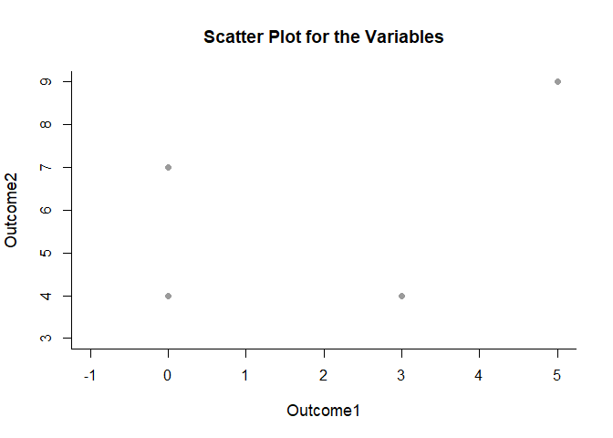
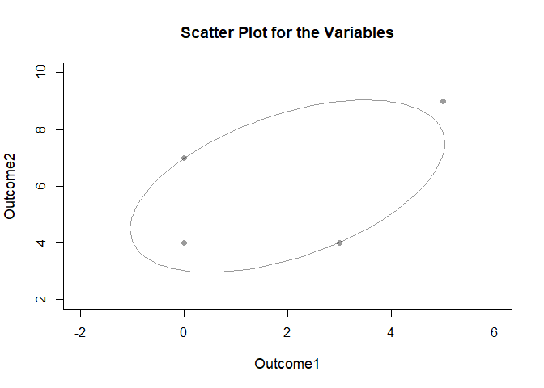
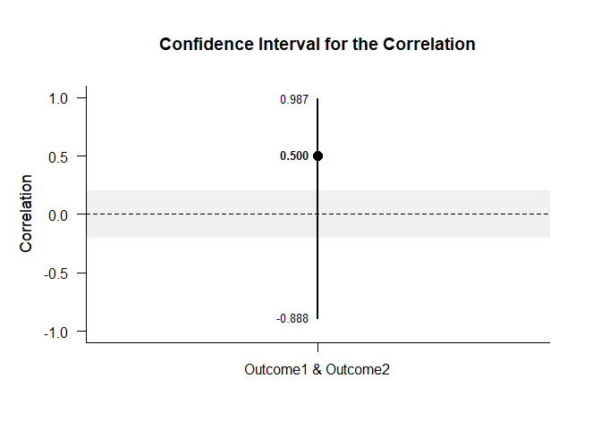

## Single Correlation Data Tutorial

This page analyzes a single correlation between two variables using raw
data input.

- [Data Management](#data-management)
  - [Data Entry](#data-entry)
  - [Plot of the Data](#plot-of-the-data)
  - [Descriptive Statistics](#descriptive-statistics)
- [Analyses of a Correlation](#analyses-of-a-correlation)
  - [Confidence Interval](#confidence-interval)
  - [Significance Test](#significance-test)

------------------------------------------------------------------------

### Data Management

#### Data Entry

This code inputs the variable names and creates a viewable data frame.

``` r
Outcome1 <- c(0,0,3,5)
Outcome2 <- c(4,7,4,9)
PairedData <- data.frame(Outcome1,Outcome2)
```

#### Plot of the Data

This code provides a scatterplot for the bivariate relationship.

``` r
plotScatter(PairedData)
```

<!-- -->

This code provides a scatterplot along with a 95% confidence ellipse for
the data.

``` r
plotScatter(PairedData,ellipse=TRUE)
```

<!-- -->

The ellipse can be altered for different confidence levels.

``` r
plotScatter(PairedData,ellipse=TRUE,conf.level=.99)
```

<!-- -->

#### Descriptive Statistics

This code obtains the descriptive statistics for the data frame.

``` r
describeMeans(PairedData)
```

    ## $`Descriptive Statistics for the Data`
    ##                N       M      SD    Skew    Kurt
    ## Outcome1   4.000   2.000   2.449   0.544  -2.944
    ## Outcome2   4.000   6.000   2.449   0.544  -2.944

``` r
describeCorrelations(PairedData)
```

    ## $`Correlation Matrix for the Variables`
    ##          Outcome1 Outcome2
    ## Outcome1    1.000    0.500
    ## Outcome2    0.500    1.000

### Analyses of a Correlation

This section produces analyses of the correlation.

#### Confidence Interval

This code will provide the confidence interval for the correlation.

``` r
estimateCorrelations(PairedData)
```

    ## $`Confidence Interval for the Correlation`
    ##                           R      SE      LL      UL
    ## Outcome1 & Outcome2   0.500   1.000  -0.888   0.987

This code will produce a graph of the confidence interval for the
correlation.

``` r
plotCorrelations(PairedData)
```

<!-- -->

The code defaults to 95% confidence intervals. This can be changed if
desired.

``` r
estimateCorrelations(PairedData,conf.level=.99)
```

    ## $`Confidence Interval for the Correlation`
    ##                           R      SE      LL      UL
    ## Outcome1 & Outcome2   0.500   1.000  -0.966   0.996

Of course, it is possible to change from the default confidence level
and to add a comparison line and a region of practical equivalence to
the graph.

``` r
plotCorrelations(PairedData,conf.level=.99,line=0,rope=c(-.2,.2))
```

<!-- -->

#### Significance Test

This code will produce a table of NHST for the correlation (against a
value of zero).

``` r
testCorrelations(PairedData)
```

    ## $`Hypothesis Test for the Correlation`
    ##                           R      SE      df       t       p
    ## Outcome1 & Outcome2   0.500   0.612   2.000   0.816   0.500
