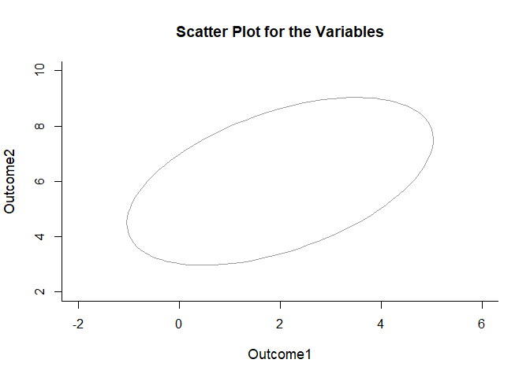
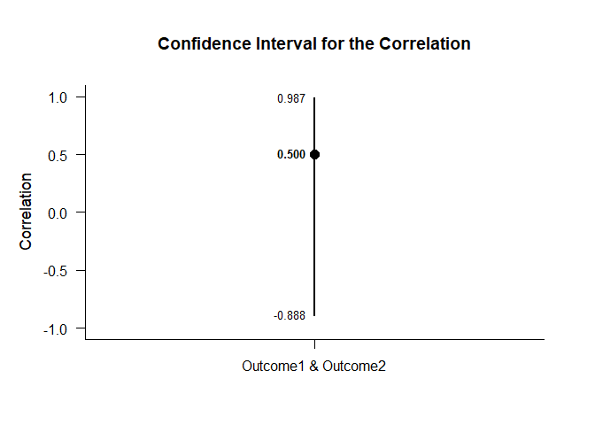
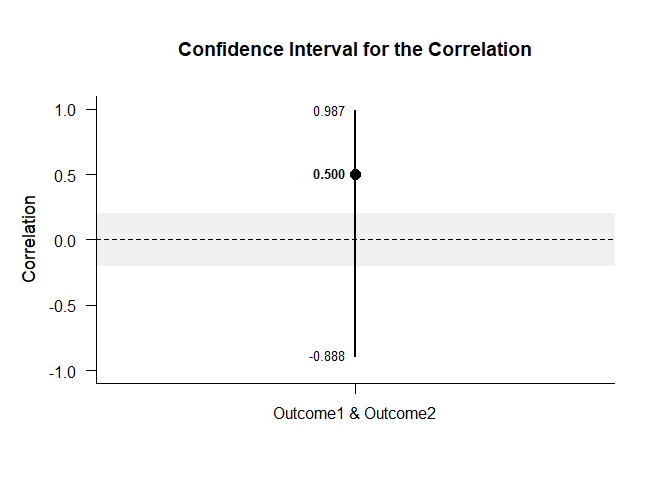

## Single Correlation Summary Statistics Tutorial

### Data Management

#### Data Entry

This code inputs the variable summaries and creates a summary table.

```r
Outcome1 <- c(N=4,M=2.000,SD=2.449)
Outcome2 <- c(N=4,M=6.000,SD=2.449)
PairedSummary <- rbind(Outcome1,Outcome2)
class(PairedSummary) <- "wss"
```

This code creates a correlation matrix and enters single correlation.

```r
PairedCorr <- declareCorrelations("Outcome1","Outcome2")
PairedCorr["Outcome1","Outcome2"] <- .500
PairedCorr <- fillCorrelations(PairedCorr)
```

#### Plot of the Data

This code provides a confidence ellipse for the bivariate relationship. Because there is no raw data, no data points are visible and the code defaults instead to an ellipse.

```r
plotScatter(PairedSummary,PairedCorr)
```

<!-- -->

The ellipse can be altered for different confidence levels.

```r
plotScatter(PairedSummary,PairedCorr,conf.level=.99)
```

<!-- -->

### Analyses of a Correlation

This section produces analyses of the correlation.

#### Confidence Interval

This code will provide the confidence interval for the correlation.

```r
estimateCorrelations(PairedSummary,PairedCorr)
```

```
## $`Confidence Interval for the Correlation`
##                           R      SE      LL      UL
## Outcome1 & Outcome2   0.500   1.000  -0.888   0.987
```

This code will produce a graph of the confidence interval for the correlation.

```r
plotCorrelations(PairedSummary,PairedCorr)
```

<!-- -->

The code defaults to 95% confidence intervals. This can be changed if desired.

```r
estimateCorrelations(PairedSummary,PairedCorr,conf.level=.99)
```

```
## $`Confidence Interval for the Correlation`
##                           R      SE      LL      UL
## Outcome1 & Outcome2   0.500   1.000  -0.966   0.996
```

Of course, it is possible to change from the default confidence level and to add a comparison line and a region of practical equivalence to the graph.

```r
plotCorrelations(PairedSummary,PairedCorr,conf.level=.99,line=0,rope=c(-.2,.2))
```

<!-- -->

#### Significance Test

This code will produce a table of NHST for the correlation (against a value of zero).

```r
testCorrelations(PairedSummary,PairedCorr)
```

```
## $`Hypothesis Test for the Correlation`
##                           R      SE      df       t       p
## Outcome1 & Outcome2   0.500   0.612   2.000   0.816   0.500
```
