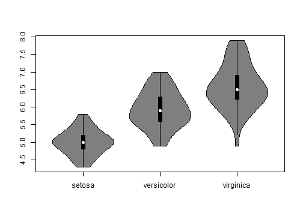

# Controlling Violin Plot Area

While boxplots have become the _de facto_ standard for plotting the distribution of data this is a vast oversimplification and may not show everything needed to evaluate the variation of data. This is particularly important for datasets which do not form a Gaussian "Normal" distribution that most researchers have become accustomed to.

While density plots are helpful in this regard, they can be less aesthetically pleasing than boxplots and harder to interpret for those familiar with boxplots. Often the only ways to compare multiple data types with density use slices of the data with faceting the plotting panes or overlaying density curves with colours and a legend. This approach is jarring for new users and leads to cluttered plots difficult to present to a wider audience.

## Violin Plots

Therefore violin plots are a powerful tool to assist researchers to visualise data, particularly in the quality checking and exploratory parts of an analysis. Violin plots have many benefits:

- Greater flexibility for plotting variation than boxplots
- More familiarity to boxplot users than density plots
- Easier to directly compare data types than existing plots

As shown below for the `iris` dataset, violin plots show distribution information that the boxplot is unable to.


```r
data(iris)
boxplot(iris$Sepal.Length[iris$Species=="setosa"], iris$Sepal.Length[iris$Species=="versicolor"], iris$Sepal.Length[iris$Species=="virginica"], names=c("setosa", "versicolor", "virginica"))
```


```r
vioplot(iris$Sepal.Length[iris$Species=="setosa"], iris$Sepal.Length[iris$Species=="versicolor"], iris$Sepal.Length[iris$Species=="virginica"], names=c("setosa", "versicolor", "virginica"))
```



```r
aov(Sepal.Length~Species,data=iris)
```

```
## Call:
##    aov(formula = Sepal.Length ~ Species, data = iris)
## 
## Terms:
##                  Species Residuals
## Sum of Squares  63.21213  38.95620
## Deg. of Freedom        2       147
## 
## Residual standard error: 0.5147894
## Estimated effects may be unbalanced
```
